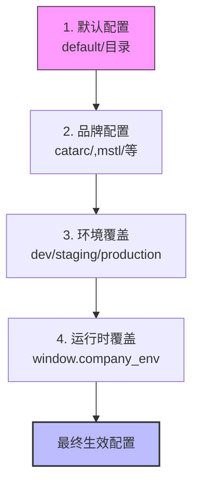

# AI 编码上下文文档 - 快速开发指南

> 本文档为AI辅助开发提供完整项目上下文，帮助快速理解架构、定位代码、保持规范。

## 📋 文档信息

- **最后更新**: 2025-11-27
- **适用版本**: vue3-frontend v4.10.0
- **Vue版本**: Vue 3.4.15 + Vite 5.2.0
- **状态**: 🟢 Active
- **文档完成度**: ✅ 100% (12/12文档)

---

## 🚀 快速导航

### 新手上路

- [项目概览](#项目概览) - 了解项目基本信息和技术栈
- [核心架构体系](#核心架构体系) - 理解关键设计概念
- [业务模块清单](#业务模块清单) - 快速了解所有业务模块

### 开发任务参考

| 开发任务     | 参考文档                                      |
| ------------ | --------------------------------------------- |
| 新增业务模块 | [模块开发规范](./module_development_guide.md) |
| API接口调用  | [API层文档](./api_layer.md)                   |
| 状态管理使用 | [Pinia Stores文档](./stores_guide.md)         |
| 复用UI组件   | [组件库复用指南](./component_library.md)      |
| 品牌定制开发 | [多品牌配置系统](./multibrand_config.md)      |
| 工具函数使用 | [Utils目录文档](./utils_documentation.md)     |

### 架构设计参考

- [架构总览](./architecture_overview.md) - 技术架构深度解析
- [多品牌配置系统](./multibrand_config.md) - 多租户架构核心机制
- [路由系统](./router_guide.md) - 路由设计与模块化管理
- [数据关系与核心概念](./database_relationship.md) - 业务实体与数据模型
- [WebSocket实时通讯](./websocket_realtime_guide.md) - 实时消息推送机制
- [开发模式指南](./development_modes_guide.md) - Dev与CATARC双模式说明
- [Composables指南](./composables_guide.md) - 组合式函数使用指南
- [错误处理指南](./error_handling_guide.md) - 全局错误处理机制

---

## 📊 项目概览

### 基本信息

- **项目名称**: vue3-frontend
- **版本**: 4.10.0
- **类型**: 企业级软件成分分析与漏洞管理平台
- **架构**: 多品牌/多租户架构

### 技术栈

| 类别        | 技术         | 版本      | 备注                               |
| ----------- | ------------ | --------- | ---------------------------------- |
| 基础框架    | Vue.js       | 3.4.15    | 使用 `<script setup>` + TypeScript |
| 构建工具    | Vite         | 5.2.0     | 支持热更新和快速构建               |
| 状态管理    | Pinia        | 2.0.33    | 官方推荐，替代Vuex                 |
| 路由        | Vue Router   | 4.1.6     | 支持动态路由和模块化               |
| UI框架      | Element Plus | 0.4.4-sct | **自定义构建版本**，含定制功能     |
| CSS框架     | UnoCSS       | 0.59.4    | 原子化CSS引擎                      |
| CSS预处理器 | SCSS         | -         | 支持现代CSS特性                    |
| HTTP客户端  | Axios        | 1.8.4     | 支持拦截器                         |
| 国际化      | Vue I18n     | 9.2.2     | 支持多语言                         |

### 项目规模

```
总代码文件: 423个
├─ Vue组件文件: 288个
├─ TypeScript/JavaScript文件: 135个
│
├─ Views目录: 52个Vue文件（业务页面）
├─ API层: 18个文件（3386行）
├─ Store层: 16个Pinia模块
└─ Components: 1个业务组件
```

### 核心依赖库

- **图表库**: ECharts 5.4.2, D3 7.8.4, AntV G6 4.8.24
- **代码编辑器**: Monaco Editor 0.37.1
- **身份认证**: @okta/okta-signin-widget 7.6.0
- **数据分析**: @segment/analytics-next 1.53.2
- **工具库**: Lodash ES, VueUse Core, Moment.js, UUID, JSZip
- **Markdown**: markdown-it 14.1.0

---

## 🎯 核心架构体系

### 1. 多品牌配置系统（核心架构）⭐⭐⭐

**定位**: 这是项目最重要的架构设计，支持多个品牌/客户定制。

**支持品牌**:

- `catarc` - 中汽研
- `mstl` - MSTL
- `anesec` - 安恒
- `osredm` / `306` - 其他客户
- `default` - 默认配置

**配置覆盖机制（三级覆盖）**:



**配置类型**:

- `featureConfig` - 功能开关配置
- `navigationConfig` - 导航菜单配置
- `tableConfig` - 表格列配置
- `companyConfig` - 公司信息配置
- `sidebarConfig` - 侧边栏配置
- `env` - 环境变量配置

**品牌特性实现方式**:

1. **动态登录页**: 根据 `companyConfig.COMPANY_ID` 动态加载不同登录组件
2. **动态主题**: 根据 `companyConfig.THEME` 加载不同CSS主题文件
3. **功能开关**: 通过 `featureConfig` 控制各品牌可见功能
4. **运行时覆盖**: 通过 `window.company_env` 在构建后修改配置

**文档**: 详细配置说明 → [多品牌配置系统文档](./multibrand_config.md)

---

### 2. 目录结构规范

```
src/
├── api/                 # API接口层（按业务模块组织）
│   ├── project.ts      # 项目管理API
│   ├── scan.ts         # 扫描管理API
│   ├── vulnerability.ts # 漏洞管理API
│   └── ...
│
├── views/               # 页面视图（业务模块）
│   ├── home/           # 首页仪表盘
│   ├── login/          # 登录页（多品牌）
│   ├── project/        # 项目管理
│   ├── scan/           # 扫描管理
│   ├── component/      # 组件库管理
│   ├── vulnerability/  # 漏洞管理
│   ├── compliance/     # 合规管理
│   ├── report/         # 报告管理
│   ├── admin/          # 系统管理
│   ├── dataManagement/ # 数据管理
│   └── layouts/        # 布局组件
│
├── components/          # 公共业务组件（按功能分类）
│   └── auth/           # 认证相关组件
│
├── composables/         # Vue组合式函数
│   ├── authHelper.ts   # 认证辅助函数
│   └── ...             # 更多详情见 [Composables指南](./composables_guide.md)
│
├── stores/              # Pinia状态管理（按模块）
│   ├── org/            # 组织管理
│   ├── project/        # 项目管理
│   ├── scan/           # 扫描管理
│   ├── vulnerability/  # 漏洞管理
│   └── ...
│
├── router/              # 路由配置
│   ├── index.js        # 路由主文件
│   └── routes/         # 路由模块
│       ├── org.js
│       ├── project.js
│       └── ...
│
├── utils/               # 工具函数
│   ├── axios.ts        # Axios实例
│   ├── export.ts       # 导出功能
│   ├── filters.ts      # 数据过滤
│   └── imgHelper.ts    # 图片辅助
│
├── types/               # TypeScript类型定义
├── directives/          # 自定义指令
├── assets/              # 静态资源
│   ├── fonts/
│   ├── images/
│   └── styles/
│       ├── reset.css
│       └── themes/     # 主题文件
│           ├── common.css
│           ├── lavender-blue.css
│           ├── navy-blue.css
│           └── peacock-blue.css
│
├── config/              # 配置系统
│   ├── index.js        # 配置主入口（核心）
│   ├── env.js          # 环境变量
│   ├── default/        # 默认配置
│   ├── catarc/         # catarc品牌配置
│   └── ...
│
└── language/            # 国际化
    ├── lang/           # i18n配置
    ├── cn.js           # 中文扩展
    └── en.js           # 英文扩展
```

---

### 3. API层调用规范

**位置**: `src/api/`

**设计原则**:

- 按业务模块划分文件（与views、stores一一对应）
- 函数命名： `getXxx` 、 `createXxx` 、 `updateXxx` 、 `deleteXxx`
- 统一使用axios实例，支持拦截器
- 响应拦截器统一处理错误

**核心API文件**:

| 文件               | 行数  | 主要功能         |
| ------------------ | ----- | ---------------- |
| `project.ts`       | 757行 | 项目管理（核心） |
| `org.ts`           | 582行 | 组织管理         |
| `scan.ts`          | 313行 | 扫描管理         |
| `vulnerability.ts` | 285行 | 漏洞管理         |
| `component.ts`     | 242行 | 组件库管理       |

**标准调用模式**:

```typescript
// 1. 导入API函数
import { getProjects, createProject } from "@/api/project";

// 2. 调用API
const data = await getProjects(params);
const result = await createProject(newProjectData);

// 3. 错误处理（由axios拦截器统一处理）
try {
  const response = await updateProject(id, data);
} catch (error) {
  // 错误已被拦截器处理，可在这里做额外处理
}
```

**文档**: API详细说明 → [API层文档](./api_layer.md)

---

### 4. 状态管理（Pinia）

**位置**: `src/stores/`

**Store模块列表**（16个）:

```
├─ org/           # 组织管理
├─ project/       # 项目管理（核心）
├─ scan/          # 扫描管理
├─ vulnerability/ # 漏洞管理
├─ component/     # 组件管理
├─ compliance/    # 合规管理
├─ user/          # 用户管理
├─ general/       # 通用状态
├─ management/    # 组织成员管理
├─ dataAdmin/     # 数据管理
├─ report/        # 报告管理
├─ sast/          # SAST管理
├─ poc/           # PoC管理
├─ team/          # 团队管理
├─ chat/          # 聊天/消息
└─ license/       # 许可证管理
```

**Store设计规范**:

- 使用组合式API风格
- 文件结构： `index.js` 或 `index.ts`
- 命名： `useXxxStore`
- 包含：state、getters、actions

**使用示例**:

```typescript
// 在组件中使用
import { useProjectStore } from "@/stores/project";
import { useUserStore } from "@/stores/user";

const projectStore = useProjectStore();
const userStore = useUserStore();

// 访问state
const projects = projectStore.projects;

// 调用action
await projectStore.fetchProjects(params);

// 使用getter
const activeProjects = projectStore.activeProjects;
```

**文档**: Store详细说明 → [Pinia Stores文档](./stores_guide.md)

---

### 5. 路由系统

**主文件**: `src/router/index.js`

**特点**:

- **动态登录页**: 根据品牌ID动态加载不同登录组件

  ```javascript
  if (isCatarc) {
    import("@/views/login/pages/CatarcLoginPage.vue");
  } else if (isMstl) {
    import("@/views/login/pages/MstlLoginPage.vue");
  }
  // ... 其他品牌
  ```

- **模块化路由**: 按业务模块划分

  ```
  src/router/routes/
  ├── org.js        # 组织路由
  ├── project.js    # 项目路由
  ├── component.js  # 组件路由
  ├── vulnerability.js # 漏洞路由
  ├── compliance.js # 合规路由
  └── management.js # 管理路由
  ```

- **路由守卫**: `requiresAuth` meta字段控制访问权限

  ```javascript
  router.beforeEach((to, from, next) => {
    if (to.matched.some((route) => route.meta.requiresAuth)) {
      // 检查登录状态
      if (!authorization()) {
        next("/login");
      }
    }
  });
  ```

- **动态重定向**: 访问根路径自动跳转到默认组织
  ```javascript
  if (emptyPath) {
    next(`/org/${userStore.defaultOrgId}`);
  }
  ```

**文档**: 路由详细说明 → [路由系统文档](./router_guide.md)

---

### 6. 组件开发规范

**技术栈**:

- Vue 3 Composition API + `<script setup>`
- TypeScript（类型安全）
- Element Plus 组件库

**文件结构模板**:

```vue
<template>
  <div class="component-class">
    <!-- 使用Element Plus组件 -->
    <el-button @click="handleClick">点击</el-button>
  </div>
</template>

<script lang="ts" setup>
import { ref, computed } from "vue";
import type { PropType } from "vue";

// Props定义（带类型）
const props = defineProps({
  title: {
    type: String as PropType<string>,
    required: true,
  },
  data: {
    type: Array as PropType<any[]>,
    default: () => [],
  },
});

// Emits定义
const emit = defineEmits<{
  (e: "update", value: string): void;
  (e: "delete", id: number): void;
}>();

// 组件状态
const loading = ref(false);
const list = ref<any[]>([]);

// 计算属性
const totalCount = computed(() => list.value.length);

// 方法
const handleClick = () => {
  emit("update", "new value");
};

// 生命周期
onMounted(() => {
  loadData();
});
</script>

<style lang="scss" scoped>
.component-class {
  // 使用UnoCSS类
  @apply p-4 m-2;
}
</style>
```

**文档**:

- 组件开发详细规范 → [组件开发规范文档](./component_guide.md)
- 表单验证示例 → [表单验证示例文档](./form_validation_examples.md)

---

### 7. 工具函数（Utils）

**位置**: `src/utils/`

**主要工具文件**:

| 文件            | 功能                       |
| --------------- | -------------------------- |
| `axios.ts`      | Axios实例配置、拦截器      |
| `export.ts`     | Excel/CSV导出功能          |
| `filters.ts`    | 数据格式化（日期、货币等） |
| `imgHelper.ts`  | 图片加载与处理             |
| `permission.ts` | 权限控制                   |
| `date.ts`       | 日期操作                   |
| `validation.ts` | 表单验证                   |

**使用示例**:

```typescript
// 导出Excel
import { exportToExcel } from "@/utils/export";

const data = await fetchData();
exportToExcel(data, "文件名.xlsx");

// 日期格式化
import { formatDate } from "@/utils/filters";

const dateStr = formatDate(new Date(), "YYYY-MM-DD");
```

**文档**: 所有工具函数 → [Utils目录文档](./utils_documentation.md)

---

## 🏗️ 业务模块清单

| 模块          | 目录                    | 功能描述           | 对应API文件         | 对应Store        |
| ------------- | ----------------------- | ------------------ | ------------------- | ---------------- |
| **首页**      | `views/home/`           | 仪表盘、统计       | `general.ts`        | `general/`       |
| **项目管理**  | `views/project/`        | 项目CRUD、扫描配置 | `project.ts`        | `project/`       |
| **扫描管理**  | `views/scan/`           | 扫描任务、结果     | `scan.ts`           | `scan/`          |
| **组件库**    | `views/component/`      | 依赖/组件管理      | `component.ts`      | `component/`     |
| **漏洞管理**  | `views/vulnerability/`  | 漏洞检测、修复     | `vulnerability.ts`  | `vulnerability/` |
| **合规管理**  | `views/compliance/`     | 许可证合规检查     | `compliance.ts`     | `compliance/`    |
| **报告**      | `views/report/`         | 生成报告、导出     | `report.ts`         | `report/`        |
| **系统管理**  | `views/admin/`          | 系统设置           | `management.ts`     | `management/`    |
| **数据管理**  | `views/dataManagement/` | 数据导入导出       | `dataAdmin.ts`      | `dataAdmin/`     |
| **组织管理**  | `views/management/`     | 组织成员           | `org.ts`, `team.ts` | `org/`           |
| **登录/认证** | `views/login/`          | 多品牌登录         | `user.ts`           | `user/`          |

---

## ⚡ 开发规范速查

### 命名约定

| 类型        | 规范                             | 示例                                 |
| ----------- | -------------------------------- | ------------------------------------ |
| 文件/文件夹 | kebab-case                       | `user-profile.vue`, `project-list/`  |
| Vue组件     | PascalCase文件名, kebab-case使用 | `UserProfile.vue` → `<user-profile>` |
| TS接口      | PascalCase + 前缀I               | `IUserInfo`, `IProjectConfig`        |
| 函数/变量   | camelCase                        | `getUserData`, `isLoading`           |
| 常量        | UPPER_CASE                       | `API_BASE_URL`, `DEFAULT_PAGE_SIZE`  |

### 新增模块标准流程（7步）

```
1. ✅ 创建 views/xxx/ 目录
   → 参考其他模块结构

2. ✅ 创建 api/xxx.ts API文件
   → 定义getXxx, createXxx, updateXxx, deleteXxx函数

3. ✅ 创建 stores/xxx/ 状态管理目录
   → 定义useXxxStore，包含state/actions/getters

4. ✅ 创建 router/routes/xxx.js 路由文件
   → 导出路由数组，按模块划分

5. ✅ 更新 router/index.js
   → 导入并合并新路由模块

6. ✅ 更新 config/navigationConfig.json
   → 在对应品牌配置中添加菜单项

7. ✅ 测试
   → 在对应品牌环境下测试功能和权限
```

详细指南 → [模块开发指南](./module_development_guide.md)

---

### API调用模式

```typescript
// ✅ 推荐：使用async/await + try/catch
async function loadData() {
  try {
    loading.value = true;
    const data = await getProjects(params);
    projects.value = data;
  } catch (error) {
    // 错误由axios拦截器处理
    ElMessage.error("加载失败");
  } finally {
    loading.value = false;
  }
}

// ✅ 推荐：使用Store统一管理
const projectStore = useProjectStore();
await projectStore.fetchProjects();
```

详细API → [API层文档](./api_layer.md)

---

### 品牌判断代码

```typescript
// 导入品牌判断函数
import { isCatarc, companyConfig, isMstl, isAnesec } from "@/config";

// 判断当前品牌
if (isCatarc) {
  // catarc专属逻辑
  theme = "lavender-blue";
} else if (isMstl) {
  // mstl专属逻辑
} else if (isAnesec) {
  // anesec专属逻辑
}

// 访问品牌配置
const title = companyConfig.WEBSITE_TITLE;
const features = companyConfig.FEATURE_FLAGS;
```

详细配置 → [多品牌配置系统](./multibrand_config.md)

---

### Store使用最佳实践

```typescript
// ✅ 推荐：使用storeToRefs解构状态
import { storeToRefs } from 'pinia'
import { useProjectStore } from '@/stores/project'

const projectStore = useProjectStore()
const { projects, total, loading } = storeToRefs(projectStore)

// ✅ 推荐：在actions中处理异步逻辑
// stores/project/index.js
actions: {
  async fetchProjects(params) {
    this.loading = true
    try {
      const response = await getProjects(params)
      this.projects = response.data
      this.total = response.total
    } finally {
      this.loading = false
    }
  }
}
```

详细说明 → [Pinia文档](./stores_guide.md)

---

1. 创建 `views/xxx/` 目录，至少包含一个入口组件
2. 创建 `api/xxx.ts`，定义至少一个API函数
3. 创建 `stores/xxx/index.js`，定义store
4. 创建 `router/routes/xxx.js`，定义路由
5. 在 `router/index.js` 导入路由模块
6. 在品牌配置中添加导航菜单（可选）

**完整指南**: [module_development_guide.md](./module_development_guide.md)

---

### Q3: 如何复用现有组件？

**步骤**:

1. 查看 [组件库复用指南](./component_library.md) 了解可用组件
2. 在组件中导入并注册
3. 查看组件props定义，传递必要参数
4. 监听emits事件，处理交互

**常见可复用组件**:

- 通用表格组件（带分页、筛选）
- 通用表单组件（基于Element Plus）
- 通用弹窗组件（Modal）
- 图表组件（基于ECharts）

**文档**: [组件库复用指南](./component_library.md)

---

### Q4: API返回格式是什么？

**标准响应格式**:

```json
{
  "code": 200,
  "message": "success",
  "data": {
    // 业务数据
  },
  "total": 100 // 分页时
}
```

**错误处理**:

- HTTP状态码非200时，axios拦截器会统一处理
- 业务错误（code !== 200）会在拦截器中显示错误消息
- 组件中只需try/catch捕获，无需重复处理

**文档**: [api_layer.md#响应格式](./api_layer.md)

---

### Q5: 如何配置导航菜单？

**配置位置**: `src/config/{brand}/navigationConfig.json`

**示例配置**:

```json
{
  "navigations": [
    {
      "name": "projects",
      "path": "/org/:org_id/project",
      "icon": "Folder",
      "label": "项目",
      "active": true
    }
  ]
}
```

**动态控制**: 通过 `featureConfig` 控制菜单显示/隐藏

**文档**: [multibrand_config.md#导航配置](./multibrand_config.md)

---

### Q6: 如何理解项目中的多品牌路由？

**动态登录页实现**:

```javascript
// router/index.js
if (isCatarc) {
  general.push({
    path: "/login",
    component: () => import("@/views/login/pages/CatarcLoginPage.vue"),
  });
} else if (isMstl) {
  general.push({
    path: "/login",
    component: () => import("@/views/login/pages/MstlLoginPage.vue"),
  });
}
```

**主路由守卫**: 检查 `requiresAuth` meta字段，未登录跳转到 `/login`

**动态重定向**: 访问根路径 `/` 自动重定向到默认组织 `/org/{org_id}`

**文档**: [router_guide.md](./router_guide.md)

---

## 📚 文档维护

### 文档更新触发条件

| 变更类型       | 需要更新的文档                                               |
| -------------- | ------------------------------------------------------------ |
| 新增业务模块   | [module_development_guide.md](./module_development_guide.md) |
| 新增可复用组件 | [component_library.md](./component_library.md)               |
| API接口变更    | [api_layer.md](./api_layer.md)                               |
| 配置系统变更   | [multibrand_config.md](./multibrand_config.md)               |
| Store变更      | [stores_guide.md](./stores_guide.md)                         |
| 路由变更       | [router_guide.md](./router_guide.md)                         |
| 工具函数变更   | [utils_documentation.md](./utils_documentation.md)           |
| 数据模型变更   | [database_relationship.md](./database_relationship.md)       |

### 维护规范

1. 本文档顶部记录最后更新日期
2. 每个重大变更在本节添加更新记录
3. 子文档在顶部标注适用版本和最后更新
4. 所有文档纳入Git版本控制

---

## 🔄 更新记录

### 2025-11-26

- **初始化版本**: v1.0
- **生成方式**: Claude Sonnet 4.5自动分析生成
- **分析范围**: 423个源码文件（288个Vue + 135个TS/JS）
- **核心发现**: 多品牌架构、模块化设计、3386行API代码

---

## ❗ 注意事项

### ⚠️ 重要提醒

1. **Element Plus为自定义构建版本**

   - 路径: `element-plus-v0.4.4-sct.tgz`
   - 可能包含定制功能，与官方文档有差异
   - 使用前请查看项目内实际API

2. **多品牌配置是核心**

   - 所有新功能开发必须考虑多品牌兼容性
   - 修改配置前请理解三级覆盖机制
   - 测试时请在多个品牌环境下验证

3. **Store模块化管理**

   - Store按业务模块划分，与API、Views一一对应
   - 保持Store的职责单一，避免跨模块调用
   - 异步操作放在actions中

4. **API文件较大**

   - `project.ts` (757行)、`org.ts` (582行) 为大文件
   - 使用搜索功能快速定位函数
   - 新增API时保持命名和格式一致

5. **路由模块化**
   - 每个业务模块有独立的路由文件
   - 修改路由时请检查requiresAuth配置
   - 动态登录页逻辑在router/index.js

---

## 📞 帮助与支持

### 快速定位问题

如果你在使用本文档时遇到问题：

1. **找不到某个功能**

   - 查看 [快速导航](#快速导航)
   - 查看 [业务模块清单](#业务模块清单)
   - 使用文档内搜索功能

2. **不理解某个概念**

   - 查看 [核心架构体系](#核心架构体系)
   - 查看 [常见问题](#常见问题与解决方案)
   - 阅读相关详细子文档

3. **代码示例不清晰**

   - 所有示例代码均来自真实项目
   - 查看代码示例标注的源文件路径
   - 在IDE中打开源文件查看完整上下文

4. **需要更新文档**
   - 参考 [文档维护](#文档维护) 章节
   - 更新后请记录更新日志
   - 提交Git时标注`docs:`前缀

---

## 🤖 AI 使用提示

### 如果你是 AI Assistant...

在阅读本文档时，请注意：

1. **优先查看**: 先阅读 [项目概览](#项目概览) 和 [核心架构体系](#核心架构体系)
2. **快速导航**: 使用 [快速导航](#快速导航) 找到相关文档
3. **代码路径**: 所有代码路径都是绝对路径，可直接读取
4. **示例代码**: 示例代码直接来自项目，可复用
5. **品牌判断**: 开发时务必考虑多品牌兼容性（使用 `isCatarc` 等判断）
6. **模块对应**: API、Store、Views模块一一对应，修改时注意同步

### 与用户协作建议

- 执行任务前，先查看相关子文档了解规范
- 遇到架构问题时，参考 [架构总览](./architecture_overview.md)
- 不确定时可询问用户业务背景
- 生成代码时遵循项目已有的代码风格
- 修改配置文件时，确保理解三级覆盖机制

---

## 📄 文档清单

本文档体系包含以下文件：

### 主文档

| 文档                                           | 优先级 | 状态      | 代码行数 | 描述                                  |
| ---------------------------------------------- | ------ | --------- | -------- | ------------------------------------- |
| [AI_Coding_Context.md](./AI_Coding_Context.md) | ⭐⭐⭐ | ✅ 已完成 | 856行    | 主文档（您正在阅读） - 快速入门和导航 |
| [README.md](./README.md)                       | ⭐⭐⭐ | ✅ 已完成 | 400+行   | 文档清单（快速导航和统计）            |

### 核心文档（⭐⭐⭐）

| 文档                                           | 优先级 | 状态      | 代码行数 | 描述                               |
| ---------------------------------------------- | ------ | --------- | -------- | ---------------------------------- |
| [multibrand_config.md](./multibrand_config.md) | ⭐⭐⭐ | ✅ 已完成 | 1097行   | 多品牌配置系统（核心架构）         |
| [api_layer.md](./api_layer.md)                 | ⭐⭐⭐ | ✅ 已完成 | 1250行   | API接口层文档（18个模块，6个示例） |
| [stores_guide.md](./stores_guide.md)           | ⭐⭐⭐ | ✅ 已完成 | 1678行   | Pinia状态管理（16个Store模块）     |

### 重要文档（⭐⭐）

| 文档                                                         | 优先级 | 状态      | 代码行数 | 描述                                    |
| ------------------------------------------------------------ | ------ | --------- | -------- | --------------------------------------- |
| [module_development_guide.md](./module_development_guide.md) | ⭐⭐   | ✅ 已完成 | 896行    | 模块开发指南（标准架构、6步骤流程）     |
| [component_guide.md](./component_guide.md)                   | ⭐⭐   | ✅ 已完成 | 1131行   | 组件开发规范（Props/Emits、TypeScript） |
| [router_guide.md](./router_guide.md)                         | ⭐⭐   | ✅ 已完成 | 1027行   | 路由系统（模块化、动态登录页）          |
| [component_library.md](./component_library.md)               | ⭐⭐   | ✅ 已完成 | 631行    | 可复用组件清单（36个核心组件）          |
| [database_relationship.md](./database_relationship.md)       | ⭐⭐   | ✅ 已完成 | 872行    | 数据关系与核心概念（10个实体、6个流程） |

### 辅助文档（⭐）

| 文档                                                   | 优先级 | 状态      | 代码行数 | 描述                               |
| ------------------------------------------------------ | ------ | --------- | -------- | ---------------------------------- |
| [architecture_overview.md](./architecture_overview.md) | ⭐     | ✅ 已完成 | 695行    | 架构总览（技术栈、设计原则、ADR）  |
| [utils_documentation.md](./utils_documentation.md)     | ⭐     | ✅ 已完成 | 1017行   | 工具函数文档（13个文件、36个函数） |

### 方案文档

| 文档                                                                         | 优先级 | 状态      | 代码行数 | 描述                                           |
| ---------------------------------------------------------------------------- | ------ | --------- | -------- | ---------------------------------------------- |
| [AI_Documentation_Generation_Plan.md](./AI_Documentation_Generation_Plan.md) | -      | ✅ 已完成 | 719行    | AI文档生成方案（执行计划、进度跟踪、风险预案） |

**统计:** 12个文档，总计约11,400行代码

---

**版权所有 © 2025 vue3-frontend 项目团队**

**文档生成**: Claude Sonnet 4.5 (Anthropic)
**自动生成时间**: 2025-11-27 20:30
**最后更新时间**: 2025-11-27 23:30
**版本**: v4.10.0
**文档完成度**: ✅ 100% (12/12文档)
