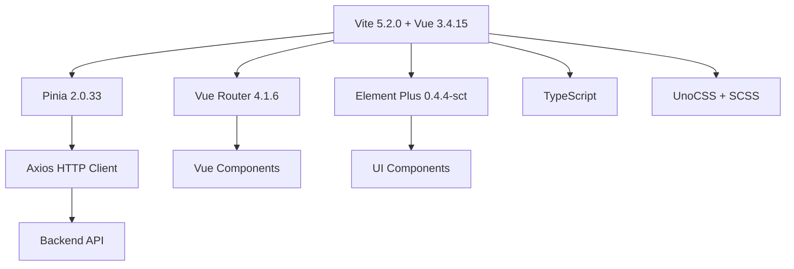
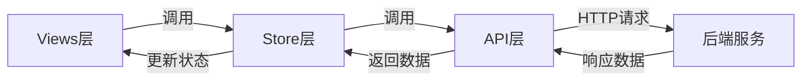
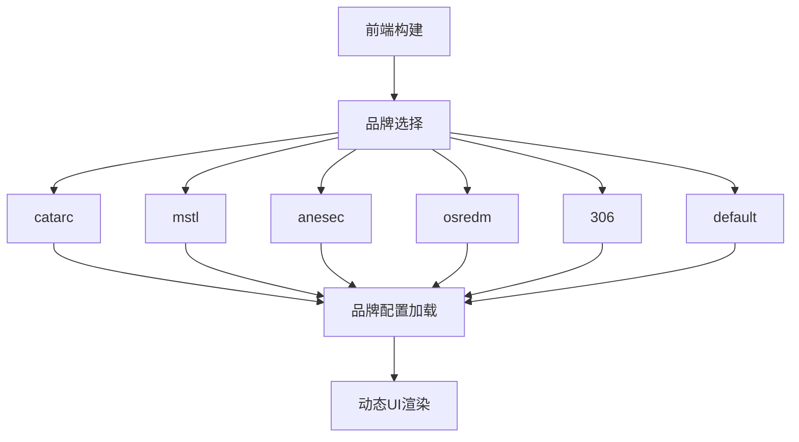
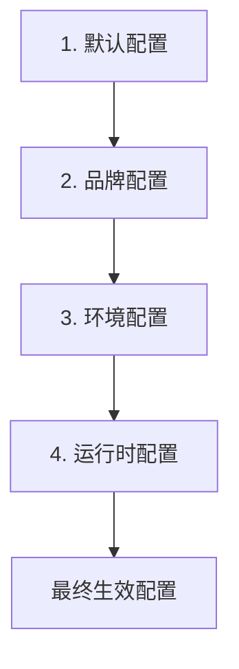
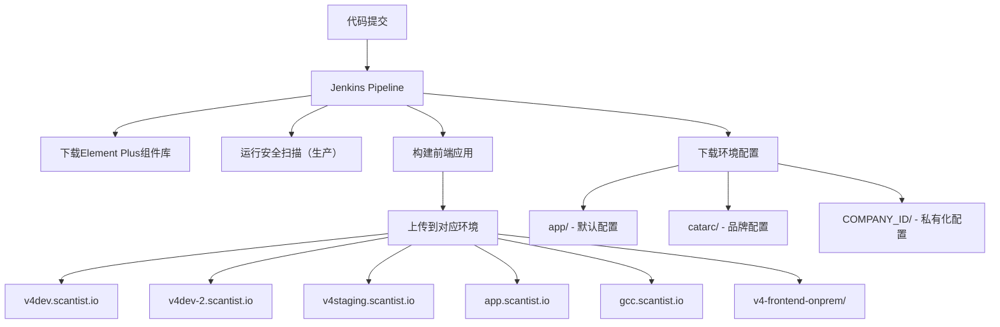

# 架构总览

本文档提供项目整体架构的鸟瞰图，包括技术栈、设计原则、目录结构和核心设计模式。

## 目录

- [技术栈详解](#技术栈详解)
- [架构设计原则](#架构设计原则)
- [目录结构图解](#目录结构图解)
- [构建部署流程](#构建部署流程)
- [性能优化策略](#性能优化策略)
- [安全设计](#安全设计)
- [扩展性设计](#扩展性设计)

---

## 技术栈详解

### 核心技术栈



### 技术选型说明

| 技术 | 版本 | 用途 | 选型理由 |
|------|------|------|----------|
| **Vue** | 3.4.15 | 前端框架 | Composition API、更好的TypeScript支持、性能优化 |
| **Vite** | 5.2.0 | 构建工具 | 极速开发服务器、优化的构建、原生ESM支持 |
| **Pinia** | 2.0.33 | 状态管理 | Vue官方推荐、类型安全、模块化设计 |
| **Vue Router** | 4.1.6 | 路由管理 | 与Vue 3深度集成、动态路由加载 |
| **Element Plus** | 0.4.4-sct | UI组件库 | 自定义构建版本、企业级组件、多主题支持 |
| **UnoCSS** | - | 原子化CSS | 按需生成、极小的CSS体积、灵活实用 |
| **TypeScript** | - | 类型系统 | 代码可维护性、IDE支持、减少错误 |
| **Monaco Editor** | 0.37.1 | 代码编辑器 | VS Code同款、语法高亮、差异对比 |
| **Axios** | - | HTTP客户端 | 请求拦截器、响应处理、错误处理 |

### 第三方库清单

#### 图表库
- **ECharts 5.4.2** - 数据可视化图表
- **D3.js 7.8.4** - 自定义数据可视化
- **AntV G6 4.8.24** - 图数据可视化（依赖关系图）

#### 编辑器
- **Monaco Editor 0.37.1** - 代码编辑器（代码查看、差异对比）

#### 认证
- **@okta/okta-signin-widget 7.6.0** - SSO认证集成

#### 分析
- **@segment/analytics-next 1.53.2** - 用户行为分析

#### 工具库
- **lodash-es 4.17.21** - 工具函数
- **moment 2.29.4** - 日期处理
- **moment-timezone 0.5.43** - 时区处理
- **qs 6.11.1** - URL参数解析
- **uuid 9.0.1** - UUID生成
- **jszip 3.10.1** - ZIP压缩/解压

#### Composables
- **@vueuse/core 10.7.2** - Vue Composition API工具库

#### 国际化
- **vue-i18n 9.2.2** - 多语言支持

---

## 架构设计原则

### 1. 模块化三层架构



**核心原则：**
- **关注点分离**：Views负责展示、Store负责状态、API负责数据访问
- **单向数据流**：API → Store → Views
- **可测试性**：每层可以独立测试
- **可维护性**：清晰的职责边界

### 2. 多品牌架构（Multi-tenant）



**实现机制：**
- 构建时配置（环境变量 `VITE_COMPANY_ID`）
- 动态加载品牌配置（`src/config/{brand}/`）
- 运行时配置覆盖（`window.company_env`）
- 动态登录页、主题、导航菜单

**详细说明：** [multibrand_config.md](./multibrand_config.md)

### 3. 配置驱动架构

**四级配置覆盖机制：**



**配置类型：**
- Feature Config（功能开关）
- Navigation Config（导航菜单）
- Table Config（表格配置）
- Company Config（公司信息）
- Sidebar Config（侧边栏）
- Environment Config（环境变量）

### 4. 组件化与可复用性

**组件层级：**
- **原子组件**：ElButton, ElInput等Element Plus基础组件
- **业务组件**：可复用组件（见 [component_library.md](./component_library.md)）
- **页面组件**：特定业务页面的组件
- **布局组件**：DashboardLayout, FilterContainerLayout等

**组件设计原则：**
- Props优先（数据驱动）
- Events通信（单向数据流）
- Scoped样式（样式隔离）
- TypeScript接口（类型安全）

### 5. 响应式设计

**断点设置：**
- 大屏：`> 1200px`（桌面显示器）
- 中屏：`768px - 1200px`（平板、小屏笔记本）
- 小屏：`< 768px`（手机）

**响应式策略：**
- CSS Grid/Flexbox布局
- 百分比宽度 + 最大宽度限制
- 媒体查询（Media Queries）
- 移动端优先（Mobile First）

---

## 目录结构图解

### 顶层目录

```
vue3-frontend/
├── public/                    # 静态资源
├── dev_docs/                  # 开发文档（AI辅助）
│   ├── AI_Coding_Context.md   # 主索引
│   ├── api_layer.md           # API文档
│   ├── stores_guide.md        # Store文档
│   └── ...                    # 其他子文档
│
├── src/
│   ├── api/                   # API接口层
│   ├── assets/                # 静态资源（图片、字体等）
│   ├── components/            # 全局公共组件
│   ├── composables/           # Composition函数
│   ├── config/                # 配置文件（多品牌）
│   ├── directives/            # 自定义指令
│   ├── language/              # 国际化语言包
│   ├── router/                # 路由配置
│   ├── services/              # 业务服务层
│   ├── stores/                # Pinia状态管理
│   ├── types/                 # TypeScript类型定义
│   ├── utils/                 # 工具函数
│   ├── views/                 # 业务页面
│   ├── App.vue                # 根组件
│   └── main.js                # 入口文件
│
├── package.json               # 依赖配置
├── vite.config.ts             # Vite配置
├── jsconfig.json              # JavaScript/TypeScript配置
└── README.md                  # 项目说明
```

### src/api/ 目录（API层）

```
src/api/
├── config/           # API配置
│   └── index.js      # Axios配置
├── chat.ts           # AI聊天
├── compliance.ts     # 合规管理
├── component.ts      # 组件管理
├── dataAdmin.ts      # 数据管理
├── general.ts        # 通用接口
├── license.ts        # 许可证管理
├── management.ts     # 组织成员管理
├── org.ts            # 组织管理
├── poc.ts            # POC验证
├── project.ts        # 项目管理
├── report.ts         # 报告管理
├── sast.ts           # SAST扫描
├── scan.ts           # 扫描管理
├── team.ts           # 团队管理
├── upload.ts         # 文件上传
├── utils.ts          # API工具
└── vulnerability.ts  # 漏洞管理
```

**总计18个API接口文件，3386行代码**

### src/types/ 目录（类型定义层）

```
src/types/
├── GeneralType.ts             # 通用类型定义
└── ...                        # 其他类型文件
```

**负责定义项目中使用的TypeScript类型，确保类型安全**

### src/services/ 目录（服务层）

```
src/services/
└── ...                        # 业务服务实现
```

**负责处理业务逻辑，连接API层和Store层**

### src/stores/ 目录（Store层）

```
src/stores/
├── admin/            # 系统管理
│   ├── actions.ts
│   ├── getters.ts
│   ├── index.ts
│   └── state.ts
│
├── chat/             # AI聊天
├── compliance/       # 合规管理
├── component/        # 组件管理
├── dataAdmin/        # 数据管理
├── general/          # 通用Store
├── license/          # 许可证管理
├── management/       # 组织成员管理
├── org/              # 组织管理
├── poc/              # POC验证
├── project/          # 项目管理
├── report/           # 报告管理
├── sast/             # SAST扫描
├── scan/             # 扫描管理
├── team/             # 团队管理
├── user/             # 用户管理
└── vulnerability/    # 漏洞管理

└── extractStore.ts   # Store提取工具
```

**总计16个Store模块**

### src/views/ 目录（Views层）

```
src/views/
├── admin/            # 系统管理
├── charts/           # 图表管理
├── compliance/       # 合规管理
├── component/        # 组件管理
│   └── components/   # 子组件
├── dataManagement/   # 数据管理
│   └── components/   # 子组件
│
├── home/             # 首页/仪表盘
│   └── components/   # 首页组件
│
├── layouts/          # 布局组件
│   └── content/      # 布局内容组件
│
├── login/            # 登录（多品牌实现）
│   ├── pages/        # 品牌登录页
│   └── components/   # 共享登录组件
│
├── management/       # 组织成员管理
├── modules/          # 全局模块（Icon, ThemeToggler等）
├── project/          # 项目管理
│   ├── components/   # 项目组件
│   └── SAAS/         # SaaS功能
│
├── report/           # 报告
│   └── PartialExportReportModal.vue
│
├── scan/             # 扫描管理
│   └── components/   # 扫描组件
│
├── setting/          # 设置
│   └── components/   # 设置组件
│
└── vulnerability/    # 漏洞管理
    └── components/   # 漏洞组件
```

**总计13个业务模块，288个Vue文件**

---

## 构建部署流程

### 开发环境

```bash
# 安装依赖
npm install

# 启动开发服务器
npm run dev

# 访问 http://localhost:3000
```

**开发特性：**
- HMR（热模块替换）
- Source Map
- 环境变量加载（`.env.development`）

### 生产构建

```bash
# 构建生产包
npm run build

# 输出到 dist/
dist/
├── index.html
├── assets/
│   ├── css/
│   ├── js/
│   ├── img/
│   └── fonts/
```

**构建优化：**
- 代码压缩（Terser）
- 代码分割（Code Splitting）
- Tree Shaking
- 资源优化（图片压缩）

### Vite配置详解

**文件：** [vite.config.ts](file:///D:/tanxun_code/000_main_project/vue3-frontend/vite.config.ts)

```typescript
export default defineConfig(({ mode }) => {
  return {
    // 路径别名
    resolve: {
      alias: {
        "@": resolve(__dirname, "./src"),
        fonts: resolve(__dirname, "src/assets/fonts"),
      },
    },

    // 开发服务器配置
    server: {
      host: true,
      https: !!env.HTTPS,  // 可选HTTPS
      headers: {           // 安全头
        "X-Content-Type-Options": "nosniff",
        "X-Frame-Options": "DENY",
        "X-XSS-Protection": "1; mode=block",
      },
    },

    // 插件配置
    plugins: [
      vue(),                   // Vue支持
      esbuildPlugin(),         // ESBuild（Vue文件）
      DefineOptions(),         // 定义选项
      Inspect(),               // 构建分析
      UnoCSS(),                // 原子化CSS
      monacoEditorPlugin({    // Monaco编辑器
        languageWorkers: ["editor", "css", "html", "json", "typescript"]
      }),
      postProcess(),           // 后处理
    ],

    // 构建配置
    build: {
      minify: "terser",        // 压缩工具
      rollupOptions: {
        output: {
          // 资源输出路径
          assetFileNames: (assetInfo) => {
            const ext = assetInfo.name.split(".").at(1);
            if (/png|jpe?g|svg|gif/i.test(ext)) {
              return `assets/img/[name][extname]`;
            } else if (/css|scss/i.test(ext)) {
              return `assets/css/[hash][extname]`;
            } else if (/otf|ttf/i.test(ext)) {
              return `assets/fonts/[name][extname]`;
            }
            return `assets/${ext}/[name][extname]`;
          },
          chunkFileNames: "assets/js/[name].js",
          entryFileNames: "assets/js/[name].js",
        },
      },
    },
  };
});
```

### 部署方案

#### Jenkins CI/CD流程（生产环境）

项目使用Jenkins实现自动化构建和部署，支持多品牌和多环境部署：



**部署环境说明：**
- **v4dev**: 开发环境（开发分支）
- **v4dev-2**: Catarc品牌开发环境
- **v4staging**: 预发布环境
- **app.scantist.io**: 生产环境
- **gcc**: GCC定制版
- **v4-frontend-onprem**: 私有化部署（支持多品牌）

**构建流程核心步骤：**
1. 安装pnpm并下载依赖
2. 下载品牌特定的Element Plus组件库
3. 根据品牌/环境复制对应的配置文件
4. 运行构建命令（build-dev/build-staging/build-catarc等）
5. 上传dist目录到对应环境的GCP存储桶

#### 静态托管（推荐）

```bash
# Nginx配置
server {
  listen 80;
  server_name your-domain.com;

  root /path/to/dist;
  index index.html;

  # 前端路由配置
  location / {
    try_files $uri $uri/ /index.html;
  }

  # 静态资源缓存
  location /assets {
    expires 1y;
    add_header Cache-Control "public, immutable";
  }
}
```

#### Docker部署

```dockerfile
# Dockerfile
FROM nginx:alpine

COPY dist/ /usr/share/nginx/html
COPY nginx.conf /etc/nginx/conf.d/default.conf

EXPOSE 80
```

**构建并运行：**
```bash
docker build -t vue3-frontend .
docker run -p 80:80 vue3-frontend
```

---

## 性能优化策略

### 1. 代码分割（Code Splitting）

```javascript
// 路由懒加载（已实施）
const routes = [
  {
    path: "/projects",
    component: () => import("@/views/project/Projects.vue")
  }
]

// 组件懒加载
const LazyComponent = defineAsyncComponent(() =>
  import("@/components/LazyComponent.vue")
)
```

### 2. 图片优化

- **现代格式**：使用WebP格式
- **懒加载**：使用 `loading="lazy"`
- **响应式图片**：`srcset` 属性
- **CDN托管**：静态资源放CDN

### 3. 依赖优化

- **按需加载**：Element Plus组件按需加载（自定义构建版）
- **Tree Shaking**：未使用的代码不打包
- **CDN引入**：大体积库使用CDN（如Monaco Editor）

### 4. 缓存策略

```javascript
// Vite配置中的缓存
build: {
  rollupOptions: {
    output: {
      assetFileNames: (assetInfo) => {
        let extType = assetInfo.name.split(".").at(1);
        if (/png|jpe?g|svg|gif|tiff|bmp|ico/i.test(extType)) {
          return `assets/img/[name][extname]`;
        } else if (/css|scss|less/i.test(extType)) {
          return `assets/css/[hash][extname]`;
        } else if (/otf|ttf/i.test(extType)) {
          return `assets/fonts/[name][extname]`;
        }
        return `assets/${extType}/[name][extname]`;
      },
      chunkFileNames: "assets/js/[name].js",
      entryFileNames: "assets/js/[name].js",
    },
  },
}
```

### 5. Monaco Editor优化

**分离Worker（已配置）：**
```javascript
monacoEditorPlugin({
  languageWorkers: [
    "editorWorkerService",
    "css",
    "html",
    "json",
    "typescript"
  ]
})
```

**效果：** 各Worker独立输出，减少主包体积

---

## 安全设计

### 1. 身份认证

- **Session管理**：JWT Token + HTTP Only Cookie
- **路由守卫**：`requiresAuth` meta字段
- **权限控制**：RBAC角色权限模型

### 2. 数据安全

- **HTTPS传输**：生产环境强制HTTPS
- **敏感数据加密**：API密钥、凭据加密存储
- **输入验证**：前端+后端双重验证

### 3. 安全头配置

```javascript
// 开发服务器已配置
server: {
  headers: {
    "X-Content-Type-Options": "nosniff",
    "X-Frame-Options": "DENY",
    "X-XSS-Protection": "1; mode=block"
  }
}
```

### 4. 依赖安全

- **定期扫描**：使用npm audit
- **及时更新**：及时更新漏洞依赖
- **最小权限**：只安装必要的依赖

---

## 扩展性设计

### 1. 模块化扩展

**添加新模块的标准流程：**

```
1. 创建API文件：src/api/moduleName.ts
2. 创建Store模块：src/stores/moduleName/
3. 创建Views页面：src/views/moduleName/
4. 配置路由：src/router/routes/moduleName.js
5. 在导航菜单注册
```

**详细说明：** [module_development_guide.md](./module_development_guide.md)

### 2. 多品牌扩展

**添加新品牌的步骤：**

```
1. 创建配置目录：src/config/{brand}/
2. 复制并修改配置文件
3. 创建登录页：src/views/login/pages/{Brand}LoginPage.vue
4. 在路由中添加条件判断
5. 添加路由元数据
6. 配置环境变量：VITE_COMPANY_ID={brand}
7. 构建并测试
8. 部署
```

**详细说明：** [multibrand_config.md](./multibrand_config.md)

### 3. 配置扩展

**运行时配置覆盖：**

```javascript
// window.company_env 可在运行时覆盖配置
window.company_env = {
  API_BASE: "https://custom-api.example.com",
  COMPANY_NAME: "Custom Company",
  featureConfig: {
    multiFactorAuth: true
  }
}
```

---

## 架构决策记录（ADR）

### ADR-001: 选择Vue 3而不是React

**决策：** 使用Vue 3作为前端框架

**理由：**
- 团队熟悉Vue生态系统
- 渐进式框架，易于迁移
- 优秀的TypeScript支持
- Composition API更灵活

**后果：**
- ✅ 正面：开发效率高、代码可维护性好
- ❌ 负面：React生态更丰富（部分库不可用）

### ADR-002: 使用Pinia而不是Vuex

**决策：** 使用Pinia作为状态管理

**理由：**
- Vue官方推荐（Vuex进入维护模式）
- 更好的TypeScript支持
- 更简洁的API
- 模块化设计更友好

**后果：**
- ✅ 正面：代码更简洁、类型更安全
- ✅ 正面：与Vue 3 Composition API配合更好

### ADR-003: 自定义Element Plus构建

**决策：** 使用自定义构建的Element Plus

**理由：**
- 减少打包体积（按需引入组件）
- 自定义主题和样式
- 移除不需要的组件
- 多品牌主题支持

**后果：**
- ✅ 正面：更小的包体积、更快的加载
- ⚠️ 注意：需要维护自定义构建流程

### ADR-004: Monaco Editor Workers分离

**决策：** 单独配置Monaco Editor的Workers

**理由：**
- 减少主包体积
- Workers并行加载
- 避免CSP问题
- 按需加载语言支持

**后果：**
- ✅ 正面：首屏加载更快
- ✅ 正面：更好的性能体验

---

## 扩展阅读

- [模块开发指南](./module_development_guide.md) - 如何添加新模块
- [多品牌配置系统](./multibrand_config.md) - 品牌定制详细说明
- [API接口层文档](./api_layer.md) - API架构和调用规范
- [Pinia状态管理](./stores_guide.md) - Store层架构设计
- [路由系统](./router_guide.md) - 路由架构和守卫
- [组件开发规范](./component_guide.md) - 组件架构标准

---

## 最后更新

**最后更新日期：** 2025-11-27
**适用版本：** v4.10.0
**文档维护：** 架构升级或技术选型变更时更新本文档
