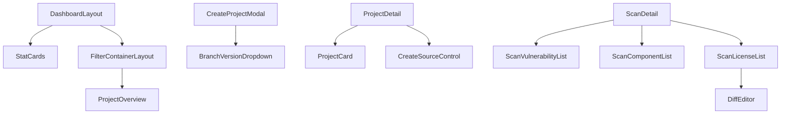

# 可复用组件清单

本清单汇总项目中所有可复用的Vue组件，按功能分类，提供组件说明和使用示例。

## 目录

- [全局组件](#全局组件)
- [布局组件](#布局组件)
- [表单组件](#表单组件)
- [数据展示组件](#数据展示组件)
- [反馈组件](#反馈组件)
- [业务组件](#业务组件)

---

## 全局组件

### 1. Icon 图标组件

**位置：** `src/views/modules/Icon.vue`

**功能：** 渲染Font Awesome或自定义图标

**Props：**
```typescript
const props = defineProps({
  src: {
    type: String,
    default: "",
  },
  state: {
    type: String as PropType<"default" | "disabled" | "unselected">,
    default: "default",
  },
  height: String,
  isClickable: {
    type: Boolean,
    default: true,
  },
})
```

**Emits：**
```typescript
const emit = defineEmits(["onClick"]);
```

**使用示例：**
```vue
<template>
  <!-- 基本使用 -->
  <Icon src="/assets/icons/user.svg" />
  
  <!-- 设置高度 -->
  <Icon src="/assets/icons/info.svg" height="24px" />
  
  <!-- 设置状态 -->
  <Icon src="/assets/icons/check.svg" state="disabled" />
  
  <!-- 可点击 -->
  <Icon src="/assets/icons/edit.svg" is-clickable @on-click="handleEdit" />
</template>
```

### 2. ThemeToggler 主题切换

**位置：** `src/views/modules/ThemeToggler.vue`

**功能：** 切换亮色/暗色主题

**使用示例：**
```vue
<template>
  <ThemeToggler />
</template>
```

### 3. LanguageDropdown 语言切换

**位置：** `src/views/modules/LanguageDropdown.vue`

**功能：** 切换系统语言

**使用示例：**
```vue
<template>
  <LanguageDropdown />
</template>
```

---

## 布局组件

### 4. DashboardLayout 仪表板布局

**位置：** `src/views/layouts/DashboardLayout.vue`

**功能：** 主布局容器，包含侧边栏、顶部导航和主内容区

**特性：**
- 侧边栏导航
- 顶部导航栏
- 通知中心
- 用户菜单

**使用示例：**
```javascript
// 路由配置
{
  path: "/",
  component: () => import("@/views/layouts/DashboardLayout.vue"),
  children: [...routes]
}
```

### 5. StatCards 统计卡片

**位置：** `src/views/home/components/StatCards.vue`

**功能：** 展示统计数据卡片

**Props：**
```typescript
const props = defineProps({
  counts: {
    type: Object,
    default: () => ({})
  },
  loading: {
    type: Boolean,
    default: false
  }
})
```

**使用示例：**
```vue
<template>
  <StatCards
    :counts="statistics"
    :loading="loading"
  />
</template>

<script setup>
const statistics = {
  project_count: 100,
  scan_count: 500,
  // ...
}
</script>
```

### 6. FilterContainerLayout 过滤容器

**位置：** `src/views/FilterContainerLayout.vue`

**功能：** 提供侧边过滤和面板的布局容器

---

## 表单组件

### 7. CreateSourceControl 创建源代码控制

**位置：** `src/views/project/components/CreateSourceControl.vue`

**功能：** 表单组件，用于创建源代码仓库集成

**Props：**
```typescript
const props = defineProps({
  modelValue: Boolean,
  edit: Boolean,
  sourceControl: Object
})
```

**Emits：**
```typescript
const emit = defineEmits(["update:modelValue", "onSuccess"])
```

**使用示例：**
```vue
<template>
  <CreateSourceControl
    v-model="showModal"
    :edit="false"
    @on-success="handleSuccess"
  />
</template>
```

### 8. BranchVersionDropdown 分支版本下拉框

**位置：** `src/views/project/components/BranchVersionDropdown.vue`

**功能：** 选择项目的分支或版本

**Props：**
```typescript
const props = defineProps({
  projectId: String,
  isScmProvider: Boolean,
  branch: String
})
```

**使用示例：**
```vue
<BranchVersionDropdown
  :project-id="project.id"
  :is-scm-provider="isScmProvider(project.provider)"
  v-model:branch="selectedBranch"
/>
```

### 9. CreateProjectModal 创建项目弹窗

**位置：** `src/views/project/components/CreateProjectModal.vue`

**功能：** 弹出式表单，创建新项目

### 10. FileUploadModal 文件上传弹窗

**位置：** `src/views/project/components/FileUploadModal.vue`

**功能：** 文件上传表单弹窗

---

## 数据展示组件

### 11. ProjectOverview 项目概览

**位置：** `src/views/project/components/ProjectOverview.vue`

**功能：** 展示项目统计信息（项目数、扫描数、扫描状态）

**Props：**
```typescript
const props = defineProps({
  totalProjects: Number,
  totalScans: Number,
  neverScanned: Number,
  outDateScans: Number,
  upToDateScans: Number
})
```

**使用示例：**
```vue
<template>
  <ProjectOverview
    :total-projects="summary.project_count"
    :total-scans="summary.scan_count"
    :never-scanned="summary.never_scanned"
    :out-date-scans="summary.outdated"
    :up-to-date-scans="summary.up_to_date"
  />
</template>
```

### 12. ProjectCard 项目卡片

**位置：** `src/views/project/components/ProjectCard.vue`

**功能：** 展示单个项目信息的卡片

### 13. ProjectStatusModal 项目状态弹窗

**位置：** `src/views/project/components/ProjectStatusModal.vue`

**功能：** 显示批量项目操作的结果状态

**Props：**
```typescript
const props = defineProps({
  modelValue: Boolean,
  projects: Array,
  title: String,
  type: String
})
```

**Emits：**
```typescript
const emit = defineEmits(["update:modelValue"])
```

### 14. SASTCodeCardSkeleton SAST代码卡片骨架屏

**位置：** `src/views/scan/components/SASTCodeCardSkeleton.vue`

**功能：** SAST扫描结果的骨架屏加载动画

**使用示例：**
```vue
<SASTCodeCardSkeleton />
```

### 15. DependencyChart 依赖关系图

**位置：** `src/views/scan/components/DependencyChart.vue`

**功能：** 可视化展示组件依赖关系

### 16. SbomDependencyTree SBOM依赖树

**位置：** `src/views/scan/components/SbomDependencyTree.vue`

**功能：** 展示SBOM的依赖树结构

### 17. ScanAdditionalSettings 扫描附加设置

**位置：** `src/views/scan/components/ScanAdditionalSettings.vue`

**功能：** 扫描配置面板

### 18. ScanComplianceList 扫描合规列表

**位置：** `src/views/scan/components/ScanComplianceList.vue`

**功能：** 展示扫描的合规性检查结果

### 19. ScanComponentList 扫描组件列表

**位置：** `src/views/scan/components/ScanComponentList.vue`

**功能：** 扫描发现的组件清单

### 20. ScanFileList 扫描文件列表

**位置：** `src/views/scan/components/ScanFileList.vue`

**功能：** 扫描涉及的文件清单

### 21. ScanLicenseList 扫描许可证列表

**位置：** `src/views/scan/components/ScanLicenseList.vue`

**功能：** 扫描发现的许可证清单

### 22. ScanRemediationList 扫描修复建议列表

**位置：** `src/views/scan/components/ScanRemediationList.vue`

**功能：** 展示漏洞修复建议

### 23. ScanVulnerabilityList 扫描漏洞列表

**位置：** `src/views/scan/components/ScanVulnerabilityList.vue`

**功能：** 扫描发现的漏洞清单

**Props：**
```typescript
const props = defineProps({
  vulnerabilities: Array,
  severityFilter: String,
  showFileName: {
    type: Boolean,
    default: false
  }
})
```

### 24. SeverityLevelAlert 严重级别警告

**位置：** `src/views/scan/components/SeverityLevelAlert.vue`

**功能：** 根据严重级别显示警告信息

**Props：**
```typescript
const props = defineProps({
  severity: String,
  message: String
})
```

### 25. DiffEditor 差异编辑器

**位置：** `src/views/scan/components/content/DiffEditor.vue`

**功能：** Monaco Editor实现的代码差异对比

**Props：**
```typescript
const props = defineProps({
  id: String,
  original: String,
  modified: String,
  boxHeight: String,
  language: String,
  wordWrap: String,
  startLineNumber: Number,
  highlightRange: Object,
  className: String
})
```

**使用示例：**
```vue
<DiffEditor
  id="diff-editor"
  :original="originalCode"
  :modified="fixedCode"
  box-height="400px"
  language="javascript"
  :start-line-number="1"
/>
```

### 26. ComponentDetail 组件详情

**位置：** `src/views/scan/components/content/ComponentDetail.vue`

**功能：** 展示组件详细信息

### 27. ScrollableCodeSegment 可滚动代码段

**位置：** `src/views/scan/components/content/ScrollableCodeSegment.vue`

**功能：** 带滚动条的代码展示区域

---

## 反馈组件

### 28. ScanLogModal 扫描日志弹窗

**位置：** `src/views/scan/components/ScanLogModal.vue`

**功能：** 显示扫描任务的详细日志

**Props：**
```typescript
const props = defineProps({
  modelValue: Boolean,
  scanLogs: Array
})
```

**Emits：**
```typescript
const emit = defineEmits(["update:modelValue"])
```

### 29. ScanReportModal 扫描报告弹窗

**位置：** `src/views/scan/components/ScanReportModal.vue`

**功能：** 显示扫描报告详情

### 30. SuppressVulnerabilityModal 抑制漏洞弹窗

**位置：** `src/views/scan/components/SuppressVulnerabilityModal.vue`

**功能：** 抑制（忽略）特定漏洞的弹窗表单

---

## 业务组件

### 31. ChatTemplate AI聊天模板

**位置：** `src/views/project/components/SAAS/ChatTemplate.vue`

**功能：** AI聊天对话界面

### 32. SAASCodeFileItem SAAS代码文件项

**位置：** `src/views/project/components/SAAS/CodeTracebilityAnalysisComponents/SAASCodeFileItem.vue`

**功能：** 代码追溯分析中的单个文件项

### 33. CodeTraceDiffModal 代码追溯差异弹窗

**位置：** `src/views/project/components/SAAS/CodeTracebilityAnalysisComponents/CodeTraceDiffModal.vue`

**功能：** 显示代码文件差异

### 34. LicensesCopyright 许可证版权

**位置：** `src/views/project/components/SAAS/CodeTracebilityAnalysisComponents/LicensesCopyright.vue`

**功能：** 展示许可证版权信息

### 35. TopFiveProjctsView 前五项目视图

**位置：** `src/views/home/components/home/TopFiveProjctsView.vue`

**功能：** 展示风险最高的前5个项目

### 36. VulnerabilityAlertList 漏洞警告列表

**位置：** `src/views/home/components/home/VulnerabilityAlertList.vue`

**功能：** 显示漏洞警告列表

---

## Element Plus扩展组件

### 使用说明

项目基于Element Plus进行了扩展，常用组件：

```vue
<!-- 自定义弹窗 -->
<el-custom-popup
  v-model="visible"
  title="Title"
  width="600px"
  @close="handleClose"
>
  <!-- 内容 -->
</el-custom-popup>

<!-- 静态卡片 -->
<el-static-card small>
  <!-- 内容 -->
</el-static-card>

<!-- 主表格 -->
<el-master-table
  v-loading="loading"
  :data="tableData"
  :columns="columns"
  :pagination-props="pagination"
/>

<!-- 自定义标签 -->
<el-custom-tag type="success" effect="plain">
  Success
</el-custom-tag>
```

**完整Element Plus说明：** 参见 [component_guide.md](./component_guide.md)

---

## 组件使用统计

### 按业务模块统计

| 模块 | 组件数量 | 主要组件 |
|------|----------|----------|
| home | 12 | StatCards, TopFiveProjectsView, VulnerabilityAlertList |
| project | 20+ | ProjectCard, ProjectOverview, CreateProjectModal, ChatTemplate |
| scan | 30+ | ScanVulnerabilityList, ScanComponentList, DiffEditor, SASTCodeCardSkeleton |
| setting | 15+ | CreateTeamModal, CreateTokenModal, IntegrationCard |
| vulnerability | 10+ | VulnerabilityDetail, VulnerabilityList |
| compliance | 8+ | ComplianceList, ScanComplianceList |

### 组件复杂度分布

| 复杂度 | 数量 | 示例 |
|--------|------|------|
| 简单展示 | 40+ | StatCards, ProjectOverview, SeverityLevelAlert |
| 中等交互 | 25+ | CreateProjectModal, BranchVersionDropdown, FilterContainerLayout |
| 复杂业务 | 15+ | DiffEditor, ChatTemplate, ScanRemediationList |

---

## 组件开发注意事项

### 组件复用性评估

在开发新组件前，检查是否可以复用现有组件：

1. **表单类**：检查CreateProjectModal、CreateSourceControl等
2. **列表类**：检查ScanVulnerabilityList、ScanComponentList等
3. **弹窗类**：检查ScanLogModal、FileUploadModal等
4. **数据展示**：检查StatCards、ProjectOverview等

### 组件扩展性

- **Props优先**：使用Props传递数据，而非硬编码
- **Events通信**：使用Emits与父组件通信
- **插槽支持**：提供插槽（slot）供自定义内容
- **TypeScript**：优先使用TypeScript定义接口

### 组件文档

新增可复用组件时，请在本文档中登记：

```markdown
### 37. NewComponent 新组件

**位置：** `src/views/module/components/NewComponent.vue`

**功能：** 组件功能描述

**Props：**
```typescript
const props = defineProps({
  prop1: String,
  prop2: {
    type: Number,
    default: 0
  }
})
```

**Emits：**
```typescript
const emit = defineEmits(["event1", "event2"])
```

**使用示例：**
```vue
<NewComponent
  prop1="value"
  :prop2="100"
  @event1="handleEvent1"
/>
```
```

---

## 组件依赖关系



---

## 扩展阅读

- [组件开发规范](./component_guide.md) - 组件开发标准
- [模块开发指南](./module_development_guide.md) - 业务模块组件组织

---

## 最后更新

**最后更新日期：** 2025-11-26
**适用版本：** v4.10.0
**文档维护：** 新增可复用组件时请同步更新本文档
