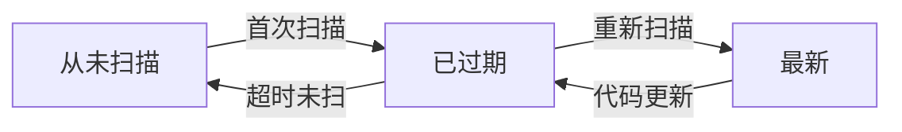
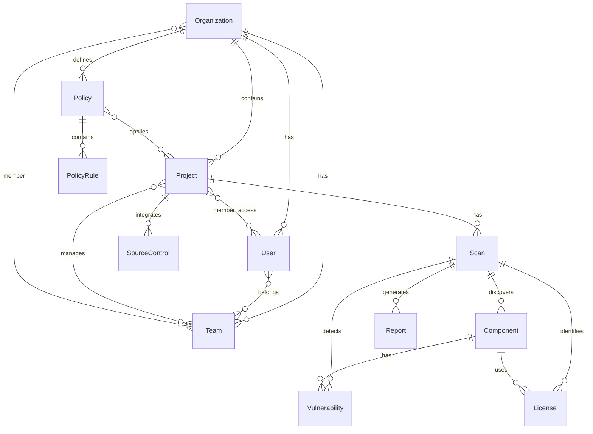
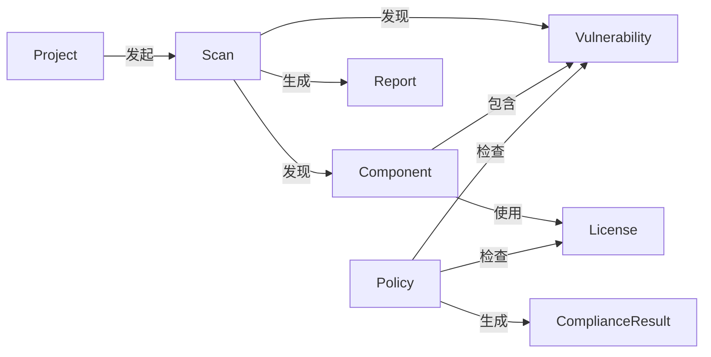
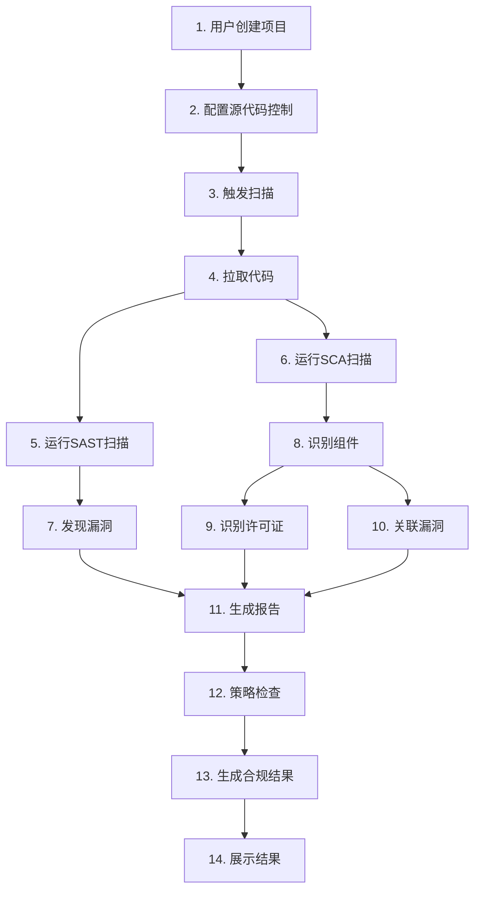
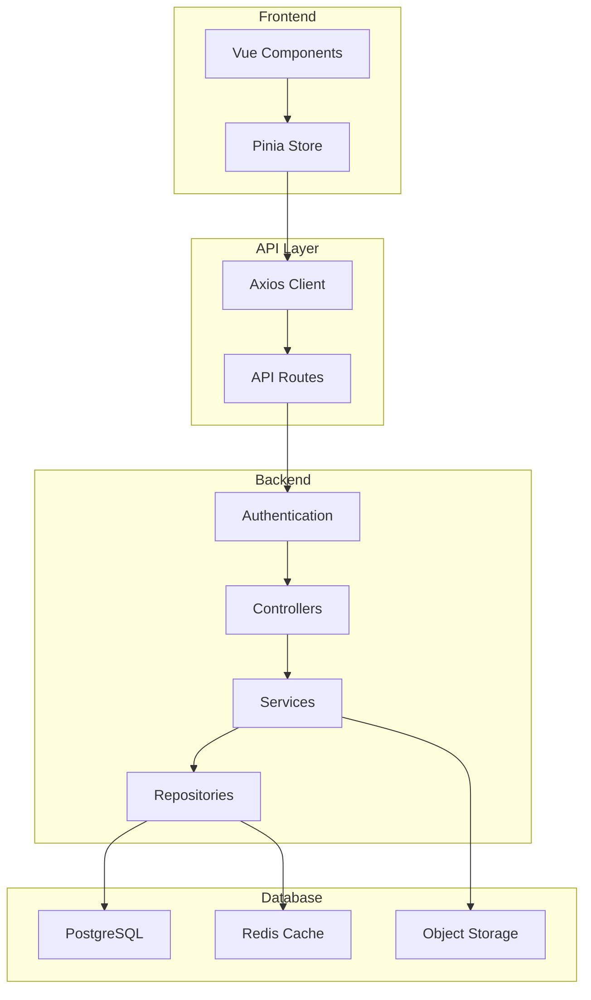
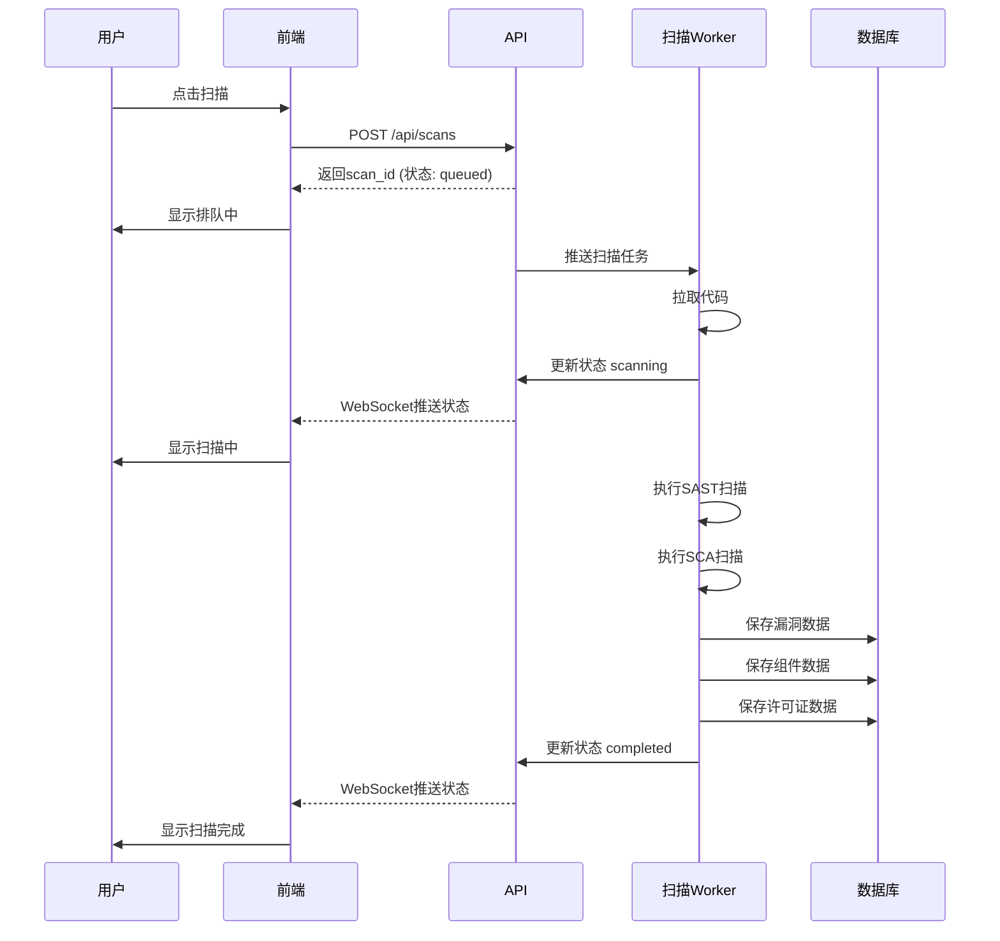
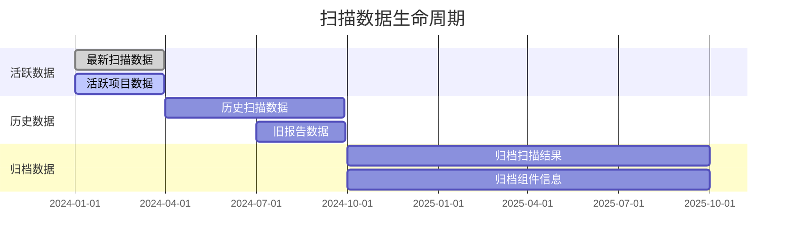

# 数据关系与核心概念

本文档描述系统的核心业务实体、数据关系、状态流转和业务流程。

## 目录

- [核心实体](#核心实体)
- [实体关系图](#实体关系图)
- [数据流转](#数据流转)
- [状态字段说明](#状态字段说明)
- [核心业务流程](#核心业务流程)
- [API与实体对应关系](#api与实体对应关系)

---

## 核心实体

### 1. Organization（组织）

**描述：** 租户/组织实体，数据隔离的基本单位

**关键属性：**
```typescript
interface Organization {
  id: number
  name: string
  display_name: string
  created_at: string
  updated_at: string
  org_tags: OrgTag[]
  policies: Policy[]
  teams: Team[]
}
```

**API对应：** [src/api/org.ts](file:///D:/tanxun_code/000_main_project/vue3-frontend/src/api/org.ts)

**相关Store：** [src/stores/org/](file:///D:/tanxun_code/000_main_project/vue3-frontend/src/stores/org/)

**视图：**
- 组织选择页：`/select-org`
- 组织详情：`/org/:org_id`

---

### 2. Project（项目）

**描述：** 源代码项目，扫描的基本单元

**关键属性：**
```typescript
interface Project {
  id: number
  org_id: number
  project_name: string
  description: string
  status: "active" | "inactive"
  provider: "github" | "gitlab" | "gitea" | "other"
  scm_connected: boolean
  branch: string
  tags: ProjectTag[]
  source_controls: SourceControl[]
  created_at: string
  updated_at: string
}
```

**状态流转：**



**API对应：** [src/api/project.ts](file:///D:/tanxun_code/000_main_project/vue3-frontend/src/api/project.ts)

**相关Store：** [src/stores/project/](file:///D:/tanxun_code/000_main_project/vue3-frontend/src/stores/project/)

**视图：**
- 项目列表：`/org/:org_id/projects`
- 项目详情：`/org/:org_id/projects/:project_id`

---

### 3. Scan（扫描）

**描述：** 一次完整的代码扫描任务

**关键属性：**
```typescript
interface Scan {
  id: number
  project_id: number
  status: "queued" | "scanning" | "completed" | "failed"
  scan_type: "sast" | "sca" | "license" | "compliance"
  branch: string
  commit_hash: string
  scan_engines: string[]
  created_at: string
  started_at: string
  completed_at: string
  stats: {
    vulnerabilities: number
    components: number
    licenses: number
    policies: number
  }
}
```

**扫描引擎类型：**
- SAST（静态应用安全测试）
- SCA（软件成分分析）
- 许可证扫描
- 合规性扫描

**API对应：** [src/api/scan.ts](file:///D:/tanxun_code/000_main_project/vue3-frontend/src/api/scan.ts)

**相关Store：** [src/stores/scan/](file:///D:/tanxun_code/000_main_project/vue3-frontend/src/stores/scan/)

**视图：**
- 扫描详情：`/org/:org_id/projects/:project_id`

---

### 4. Component（软件组件）

**描述：** 扫描发现的第三方软件组件

**关键属性：**
```typescript
interface Component {
  id: number
  scan_id: number
  name: string
  version: string
  purl: string
  licenses: License[]
  vulnerabilities: Vulnerability[]
  risk_score: number
  direct: boolean
}
```

**API对应：** [src/api/component.ts](file:///D:/tanxun_code/000_main_project/vue3-frontend/src/api/component.ts)

**相关Store：** [src/stores/component/](file:///D:/tanxun_code/000_main_project/vue3-frontend/src/stores/component/)

---

### 5. Vulnerability（漏洞）

**描述：** 发现的安全漏洞

**关键属性：**
```typescript
interface Vulnerability {
  id: number
  scan_id: number
  component_id: number
  vuln_id: string
  title: string
  description: string
  severity: "Critical" | "High" | "Medium" | "Low" | "Info"
  cvss_score: number
  cve: string
  cwe: string
  fixed_in: string[]
  references: string[]
  suppress: boolean
}
```

**严重级别：**
- Critical（严重）：9.0-10.0
- High（高危）：7.0-8.9
- Medium（中危）：4.0-6.9
- Low（低危）：0.1-3.9
- Info（信息）：0

**API对应：** [src/api/vulnerability.ts](file:///D:/tanxun_code/000_main_project/vue3-frontend/src/api/vulnerability.ts)

**相关Store：** [src/stores/vulnerability/](file:///D:/tanxun_code/000_main_project/vue3-frontend/src/stores/vulnerability/)

---

### 6. License（许可证）

**描述：** 软件组件的许可证信息

**关键属性：**
```typescript
interface License {
  id: number
  component_id: number
  license_id: string
  name: string
  spdx_id: string
  risk_level: "low" | "medium" | "high"
  copyright: string
}
```

**许可证风险：**
- low（低风险）：MIT, Apache 2.0, BSD
- medium（中风险）：LGPL
- high（高风险）：GPL, Copyleft

**API对应：** [src/api/license.ts](file:///D:/tanxun_code/000_main_project/vue3-frontend/src/api/license.ts)

**相关Store：** [src/stores/license/](file:///D:/tanxun_code/000_main_project/vue3-frontend/src/stores/license/)

---

### 7. Policy（策略）

**描述：** 合规性策略和规则

**关键属性：**
```typescript
interface Policy {
  id: number
  org_id: number
  policy_name: string
  policy_type: "vulnerability" | "license" | "compliance"
  rules: PolicyRule[]
  enabled: boolean
}

interface PolicyRule {
  field: string
  operator: "equals" | "contains" | "greater_than" | "less_than"
  value: string
}
```

**API对应：** [src/api/compliance.ts](file:///D:/tanxun_code/000_main_project/vue3-frontend/src/api/compliance.ts)

**相关Store：** [src/stores/compliance/](file:///D:/tanxun_code/000_main_project/vue3-frontend/src/stores/compliance/)

---

### 8. SourceControl（源代码控制）

**描述：** 项目与代码仓库的集成配置

**关键属性：**
```typescript
interface SourceControl {
  id: number
  project_id: number
  provider: string
  base_url: string
  repo_name: string
  credentials: Credentials
  webhook_enabled: boolean
  auto_scan: boolean
}
```

**支持的提供商：**
- GitHub
- GitLab
- Gitea
- Gerrit

---

### 9. User（用户）

**描述：** 系统用户

**关键属性：**
```typescript
interface User {
  id: number
  name: string
  email: string
  role: "owner" | "admin" | "manager" | "developer" | "viewer"
  avatar: string
  orgs: Organization[]
  teams: Team[]
  mfa_enabled: boolean
}
```

**角色权限：**
- owner：组织所有者，拥有所有权限
- admin：管理员，管理组织和项目
- manager：项目经理，管理项目
- developer：开发者，查看和扫描
- viewer：只读权限

**API对应：** [src/api/general.ts](file:///D:/tanxun_code/000_main_project/vue3-frontend/src/api/general.ts)

**相关Store：** [src/stores/general/](file:///D:/tanxun_code/000_main_project/vue3-frontend/src/stores/general/)
---

### 10. Report（报告）

**描述：** 扫描报告和合规性报告

**关键属性：**
```typescript
interface Report {
  id: number
  org_id: number
  project_id: number
  scan_id: number
  report_type: "executive" | "technical" | "compliance"
  format: "pdf" | "html" | "json"
  generated_at: string
  filter: ReportFilter
  sections: ReportSection[]
}

interface ReportFilter {
  severities: string[]
  components: number[]
  vulnerability_types: string[]
}
```

---

## 实体关系图

### 核心实体关系



### 扫描流转关系



---

## 数据流转

### 完整扫描流程



### 数据存储架构



---

## 状态字段说明

### 项目状态

| 状态值 | 说明 | 颜色标识 | 业务含义 |
|--------|------|----------|----------|
| never | 从未扫描 | 灰色 | 项目创建后未执行过扫描 |
| outdated | 已过期 | 橙色 | 扫描结果已过时（代码有更新） |
| up-to-date | 最新 | 绿色 | 扫描结果是最新的 |

### 扫描状态

| 状态值 | 说明 | 图标 | 业务含义 |
|--------|------|------|----------|
| queued | 排队中 | ⏳ | 等待扫描引擎资源 |
| scanning | 扫描中 | 🔄 | 正在执行扫描 |
| completed | 已完成 | ✅ | 扫描成功完成 |
| failed | 失败 | ❌ | 扫描执行失败 |

**状态流转：**
```mermaid
graph LR
    A[queued] --> B[scanning]
    B --> C[completed]
    B --> D[failed]
    D --> A  retry
```

### 漏洞严重级别

| 级别 | 分数范围 | 颜色标识 | 业务影响 | 处理优先级 |
|------|----------|----------|----------|------------|
| Critical | 9.0-10.0 | 🔴 红色 | 高危漏洞，可远程利用 | 立即处理 |
| High | 7.0-8.9 | 🟠 橙色 | 高危漏洞，条件利用 | 24小时内 |
| Medium | 4.0-6.9 | 🟡 黄色 | 中等风险 | 1周内 |
| Low | 0.1-3.9 | 🟢 绿色 | 低风险 | 按需处理 |
| Info | 0 | 🔵 蓝色 | 信息性 | 无需处理 |

### 许可证风险

| 风险级别 | 许可证示例 | 说明 | 合规要求 |
|----------|------------|------|----------|
| low | MIT, Apache, BSD | 商业友好 | 无特殊要求 |
| medium | LGPL, EPL | 有要求 | 需保留版权声明 |
| high | GPL, AGPL, Copyleft | 传染性 | 需开源衍生代码 |

### 组织成员角色

| 角色 | 权限范围 | 适用场景 |
|------|----------|----------|
| owner | 所有权限，管理组织 | 组织所有者 |
| admin | 管理组织、项目、成员 | 组织管理员 |
| manager | 管理项目、邀请成员 | 项目经理 |
| developer | 查看项目、触发扫描 | 开发人员 |
| viewer | 只读权限 | 审计人员 |

**权限继承：**
```mermaid
graph BT
    Viewer --< Developer
    Developer --< Manager
    Manager --< Admin
    Admin --< Owner
```

---

## 核心业务流程

### 流程1：创建项目

**步骤：**
1. 访问项目列表页：`/org/:org_id/projects`
2. 点击"创建项目"按钮
3. 填写项目信息：
   - 项目名称（必填）
   - 描述（可选）
   - 标签（可选）
4. 选择源代码控制类型：
   - GitHub
   - GitLab
   - Gitea
   - 其他（手动上传）
5. 配置SCM凭据（如需要）
6. 提交创建

**API调用：**
```javascript
// 1. 创建项目
POST /api/projects
{
  "project_name": "My Project",
  "org_id": 123,
  ...
}

// 2. 创建源代码控制（可选）
POST /api/projects/:project_id/source_controls
{
  "provider": "github",
  "repo_name": "myrepo",
  ...
}
```

**相关组件：**
- [CreateProjectModal.vue](file:///D:/tanxun_code/000_main_project/vue3-frontend/src/views/project/components/CreateProjectModal.vue)
- [CreateSourceControl.vue](file:///D:/tanxun_code/000_main_project/vue3-frontend/src/views/project/components/CreateSourceControl.vue)
- [ProjectCard.vue](file:///D:/tanxun_code/000_main_project/vue3-frontend/src/views/project/components/ProjectCard.vue)

---

### 流程2：触发扫描

**步骤：**
1. 访问项目详情页：`/org/:org_id/projects/:project_id`
2. 点击"扫描"按钮
3. 选择扫描引擎：
   - SAST（安全扫描）
   - SCA（成分分析）
   - 许可证扫描
   - 合规性扫描
4. 选择分支/版本
5. 选择合规策略
6. 提交扫描任务

**扫描状态流转：**


**API调用：**
```javascript
// 触发扫描
POST /api/scans
{
  "project_id": 456,
  "scan_engines": ["sast", "sca", "license"],
  "branch": "main",
  "compliance_id": 789
}

// 查询扫描状态
GET /api/scans/:scan_id
```

**相关组件：**
- [ScanModal.vue](file:///D:/tanxun_code/000_main_project/vue3-frontend/src/views/project/ScanModal.vue)
- [BranchVersionDropdown.vue](file:///D:/tanxun_code/000_main_project/vue3-frontend/src/views/project/components/BranchVersionDropdown.vue)
- [ScanInProgress.vue](file:///D:/tanxun_code/000_main_project/vue3-frontend/src/views/scan/components/ScanInProgress.vue)

---

### 流程3：查看扫描结果

**步骤：**
1. 访问项目详情页
2. 查看扫描历史
3. 点击扫描记录
4. 切换不同标签页：
   - 漏洞（Vulnerabilities）
   - 组件（Components）
   - 许可证（Licenses）
   - 合规性（Compliance）
5. 查看详情

**相关组件：**
- [ScanVulnerabilityList.vue](file:///D:/tanxun_code/000_main_project/vue3-frontend/src/views/scan/components/ScanVulnerabilityList.vue)
- [ScanComponentList.vue](file:///D:/tanxun_code/000_main_project/vue3-frontend/src/views/scan/components/ScanComponentList.vue)
- [ScanLicenseList.vue](file:///D:/tanxun_code/000_main_project/vue3-frontend/src/views/scan/components/ScanLicenseList.vue)
- [ScanComplianceList.vue](file:///D:/tanxun_code/000_main_project/vue3-frontend/src/views/scan/components/ScanComplianceList.vue)

---

### 流程4：漏洞修复流程

**步骤：**
1. 查看漏洞列表，筛选严重级别
2. 点击漏洞查看详情
3. 查看漏洞说明
4. 查看推荐修复版本
5. 查看受影响项目
6. 创建修复PR（如支持）

**相关组件：**
- [ScanRemediationList.vue](file:///D:/tanxun_code/000_main_project/vue3-frontend/src/views/scan/components/ScanRemediationList.vue)
- [RecommendPatchedVersion.vue](file:///D:/tanxun_code/000_main_project/vue3-frontend/src/views/scan/components/ScanRemediationDetail/RecommendPatchedVersion.vue)
- [RaisePrModal.vue](file:///D:/tanxun_code/000_main_project/vue3-frontend/src/views/scan/components/ScanRemediationDetail/RaisePrModal.vue)
- [VulnerabilityExplanation.vue](file:///D:/tanxun_code/000_main_project/vue3-frontend/src/views/scan/components/ScanRemediationDetail/VulnerabilityExplanation.vue)

---

### 流程5：合规性检查

**步骤：**
1. 创建合规策略
2. 定义规则（针对漏洞、许可证、组件）
3. 关联策略到扫描
4. 查看不合规项目
5. 生成合规报告

**相关组件：**
- [CreatePolicyModal.vue](file:///D:/tanxun_code/000_main_project/vue3-frontend/src/views/setting/components/CreatePolicyModal.vue)
- [OrganizationPoliciesWrapper.vue](file:///D:/tanxun_code/000_main_project/vue3-frontend/src/views/setting/components/OrganizationPoliciesWrapper.vue)
- [ComplianceList.vue](file:///D:/tanxun_code/000_main_project/vue3-frontend/src/views/compliance/components/ComplianceList.vue)

---

### 流程6：生成报告

**步骤：**
1. 选择报告类型（管理报告、技术报告、合规报告）
2. 选择过滤条件（严重级别、组件等）
3. 选择格式（PDF/HTML/JSON）
4. 生成报告
5. 下载报告

**相关API：**
```javascript
// 生成报告
POST /api/reports
{
  "project_id": 456,
  "scan_id": 789,
  "report_type": "executive",
  "format": "pdf",
  "filter": {
    "severities": ["Critical", "High"]
  }
}
```

---

## API与实体对应关系

### 模块对应表

| 实体 | API文件 | Store模块 | Views模块 | 主要组件 |
|------|---------|-----------|-----------|----------|
| Organization | [org.ts](file:///D:/tanxun_code/000_main_project/vue3-frontend/src/api/org.ts) | [org/](file:///D:/tanxun_code/000_main_project/vue3-frontend/src/stores/org/) | home | OrgDetail, SelectOrg |
| Project | [project.ts](file:///D:/tanxun_code/000_main_project/vue3-frontend/src/api/project.ts) | [project/](file:///D:/tanxun_code/000_main_project/vue3-frontend/src/stores/project/) | project | Projects, ProjectCard, ProjectOverview |
| Scan | [scan.ts](file:///D:/tanxun_code/000_main_project/vue3-frontend/src/api/scan.ts) | [scan/](file:///D:/tanxun_code/000_main_project/vue3-frontend/src/stores/scan/) | scan | ScanDetail, ScanInProgress |
| Component | [component.ts](file:///D:/tanxun_code/000_main_project/vue3-frontend/src/api/component.ts) | [component/](file:///D:/tanxun_code/000_main_project/vue3-frontend/src/stores/component/) | scan, component | ScanComponentList, ComponentDetail |
| Vulnerability | [vulnerability.ts](file:///D:/tanxun_code/000_main_project/vue3-frontend/src/api/vulnerability.ts) | [vulnerability/](file:///D:/tanxun_code/000_main_project/vue3-frontend/src/stores/vulnerability/) | vulnerability, scan | ScanVulnerabilityList, VulnerabilityDetail |
| License | [license.ts](file:///D:/tanxun_code/000_main_project/vue3-frontend/src/api/license.ts) | [license/](file:///D:/tanxun_code/000_main_project/vue3-frontend/src/stores/license/) | scan | ScanLicenseList, LicenseDetail |
| Policy | [compliance.ts](file:///D:/tanxun_code/000_main_project/vue3-frontend/src/api/compliance.ts) | [compliance/](file:///D:/tanxun_code/000_main_project/vue3-frontend/src/stores/compliance/) | compliance, setting | CreatePolicyModal, ComplianceList |
| User | [general.ts](file:///D:/tanxun_code/000_main_project/vue3-frontend/src/api/general.ts) | [user/](file:///D:/tanxun_code/000_main_project/vue3-frontend/src/stores/user/) | login, setting | UserProfile, TeamManagement |
| Report | [report.ts](file:///D:/tanxun_code/000_main_project/vue3-frontend/src/api/report.ts) | [report/](file:///D:/tanxun_code/000_main_project/vue3-frontend/src/stores/report/) | report | ReportGeneration |

### API调用示例

#### 查询机构项目

```typescript
// API层
export const getOrgProjects = (orgId, params) => {
  return axios.get(`/api/orgs/${orgId}/projects`, { params })
}

// Store层
export async function fetchProjects() {
  this.loading = true
  try {
    const res = await getOrgProjects(this.orgId, this.queryParams)
    this.projects = res.data.items
    this.total = res.data.total
  } finally {
    this.loading = false
  }
}

// 组件层
const orgStore = useOrgStore()
const projectStore = useProjectStore()

onMounted(() => {
  orgStore.fetchOrgDetail(orgId)
  projectStore.fetchProjects()
})
```

#### 查询扫描漏洞

```typescript
// API层
export const getScanVulnerabilities = (scanId, params) => {
  return axios.get(`/api/scans/${scanId}/vulnerabilities`, { params })
}

// Store层
export async function fetchVulnerabilities() {
  this.loading = true
  try {
    const res = await getScanVulnerabilities(this.scanId, {
      severity: this.severityFilter
    })
    this.vulnerabilities = res.data.items
  } finally {
    this.loading = false
  }
}
```

#### 创建策略

```typescript
// API层
export const createPolicy = (data) => {
  return axios.post("/api/policies", data)
}

// Store层
export async function createPolicy(data) {
  try {
    await createPolicy(data)
    ElMessage.success("策略创建成功")
    await this.fetchPolicies()
    return true
  } catch (error) {
    ElMessage.error("创建失败")
    return false
  }
}
```

---

## 数据库索引建议

### 高频查询字段

1. **projects表**：
   - org_id（按组织查询）
   - status（状态筛选）
   - created_at（时间排序）

2. **scans表**：
   - project_id（按项目查询）
   - status（状态查询）
   - created_at（时间排序）

3. **vulnerabilities表**：
   - scan_id（按扫描查询）
   - severity（级别筛选）
   - vuln_id（按CVE查询）

4. **components表**：
   - scan_id（按扫描查询）
   - purl（按组件查询）
   - risk_score（风险排序）

5. **licenses表**：
   - component_id（按组件查询）
   - spdx_id（按许可证查询）

---

## 数据备份和归档

### 扫描数据生命周期



### 归档策略

| 数据类型 | 保留期限 | 归档时机 | 归档位置 |
|----------|----------|----------|----------|
| 扫描详情 | 1年 | 扫描1年后 | 冷存储 |
| 漏洞详情 | 2年 | 漏洞修复后1年 | 归档数据库 |
| 报告文件 | 永久 | 生成后立即 | 对象存储 |
| 日志文件 | 30天 | 30天后 | 删除 |

---

## 扩展阅读

- [模块开发指南](./module_development_guide.md) - 各模块API、Store和Views的完整对应关系
- [API接口层文档](./api_layer.md) - 完整的API调用示例
- [Pinia状态管理](./stores_guide.md) - Store层详细使用说明
- [可复用组件清单](./component_library.md) - 组件与数据实体的绑定关系

---

## 最后更新

**最后更新日期：** 2025-11-26
**适用版本：** v4.10.0
**文档维护：** 新增实体或修改数据结构时更新本文档
