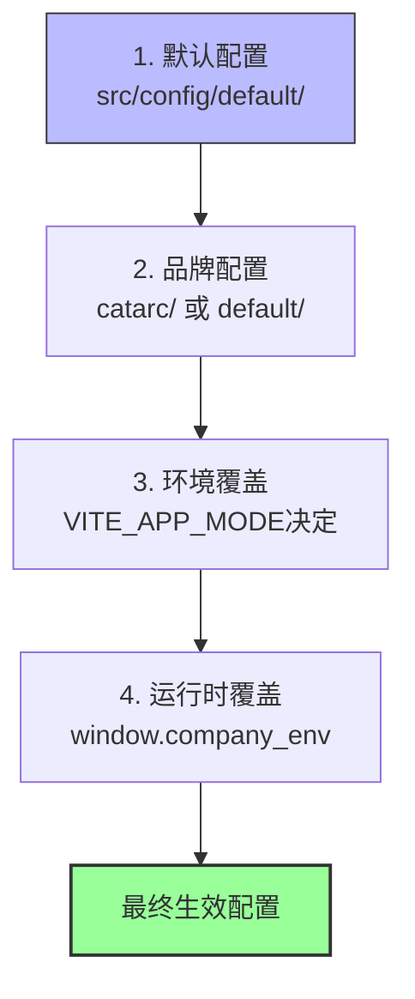

# 开发模式指南

> **基于代码版本**: v4.10.0
> **最后验证时间**: 2025-11-27 09:25
> **代码文件来源**:
> - `package.json` (89行, 节点脚本部分)
> - `src/config/index.js` (129行, 配置加载逻辑)
> - `src/config/default/` (42个文件, 已验证)
> - `src/config/catarc/` (31个文件, 已验证)

⚠️ **重要提示**: 本文档完全基于实际项目代码，不包含未实现的功能。

Vue3前端项目支持**两种开发模式**，对应不同的品牌配置系统。

## 目录

- [两种模式概述](#两种模式概述)
- [模式1: Dev模式](#模式1-dev模式)
- [模式2: CATARC模式](#模式2-catarc模式)
- [配置加载机制](#配置加载机制)
- [模式差异对比](#模式差异对比)
- [代码中的模式判断](#代码中的模式判断)
- [使用建议](#使用建议)
- [常见问题](#常见问题)

---

## 两种模式概述

项目通过**Vite的mode参数**区分不同的配置环境：

| 模式 | 启动命令 | VITE_APP_MODE | 配置目录 | 主要用途 |
|------|----------|---------------|----------|----------|
| **Dev模式** | `npm run dev` | 未设置/默认值 | `src/config/default/` | 默认品牌开发 |
| **CATARC模式** | `npm run catarc` | `catarc-dev` | `src/config/catarc/` | CATARC品牌定制开发 |

**核心原则**: 两种模式使用**完全不同的配置集合**，通过 `isCatarc` 标志在代码中区分逻辑。

---

## 模式1: Dev模式

### 启动命令

```json
// package.json (第7行)
"dev": "vite"
```

**使用方式**:
```bash
npm run dev
# 或
pnpm dev
```

**环境变量**:
```bash
VITE_APP_MODE=    # 未设置或使用默认值
```

### 配置文件结构

```
src/config/default/
├── env/
│   ├── dev.json              # 开发环境配置
│   ├── dev-2.json            # 开发环境备用配置
│   ├── staging.json          # 预发布环境配置
│   ├── production.json       # 生产环境配置
│   └── onprem.json           # 私有化部署配置
│
├── featureConfig.json        # 功能开关配置
├── tableConfig.js           # 表格列配置
├── navigationConfig.json    # 导航菜单配置
├── sidebarConfig.json       # 侧边栏配置
├── companyConfig.json       # 公司信息配置
├── licensesConfig.json      # 许可证配置
├── uploadConfig.json        # 上传配置
└── ... (共42个文件)
```

**核心配置**:
```javascript
// 导入默认配置 (src/config/index.js:16-27)
import devEnv from "./default/env/dev.json";
import prodEnv from "./default/env/production.json";
import stagingEnv from "./default/env/staging.json";
import onpremEnv from "./default/env/onprem.json";
import features from "./default/featureConfig.json";
import tables from "./default/tableConfig.js";
import navigationConfig from "./default/navigationConfig.json";
import companyConfig from "./default/companyConfig.json";
```

### 配置加载逻辑

**部署配置** (`src/config/index.js` 第36-45行):
```javascript
{
  name: "default",
  featureConfig: features,          // 在 window.__company_config__.FEATURE_FLAGS
  tableConfig: tables,              // 在 window.__company_config__.TABLE_CONFIG
  navigationConfig: navigationConfig, // 在 window.__company_config__.NAV_IMAGE_URLS
  sidebarConfig: {},                // 在 window.__company_config__.INSTRUCTION_SIDEBAR
  companyConfig: companyConfig,     // 在 window.__company_config__.COMPANY_ID
}
```

---

## 模式2: CATARC模式

### 启动命令

```json
// package.json (第8行)
"catarc": "vite --mode catarc-dev"

// 构建命令 (第9行)
"build-catarc": "vite build --mode catarc-prod"
```

**开发使用**:
```bash
npm run catarc
# 或
pnpm catarc
```

**构建使用**:
```bash
npm run build-catarc
```

**环境变量**:
```bash
VITE_APP_MODE=catarc-dev        # 开发环境
# 或
VITE_APP_MODE=catarc-prod       # 生产环境
```

### 配置文件结构

```
src/config/catarc/
├── env/
│   ├── dev.js                  # 开发环境配置（JS格式）
│   ├── dev-2-catarc.json       # 备用开发配置
│   └── production.json         # 生产环境配置
│
├── featureConfig.json          # CATARC功能开关
├── tableConfig.js             # CATARC表格配置
├── navigationConfig.json      # CATARC导航配置
├── sidebarConfig.json         # CATARC侧边栏配置（空）
├── companyConfig.json         # CATARC公司信息
└── ... (共31个文件)
```

**核心配置导入** (`src/config/index.js` 第10-15行):
```javascript
import { catarcDev } from "./catarc/env/dev.js";           // JS格式导出
import catarcProdEnv from "./catarc/env/production.json";
import catarcFeatures from "./catarc/featureConfig.json";
import catarcTables from "./catarc/tableConfig.js";
import catarcNavigationConfig from "./catarc/navigationConfig.json";
import catarcCompanyConfig from "./catarc/companyConfig.json";
// 注意: catarc没有独立的sidebarConfig
```

### 专门的侧边栏配置

**特殊处理**: CATARC模式直接使用 `default/navigationConfig.json` 作为侧边栏配置

```javascript
// src/config/index.js (第89-95行)
// 为兼容sidebar配置的使用位置
if (isCatarc) {
  const sidebarConfig = import("./default/navigationConfig.json");
  sidebarConfig.then((data) => {
    window.__company_config__.INSTRUCTION_SIDEBAR = data.default;
  });
}
```

---

## 配置加载机制

### 核心判断逻辑

**位置**: `src/config/index.js` (第122行)

```javascript
export const isCatarc = _companyConfig.COMPANY_ID === "catarc";
```

**原理**: 通过 `COMPANY_ID` 配置值判断当前是否为CATARC模式。

### 环境选择逻辑

**位置**: `src/config/index.js` (第49-67行)

```javascript
let _env = {};

switch (__VITE_APP_MODE__) {
  case "catarc-dev":
    _env = catarcDev;
    break;
  case "catarc-prod":
    _env = catarcProdEnv;
    break;
  case "staging":
    _env = stagingEnv;
    break;
  case "production":
    _env = prodEnv;
    break;
  case "onprem":
    _env = onpremEnv;
    break;
  case "dev":
  default:
    _env = devEnv;
}

export const config = _env;
```

**流程图**:
```mermaid
graph TD
    A[开始启动] --> B{__VITE_APP_MODE__?}
    B -->|catarc-dev| C[加载catarc/env/dev.js]
    B -->|catarc-prod| D[加载catarc/env/production.json]
    B -->|staging| E[加载default/env/staging.json]
    B -->|production| F[加载default/env/production.json]
    B -->|onprem| G[加载default/env/onprem.json]
    B -->|dev/other| H[加载default/env/dev.json]

    C --> I{COMPANY_ID === "catarc"?}
    D --> I
    E --> I
    F --> I
    G --> I
    H --> I

    I -->|是| J[isCatarc = true]
    I -->|否| K[isCatarc = false]

    J --> L[加载catarc/配置]
    K --> M[加载default/配置]

    L --> N[完成]
    M --> N
```

### 配置合并机制

**三级覆盖系统**:



**应用方式**:

```javascript
// 在window对象上挂载配置
window.__company_config__ = {
  FEATURE_FLAGS: deployment.featureConfig,
  TABLE_CONFIG: deployment.tableConfig,
  NAV_IMAGE_URLS: deployment.navigationConfig,
  INSTRUCTION_SIDEBAR: deployment.sidebarConfig,
  COMPANY_ID: deployment.companyConfig.COMPANY_ID,
  ...config,  // 环境变量
};
```

---

## 模式差异对比

### 配置层面对比

| 特性 | Dev模式 | CATARC模式 | 说明 |
|------|---------|------------|------|
| **COMPANY_ID** | `default` / 其他 | `catarc` | 核心判断依据 |
| **配置目录** | `src/config/default/` | `src/config/catarc/` | 互斥使用 |
| **配置文件数** | 42个 | 31个 | CATARC少了sidebar配置等 |
| **环境变量格式** | JSON (dev.json) | JS (dev.js) | CATARC使用JS导出 |
| **SSO登录** | ❌ 无 | ✅ 有 (CATARC_CLIENT_ID) | 仅CATARC支持 |
| **许可证处理** | 通用消息 | 专用过期弹窗 | 见errorHandler 402处理 |

### 功能特性对比

**从featureConfig.json提取的差异**:

| 功能开关 | Dev模式 | CATARC模式 | 影响 |
|----------|---------|------------|------|
| `CATARC_SAAS_TRIAL` | `false` | `true` | 试用期功能 |
| `SHOW_CVE_CWE_IN_CATARC` | `false` | `true` | 显示CVE/CWE信息 |
| `SHOW_SIDEBAR` | `true` | `false` | 侧边栏显示控制 |

### WebSocket事件差异

```typescript
// DashboardLayout.vue (162-165行)
channel.bind("project_status_update", function (data: any) {
  if (!isCatarc) {
    // ⚠️ CATARC模式不处理project_status_update事件
    projectStore.updateProjectStatus(data);
  }
});
```

**CATARC模式忽略的事件**:
- `project_status_update` - 项目状态更新

**原因**: CATARC的业务流程与其他品牌不同。

---

## 代码中的模式判断

### 1. 使用`isCatarc`常量

**推荐方式**:

```typescript
import { isCatarc, config, companyConfig } from "@/config";

// 简单判断
if (isCatarc) {
  // 仅CATARC逻辑
  console.log("当前是CATARC模式");
} else {
  // 其他品牌通用逻辑
}

// 多品牌判断
import { isCatarc, isMstl, isAnesec } from "@/config";

if (isCatarc) {
  // CATARC专属
  theme = "lavender-blue";
} else if (isMstl) {
  // MSTL专属
} else if (isAnesec) {
  // 安恒专属
} else {
  // 默认品牌
}
```

### 2. 使用`companyConfig`判断

**底层实现**:

```javascript
// src/config/index.js (122行)
export const isCatarc = _companyConfig.COMPANY_ID === "catarc";
export const isMstl = _companyConfig.COMPANY_ID === "mstl";
export const isAnesec = _companyConfig.COMPANY_ID === "anesec";
```

**等价判断**:
```typescript
import { companyConfig } from "@/config";

// 这两种判断等价
if (isCatarc) { ... }
if (companyConfig.COMPANY_ID === "catarc") { ... }
```

### 3. 实际使用示例

#### 示例1: 错误处理中的CATARC特殊处理

```typescript
// src/utils/errorHandler.ts (71-89行)
if (status == 402 && isCatarc) {
  // 仅CATARC显示许可证过期确认框
  ElMessageBox.confirm(
    t("AUTOMOTIVE_LICENSE_EXPIRED", { ... }),
    t("ERROR"),
    { showCancelButton: false, type: "error" }
  );
}
```

#### 示例2: WebSocket事件差异化处理

```typescript
// DashboardLayout.vue (153-159行)
channel.bind("project_status_update", function (data: any) {
  if (!isCatarc) {
    // CATARC模式不更新项目状态
    projectStore.updateProjectStatus(data);
  }
});
```

#### 示例3: 主题选择

```typescript
// 动态选择主题CSS
let theme;
if (isCatarc) {
  theme = "lavender-blue";  // 中汽研主题
} else if (isMstl) {
  theme = "navy-blue";      // MSTL主题
} else {
  theme = "common";         // 默认主题
}

import(`@/assets/styles/themes/${theme}.css`);
```

---

## 使用建议

### ✅ 开发Dev模式（默认品牌）

```bash
# 启动开发服务器
npm run dev

# 访问
# http://localhost:5173/login
```

**配置来源**: `src/config/default/env/dev.json`

**适用场景**:
- 开发通用功能（所有品牌共享）
- 测试默认UI和流程
- 开发新功能原型

---

### ✅ 开发CATARC模式

```bash
# 启动CATARC开发服务器
npm run catarc

# 访问
# http://localhost:5173/login (会自动加载CATARC登录页)
```

**配置来源**: `src/config/catarc/env/dev.js`

**适用场景**:
- 开发CATARC专属功能
- 测试SSO登录流程
- 验证CATARC主题和样式
- 测试汽车许可证过期流程

---

### ✅ 构建CATARC生产版本

```bash
# 构建CATARC生产包
npm run build-catarc

# 输出目录
# dist/
```

**配置来源**: `src/config/catarc/env/production.json`

**环境变量**:
```bash
VITE_APP_MODE=catarc-prod
```

---

## 常见问题

### Q1: 如何判断当前是什么模式？

**方法1**: 控制台打印
```typescript
import { isCatarc, config } from "@/config";

console.log("是否CATARC模式:", isCatarc);
console.log("当前配置:", config);
console.log("COMPANY_ID:", config.COMPANY_ID);
```

**方法2**: 查看window对象
```javascript
console.log(window.__company_config__);
```

**方法3**: 查看网络请求
- CATARC模式: 请求 `CATARC_API_BASE` 地址
- Dev模式: 请求 `API_BASE` 地址

---

### Q2: 如何在代码中支持多品牌？

**最佳实践**:

```typescript
import { isCatarc, isMstl } from "@/config";

function getFeatureConfig() {
  // 使用配置系统而非硬编码
  return config.FEATURE_FLAGS.MY_FEATURE;

  // 或者使用模式判断
  if (isCatarc) {
    return catarcSpecificConfig;
  }
  return defaultConfig;
}
```

**避免**:
```typescript
// ❌ 硬编码COMPANY_ID判断
if (companyConfig.COMPANY_ID === 'catarc') { ... }

// ✅ 使用isCatarc常量（已被多处引用）
if (isCatarc) { ... }
```

---

### Q3: 新增配置项应该放在哪里？

**通用配置**:
1. 添加到 `src/config/default/` 对应文件
2. 复制到 `src/config/catarc/`（如果需要差异化）
3. 更新 `src/config/index.js` 导入逻辑

**CATARC专属配置**:
1. 仅添加到 `src/config/catarc/`
2. 在代码中通过 `isCatarc` 判断使用

---

### Q4: 开发时应该使用哪个模式？

**通用功能开发**: 使用Dev模式（默认）
```bash
npm run dev
```

**CATARC功能开发**: 使用CATARC模式
```bash
npm run catarc
```

**建议**: 在多个模式下测试功能，确保兼容性。

---

### Q5: 为什么CATARC的env配置是JS格式？

**历史原因**: `src/config/catarc/env/dev.js` 需要动态导入和使用环境变量。

**dev.js示例**:
```javascript
export const catarcDev = {
  API_BASE: VITE_CATARC_API_BASE,           // 使用环境变量
  PUSHER_HOST: VITE_CATARC_API_GATEWAY,
  SSO_LOGIN_URL: `http://${VITE_CATARC_API_GATEWAY}/ssoLogin`,
  CATARC_CLIENT_ID: "DB5312B85CA24B3E491985A99A7E7B14",
  CONTACT_EMAIL: "zhouyixuan@catarc.ac.cn",
  CATARC_SAAS_TRIAL: true,
};
```

**优点**: 可以使用JS表达式和模板字符串。

**对比**: `default/env/dev.json` 是纯JSON格式，不支持JS语法。

---

### Q6: 如何为CATARC添加新功能开关？

**步骤**:

1. **编辑CATARC功能配置**:
```json
// src/config/catarc/featureConfig.json
{
  "MY_NEW_FEATURE": true,  // 开启新功能
  ...
}
```

2. **编辑Default功能配置**（如果需要）:
```json
// src/config/default/featureConfig.json
{
  "MY_NEW_FEATURE": false,  // 默认关闭
  ...
}
```

3. **在代码中使用**:
```typescript
import { config } from "@/config";

if (config.FEATURE_FLAGS.MY_NEW_FEATURE) {
  // 新功能逻辑
}
```

4. **测试**: 分别在两种模式下测试功能开关

---

## 相关文档

- [多品牌配置系统](./multibrand_config.md) - 完整的配置系统详解
- [架构总览](./architecture_overview.md) - 技术栈和架构设计
- [错误处理指南](./error_handling_guide.md) - 包含CATARC特殊错误处理
- [WebSocket实时通讯](./websocket_realtime_guide.md) - 包含CATARC事件差异

---

## 更新日志

### 2025-11-27
- **创建文档**: v1.0
- **验证文件**:
  - `package.json` (启动脚本)
  - `src/config/index.js` (配置加载逻辑)
  - `src/config/default/` (42个文件)
  - `src/config/catarc/` (31个文件)
- **主要功能**: Dev/CATARC双模式说明、配置加载机制、模式差异对比

---

**文档路径**: `dev_docs/development_modes_guide.md`
**最后更新**: 2025-11-27 11:00
**维护者**: Claude Sonnet 4.5
**代码版本**: v4.10.0
