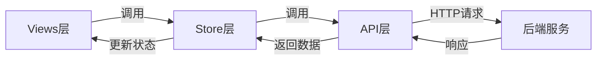

# 模块开发指南

本指南详细介绍如何开发新的业务模块，包含标准化的模块结构、文件组织方式和开发步骤。

## 目录

- [标准模块架构](#标准模块架构)
- [文件组织结构](#文件组织结构)
- [各层详细规范](#各层详细规范)
- [创建新模块的完整步骤](#创建新模块的完整步骤)
- [实际案例](#实际案例)

---

## 标准模块架构

项目采用**模块化三层架构**：

```
src/
├── api/              # API接口层（数据访问）
├── stores/           # 状态管理层（Pinia Store）
└── views/            # 视图组件层（Vue组件）
```

### 三层分离设计



**实际项目中的模块对应关系示例：**

| 业务模块 | API文件 | Store模块 | Views目录 |
|----------|---------|-----------|-----------|
| project | [src/api/project.ts](file:///D:/tanxun_code/000_main_project/vue3-frontend/src/api/project.ts) | [src/stores/project/](file:///D:/tanxun_code/000_main_project/vue3-frontend/src/stores/project/) | [src/views/project/](file:///D:/tanxun_code/000_main_project/vue3-frontend/src/views/project/) |
| scan | [src/api/scan.ts](file:///D:/tanxun_code/000_main_project/vue3-frontend/src/api/scan.ts) | [src/stores/scan/](file:///D:/tanxun_code/000_main_project/vue3-frontend/src/stores/scan/) | [src/views/scan/](file:///D:/tanxun_code/000_main_project/vue3-frontend/src/views/scan/) |
| vulnerability | [src/api/vulnerability.ts](file:///D:/tanxun_code/000_main_project/vue3-frontend/src/api/vulnerability.ts) | [src/stores/vulnerability/](file:///D:/tanxun_code/000_main_project/vue3-frontend/src/stores/vulnerability/) | [src/views/vulnerability/](file:///D:/tanxun_code/000_main_project/vue3-frontend/src/views/vulnerability/) |

---

## 文件组织结构

### 典型模块目录树

以 **project** 模块为例：

```
src/
├── api/
│   └── project.ts                 # API接口函数
├── stores/
│   └── project/
│       ├── index.ts              # Store入口，导出useStore
│       ├── state.ts              # 状态定义
│       ├── actions.ts            # 异步操作（调用API）
│       └── getters.ts            # 计算属性
└── views/
    └── project/
        ├── components/           # 共享组件目录
        │   ├── ProjectCard.vue
        │   ├── ProjectOverview.vue
        │   └── CreateSourceControl.vue
        ├── Projects.vue          # 主列表页
        ├── ProjectDetail.vue     # 详情页
        └── CreateProject.vue     # 创建页（如需要）
```

### 模块完整文件清单

一个完整的业务模块应包含以下文件：

**必需文件（4个）：**
- ✅ `src/api/moduleName.ts` - API接口
- ✅ `src/stores/moduleName/index.ts` - Store入口
- ✅ `src/stores/moduleName/state.ts` - 状态定义
- ✅ `src/views/moduleName/列表页.vue` - 主列表页面

**推荐文件（按需求添加）：**
- [x] `src/stores/moduleName/actions.ts` - 异步操作
- [x] `src/stores/moduleName/getters.ts` - 计算属性
- [x] `src/views/moduleName/Detail.vue` - 详情页
- [x] `src/views/moduleName/components/` - 共享组件
- [x] `src/router/routes/moduleName.js` - 路由配置（详见[router_guide.md](./router_guide.md)）

---

## 各层详细规范

### 1. API层规范

#### 文件位置

```
src/api/
├── project.ts
├── scan.ts
├── vulnerability.ts
└── moduleName.ts       # 新模块API文件
```

#### 标准模板

```typescript
// src/api/moduleName.ts

import axios from 'axios'

/**
 * 获取模块列表
 * @param params 查询参数
 * @returns Promise
 */
export const getModules = (params: any) => {
  return axios.get('/api/modules', {
    params
  })
}

/**
 * 获取模块详情
 * @param id 模块ID
 * @returns Promise
 */
export const getModuleDetail = (id: number | string) => {
  return axios.get(`/api/modules/${id}`)
}

/**
 * 创建模块
 * @param data 模块数据
 * @returns Promise
 */
export const createModule = (data: any) => {
  return axios.post('/api/modules', data)
}

/**
 * 更新模块
 * @param id 模块ID
 * @param data 更新数据
 * @returns Promise
 */
export const updateModule = (id: number | string, data: any) => {
  return axios.put(`/api/modules/${id}`, data)
}

/**
 * 删除模块
 * @param id 模块ID
 * @returns Promise
 */
export const deleteModule = (id: number | string) => {
  return axios.delete(`/api/modules/${id}`)
}
```

**实际项目参考：** [src/api/project.ts](file:///D:/tanxun_code/000_main_project/vue3-frontend/src/api/project.ts)

#### 命名规范

- **文件名**：小写，与模块名一致（如 `project.ts`, `scan.ts`）
- **函数名**：
  - 查询列表：`get{模块名}s`（如 `getProjects`, `getScans`）
  - 详情：`get{模块名}Detail`（如 `getProjectDetail`, `getScanDetail`）
  - 创建：`create{模块名}`（如 `createProject`）
  - 更新：`update{模块名}`（如 `updateProject`）
  - 删除：`delete{模块名}`（如 `deleteProject`）

#### 最佳实践

1. 每个函数必须有JSDoc注释说明参数和返回值
2. 函数中只包含HTTP调用逻辑
3. 复杂的参数构建应在Store中处理
4. 统一的错误处理已在axios拦截器中实现（参见[api_layer.md](./api_layer.md)）

---

### 2. Store层规范

#### 文件位置

```
src/stores/moduleName/
├── index.ts          # Store入口
├── state.ts          # 状态定义
├── actions.ts        # 异步操作（可选）
└── getters.ts        # 计算属性（可选）
```

#### index.ts 标准模板

```typescript
// src/stores/moduleName/index.ts

import { defineStore } from 'pinia'
import { extractStore } from '../extractStore'
import state from './state'
import * as actions from './actions'
import * as getters from './getters'

/**
 * ModuleName Store
 * 管理模块的状态和业务逻辑
 */
export const useModuleNameStore = extractStore(
  defineStore('moduleName', () => {
    return {
      ...state,
      ...actions,
      ...getters
    }
  })
)
```

> **注意**：项目使用 `extractStore` 工具函数，它会自动处理响应式状态、操作和计算属性的组合。参见 [src/stores/extractStore.ts](file:///D:/tanxun_code/000_main_project/vue3-frontend/src/stores/extractStore.ts)

#### state.ts 标准模板

```typescript
// src/stores/moduleName/state.ts

import { reactive } from 'vue'

/**
 * 状态定义
 */
export default {
  // 数据列表
  list: reactive([]),

  // 当前项详情
  detail: reactive({}),

  // 加载状态
  loading: false,

  // 分页信息
  pagination: reactive({
    page: 1,
    page_size: 10,
    total: 0
  }),

  // 查询条件
  queryParams: reactive({
    search: '',
    status: ''
  })
}
```

**实际项目参考：** [src/stores/project/state.ts](file:///D:/tanxun_code/000_main_project/vue3-frontend/src/stores/project/state.ts)

#### actions.ts 标准模板

```typescript
// src/stores/moduleName/actions.ts

import { getModules, getModuleDetail, createModule, updateModule, deleteModule } from '../../api/moduleName'
import { ElMessage } from 'element-plus'

/**
 * 获取模块列表
 */
export async function fetchModules() {
  this.loading = true
  try {
    const res = await getModules(this.queryParams)
    this.list = res.data.items || []
    this.pagination.total = res.data.total || 0
  } catch (error) {
    ElMessage.error('获取列表失败')
  } finally {
    this.loading = false
  }
}

/**
 * 获取模块详情
 */
export async function fetchModuleDetail(id: number | string) {
  try {
    const res = await getModuleDetail(id)
    this.detail = res.data
  } catch (error) {
    ElMessage.error('获取详情失败')
  }
}

/**
 * 创建模块
 */
export async function createModuleAction(data: any) {
  try {
    await createModule(data)
    ElMessage.success('创建成功')
    await this.fetchModules()  // 刷新列表
    return true
  } catch (error) {
    ElMessage.error('创建失败')
    return false
  }
}

/**
 * 更新模块
 */
export async function updateModuleAction(id: number | string, data: any) {
  try {
    await updateModule(id, data)
    ElMessage.success('更新成功')
    await this.fetchModuleDetail(id)  // 刷新详情
    return true
  } catch (error) {
    ElMessage.error('更新失败')
    return false
  }
}

/**
 * 删除模块
 */
export async function deleteModuleAction(id: number | string) {
  try {
    await deleteModule(id)
    ElMessage.success('删除成功')
    await this.fetchModules()  // 刷新列表
    return true
  } catch (error) {
    ElMessage.error('删除失败')
    return false
  }
}

/**
 * 重置查询条件
 */
export function resetQuery() {
  this.queryParams = {
    search: '',
    status: ''
  }
  this.fetchModules()
}
```

**实际项目参考：** [src/stores/project/actions.ts](file:///D:/tanxun_code/000_main_project/vue3-frontend/src/stores/project/actions.ts)

#### getters.ts 标准模板

```typescript
// src/stores/moduleName/getters.ts

import { computed } from 'vue'

/**
 * 计算属性：已启用的模块数量
 */
export const enabledCount = computed(() => {
  return this.list.filter(item => item.enabled).length
})

/**
 * 计算属性：筛选后的列表
 */
export const filteredList = computed(() => {
  const { search } = this.queryParams
  if (!search) return this.list
  return this.list.filter(item =>
    item.name.toLowerCase().includes(search.toLowerCase())
  )
})
```

**注意**：getters中使用 `this` 访问store实例的状态和其他属性

**实际项目参考：** [src/stores/project/getters.ts](file:///D:/tanxun_code/000_main_project/vue3-frontend/src/stores/project/getters.ts)

---

### 3. Views层规范

#### 文件位置

```
src/views/moduleName/
├── components/          # 共享组件（必需）
├── List.vue            # 主列表页（必需）
├── Detail.vue          # 详情页（可选）
└── CreateEdit.vue      # 创建/编辑页（可选）
```

**实际项目参考：** [src/views/project/](file:///D:/tanxun_code/000_main_project/vue3-frontend/src/views/project/)

#### 主列表页标准模板

```vue
<template>
  <div class="module-container">
    <!-- 页头（标题和说明） -->
    <div class="page-header">
      <h2>{{ $t('MODULE_LIST') }}</h2>
      <el-tooltip :content="$t('MODULE_TOOLTIP')" placement="top">
        <i class="fa-solid fa-circle-info"></i>
      </el-tooltip>
    </div>

    <!-- 表格 -->
    <el-master-table
      v-loading="moduleStore.loading"
      :data="moduleStore.list"
      :columns="columns"
      :pagination-props="paginationProps"
      @queryChange="handleQueryChange"
      @selection-change="handleSelectionChange"
      @sort-change="onSortChange"
    >
      <!-- 自定义列模板 -->
      <template #name="{ row }">
        <router-link :to="`/modules/${row.id}`" class="link">
          {{ row.name }}
        </router-link>
      </template>

      <template #status="{ row }">
        <el-custom-tag :type="row.status === 'active' ? 'success' : 'info'">
          {{ row.status }}
        </el-custom-tag>
      </template>

      <!-- 顶部操作栏 -->
      <template #top-left>
        <el-input
          v-model="searchQuery"
          :placeholder="$t('SEARCH')"
          @keyup.enter="handleSearch"
        />
      </template>

      <template #top-right>
        <el-button type="primary" @click="handleCreate">
          {{ $t('CREATE_MODULE') }}
        </el-button>
      </template>
    </el-master-table>
  </div>
</template>

<script setup>
import { computed, ref } from 'vue'
import { useModuleNameStore } from '@/stores/moduleName'
import { useRouter } from 'vue-router'
import { useI18n } from 'vue-i18n'

const router = useRouter()
const { t } = useI18n()

// 使用Store
const moduleStore = useModuleNameStore()

// 表格列定义
const columns = computed(() => [
  {
    prop: 'name',
    label: t('NAME'),
    width: 200,
    sortable: true
  },
  {
    prop: 'status',
    label: t('STATUS'),
    width: 120
  },
  {
    prop: 'created_at',
    label: t('CREATED_TIME'),
    width: 180
  }
])

// 分页配置
const paginationProps = {
  page: moduleStore.pagination.page,
  total: moduleStore.pagination.total,
  pageSize: moduleStore.pagination.page_size
}

// 搜索查询
const searchQuery = ref('')

// 查询变化
const handleQueryChange = (query) => {
  moduleStore.queryParams = { ...query }
  moduleStore.fetchModules()
}

// 搜索
const handleSearch = () => {
  moduleStore.queryParams.search = searchQuery.value
  moduleStore.fetchModules()
}

// 创建
const handleCreate = () => {
  router.push('/modules/create')
}

// 初始化
moduleStore.fetchModules()
</script>
```

**关键要点：**
- 使用 `defineComponent`（Options API）或 `<script setup>`（Composition API），以实际项目风格为准
- 使用Element Plus组件库（[src/api/layer.md](./api_layer.md) 查看完整组件文档）
- 在 `<script setup>` 中使用环境变量必须手动引入：

```typescript
import.meta.env  // ❌ 无法在 <script setup lang='ts'> 中直接使用
```

**正确做法：**

```typescript
// 通过JS模块导入
import { COMPANY, BASE_URL } from '@/config'

// 或在组件外用JS定义，然后导入
// const config.js
export const ENV_CONFIG = {
  API_BASE: import.meta.env.VITE_API_BASE,
  BRAND: import.meta.env.VITE_BRAND
}

// 然后在组件中
import { ENV_CONFIG } from '@/config'
```

**实际项目参考：** [src/views/project/Projects.vue](file:///D:/tanxun_code/000_main_project/vue3-frontend/src/views/project/Projects.vue)

---

#### 组件内调用Store示例

```vue
<script setup>
import { useProjectStore } from '@/stores/project'
import { storeToRefs } from 'pinia'

const projectStore = useProjectStore()

// 使用 storeToRefs 保持响应式
const { list, loading, pagination } = storeToRefs(projectStore)

// 调用actions
const handleRefresh = async () => {
  await projectStore.fetchProjects()
}

const handleDelete = async (id) => {
  const success = await projectStore.deleteProject(id)
  if (success) {
    // 删除成功
  }
}
</script>
```

---

## 创建新模块的完整步骤

### 步骤 1：创建API层（5分钟）

1. 在 `src/api/` 目录下创建 `{模块名}.ts`
2. 定义标准的 CRUD 接口函数
3. 导出所有函数

```bash
# 查看现有API文件示例
ls D:\tanxun_code\000_main_project\vue3-frontend\src\api\*.ts
```

**示例输出：**
```
chat.ts          component.ts     license.ts       poc.ts           report.ts
compliance.ts    dataAdmin.ts     management.ts    project.ts       sast.ts
component.ts     general.ts       org.ts           scan.ts          team.ts
```

### 步骤 2：创建Store层（10分钟）

1. 在 `src/stores/` 目录下创建模块子目录：

```bash
mkdir D:\tanxun_code\000_main_project\vue3-frontend\src\stores\moduleName
```

2. 创建四个标准文件：

```bash
touch D:\tanxun_code\000_main_project\vue3-frontend\src\stores\moduleName/index.ts
touch D:\tanxun_code\000_main_project\vue3-frontend\src\stores\moduleName/state.ts
touch D:\tanxun_code\000_main_project\vue3-frontend\src\stores\moduleName/actions.ts
touch D:\tanxun_code\000_main_project\vue3-frontend\src\stores\moduleName/getters.ts
```

3. 复制并修改标准模板（参见上面的模板）

### 步骤 3：创建Views层（15分钟）

1. 在 `src/views/` 目录下创建模块子目录：

```bash
mkdir D:\tanxun_code\000_main_project\vue3-frontend\src\views\moduleName
mkdir D:\tanxun_code\000_main_project\vue3-frontend\src\views\moduleName\components
```

2. 创建主列表页：

```bash
touch D:\tanxun_code\000_main_project\vue3-frontend\src\views\moduleName/Modules.vue
```

3. 复制并修改标准模板（参见上面的模板）

### 步骤 4：配置路由（5分钟）

1. 模块化路由文件（详细了解请参考 [router_guide.md](./router_guide.md)）：

```bash
touch D:\tanxun_code\000_main_project\vue3-frontend\src\router\routes\moduleName.js
```

2. 在主路由文件中导入（自动扫描）：

```bash
# 查看路由加载逻辑
cat D:\tanxun_code\000_main_project\vue3-frontend\src\router\index.js
```

### 步骤 5：在AI_Coding_Context.md中注册（2分钟）

在主文档中添加新的模块信息：

```markdown
- **moduleName**: [ModuleNameList](file:///D:/tanxun_code/000_main_project/vue3-frontend/src/views/moduleName/Modules.vue)
  - API: [src/api/moduleName.ts](file:///D:/tanxun_code/000_main_project/vue3-frontend/src/api/moduleName.ts)
  - Store: [src/stores/moduleName/](file:///D:/tanxun_code/000_main_project/vue3-frontend/src/stores/moduleName/)
  - Views: [src/views/moduleName/](file:///D:/tanxun_code/000_main_project/vue3-frontend/src/views/moduleName/)
```

### 步骤 6：验证和测试（3分钟）

1. 运行开发服务器：

```bash
npm run dev
```

2. 访问模块路由，检查：
   - ✅ 页面正常加载
   - ✅ API调用正常
   - ✅ Store状态更新正常
   - ✅ 表格数据正确显示
   - ✅ 搜索、分页、排序功能正常

3. 检查控制台是否有错误

---

## 实际案例

### 案例：project 模块

**业务场景：** 项目管理（列表、详情、创建、编辑、删除）

**完整文件清单：**

| 层级 | 文件 | 代码行数 | 主要功能 |
|------|------|----------|----------|
| API | [src/api/project.ts](file:///D:/tanxun_code/000_main_project/vue3-frontend/src/api/project.ts) | 757行 | 37个API函数（项目CRUD、扫描、版本控制集成等） |
| Store | [src/stores/project/state.ts](file:///D:/tanxun_code/000_main_project/vue3-frontend/src/stores/project/state.ts) | 146行 | 定义项目状态（列表、详情、过滤条件等） |
| Store | [src/stores/project/actions.ts](file:///D:/tanxun_code/000_main_project/vue3-frontend/src/stores/project/actions.ts) | 585行 | 29个异步操作（获取列表、创建项目、删除项目等） |
| Store | [src/stores/project/getters.ts](file:///D:/tanxun_code/000_main_project/vue3-frontend/src/stores/project/getters.ts) | 16行 | 6个计算属性 |
| Views | [src/views/project/Projects.vue](file:///D:/tanxun_code/000_main_project/vue3-frontend/src/views/project/Projects.vue) | 400+行 | 主列表页（表格、搜索、分页、操作按钮） |
| Views | [src/views/project/ProjectDetail.vue](file:///D:/tanxun_code/000_main_project/vue3-frontend/src/views/project/ProjectDetail.vue) | 52行 | 项目详情页 |
| Components | [src/views/project/components/ProjectOverview.vue](file:///D:/tanxun_code/000_main_project/vue3-frontend/src/views/project/components/ProjectOverview.vue) | 228行 | 项目概览卡片组件 |

**关键设计模式：**

1. **状态管理**：Store中管理项目列表、当前项目详情、过滤条件和分页信息
2. **组件通信**：主列表页通过props向ProjectOverview组件传递统计数据
3. **三大操作**：
   - `fetchProjects()` - 获取项目列表
   - `createProject()` - 创建新项目（调用API后刷新列表）
   - `deleteProject()` - 删除项目（调用API后刷新列表）

---

### 案例：scan 模块

**业务场景：** 扫描管理（项目扫描任务、扫描结果、漏洞分析）

**关键文件：**

- [src/api/scan.ts](file:///D:/tanxun_code/000_main_project/vue3-frontend/src/api/scan.ts) - 313行，15个API函数
- [src/stores/scan/actions.ts](file:///D:/tanxun_code/000_main_project/vue3-frontend/src/stores/scan/actions.ts) - 388行，20个异步操作
- [src/views/scan/ScanDetail.vue](file:///D:/tanxun_code/000_main_project/vue3-frontend/src/views/scan/ScanDetail.vue) - 主扫描详情页
- [src/views/scan/components/](file:///D:/tanxun_code/000_main_project/vue3-frontend/src/views/scan/components/) - 12个扫描相关组件

**设计特点：**

- 扫描状态管理（排队、扫描中、完成、失败）
- 扫描结果的多维度展示（漏洞、组件、许可证、合规等）
- 丰富的组件生态系统（SAST、SCA、许可证、漏洞详细展示）

---

### 案例：vulnerability 模块

**业务场景：** 漏洞管理（漏洞库、CVE、严重级别分析）

**关键文件：**

- API层：`src/api/vulnerability.ts` (285行，14个API函数)
- Store层：`src/stores/vulnerability/` (state + actions + getters)
- Views层：`src/views/vulnerability/` (列表页、详情页、组件)

**核心功能：**

- 漏洞库管理（CVE、CVSS评分）
- 项目漏洞关联分析
- 严重级别过滤（Critical、High、Medium、Low）
- 漏洞修复建议

---

## 开发检查清单

### 创建新模块前

- [ ] 确认模块名称（使用英文小写，如 `moduleName`）
- [ ] 确认模块的职责边界（避免与已有模块重叠）
- [ ] 确认需要的API接口（与后端确认接口文档）
- [ ] 确认页面布局和设计（与UI/UX确认设计稿）

### 开发中

- [ ] API层：所有函数都有JSDoc注释
- [ ] Store层：state、actions、getters分离清晰
- [ ] Views层：组件结构清晰，代码复用组件化
- [ ] 路由配置：路径命名规范，权限控制（requiresAuth）
- [ ] 国际化：所有用户可见文本使用 `$t()`
- [ ] 错误处理：API调用失败有用户提示
- [ ] 加载状态：关键操作显示加载动画

### 完成后

- [ ] 功能自测：所有功能按钮可正常工作
- [ ] 边界测试：空数据、错误数据、大数据量场景
- [ ] 浏览器兼容：Chrome 100+ 测试通过
- [ ] 性能检查：大量数据渲染性能可接受
- [ ] 代码审查：符合项目编码规范
- [ ] 文档更新：更新AI_Coding_Context.md模块清单

---

## 常见问题

### Q1: API返回的数据结构复杂，如何处理？

**A:** 在Store的actions中处理数据转换：

```typescript
export async function fetchModules() {
  const res = await getModules()
  // 数据转换
  this.list = res.data.items.map(item => ({
    id: item.id,
    name: item.attributes.name,
    status: item.attributes.status
  }))
}
```

### Q2: 多个组件共享同一个API数据，如何避免重复请求？

**A:** 使用Store的缓存机制：

```typescript
// state.ts
export default {
  list: reactive([]),
  lastFetchTime: 0,  // 上次获取时间
  cacheDuration: 5 * 60 * 1000  // 缓存5分钟
}

// actions.ts
export async function fetchModules() {
  // 检查缓存是否有效
  const now = Date.now()
  if (this.list.length > 0 && now - this.lastFetchTime < this.cacheDuration) {
    return  // 使用缓存数据
  }

  const res = await getModules()
  this.list = res.data
  this.lastFetchTime = now
}
```

### Q3: 表单数据很多，如何组织代码？

**A:** 使用表单对象 + 表单验证：

```vue
<template>
  <el-form :model="formData" :rules="formRules" ref="formRef">
    <!-- 表单字段 -->
  </el-form>
</template>

<script setup>
import { reactive, ref } from 'vue'

const formRef = ref(null)

// 表单数据
const formData = reactive({
  name: '',
  description: '',
  status: 'active'
})

// 表单验证规则
const formRules = reactive({
  name: [
    { required: true, message: '请输入名称', trigger: 'blur' }
  ]
})

// 提交表单
const handleSubmit = async () => {
  await formRef.value.validate((valid) => {
    if (valid) {
      // 提交逻辑
    }
  })
}
</script>
```

### Q4: 如何优化大量数据的表格性能？

**A:** 使用虚拟滚动和分页：

```vue
<template>
  <el-master-table
    :data="tableData"
    :virtual-scroll="true"
    :page-size="50"
  />
</template>
```

1. 后端分页：优先使用后端分页，每次只加载一页数据
2. 虚拟滚动：对大表格开启虚拟滚动
3. 懒加载：对详情数据使用懒加载

---

## 扩展阅读

- [API接口层文档](./api_layer.md) - 深入了解API调用模式和错误处理
- [Pinia状态管理](./stores_guide.md) - 学习高级状态管理技术
- [路由系统](./router_guide.md) - 掌握路由配置和导航守卫
- [组件开发规范](./component_guide.md) - 编写可复用、易维护的组件
- [可复用组件清单](./component_library.md) - 查看现有组件库

---

## 最后更新

**最后更新日期：** 2025-11-26
**适用版本：** v4.10.0
**文档维护：** 新增模块时需要同步更新本指南的案例部分
