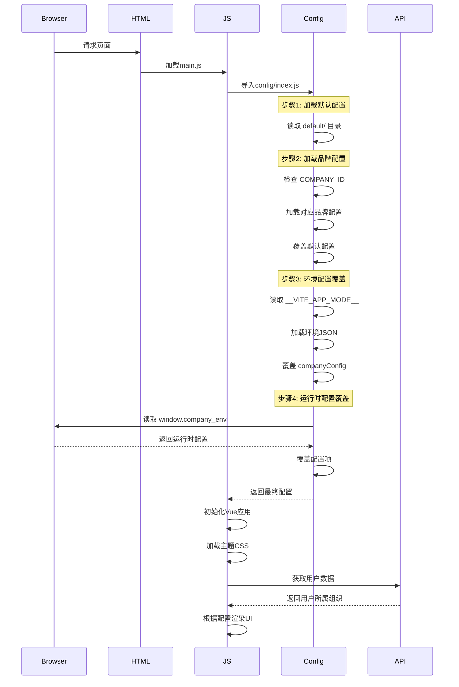

# 多品牌配置系统详解

> 本文档深入解析项目的多品牌/多租户架构配置系统，这是项目最核心的架构设计。

## 📋 文档信息

- **最后更新**: 2025-11-26
- **适用版本**: vue3-frontend v4.10.0
- **重要性**: ⭐⭐⭐ 核心架构
- **相关文件**: [src/config/index.js](../src/config/index.js)

---

## 目录

1. [概述](#概述)
2. [配置覆盖机制（核心原理）](#配置覆盖机制核心原理)
3. [配置类型详解](#配置类型详解)
4. [品牌配置对比](#品牌配置对比)
5. [配置加载流程](#配置加载流程)
6. [实战：添加新品牌](#实战添加新品牌)
7. [配置调试与排查](#配置调试与排查)
8. [最佳实践](#最佳实践)

---

## 概述

### 什么是多品牌配置系统？

多品牌配置系统是vue3-frontend项目支持多个客户/品牌定制的核心机制。通过配置系统，可以为不同品牌（如catarc、mstl、anesec等）提供定制化的：

- 功能开关（Feature Flags）
- 导航菜单布局
- 主题样式
- 表格列配置
- 公司信息（名称、Logo、标题等）
- 侧边栏布局
- TypeScript类型定义

### 配置目录结构

```
src/config/
├── index.js              # 配置加载入口
├── env.js                # 环境变量定义
├── types.ts              # TypeScript类型定义
├── default/              # 默认配置
│   ├── env/              # 环境配置文件
│   │   ├── dev.json      # 开发环境
│   │   ├── dev-2.json    # 开发环境2
│   │   ├── staging.json  # 测试环境
│   │   ├── production.json # 生产环境
│   │   └── onprem.json   # 私有化部署环境
│   ├── featureConfig.json    # 功能开关
│   ├── navigationConfig.json  # 导航菜单
│   ├── tableConfig.js        # 表格配置
│   ├── companyConfig.js      # 公司信息
│   └── sidebarConfig.json    # 侧边栏配置
└── catarc/               # catarc品牌配置
    ├── env/               # catarc环境配置
    ├── featureConfig.json     # catarc功能开关
    ├── navigationConfig.json   # catarc导航菜单
    ├── tableConfig.js         # catarc表格配置
    └── companyConfig.json     # catarc公司信息
```

### 支持的品牌

目前项目支持以下品牌：

| 品牌ID | 品牌名称 | 配置文件目录 | 特点 |
|--------|----------|--------------|------|
| `catarc` | 中汽研（CATARC） | `src/config/catarc/` | 中文界面，特殊布局 |
| `mstl` | MSTL | `src/config/default/` + 动态配置 | 标准配置 |
| `anesec` | 安恒信息 | `src/config/default/` + 动态配置 | 标准配置 |
| `osredm` | OSRedM | `src/config/default/` + 动态配置 | 标准配置 |
| `306` | 306研究所 | `src/config/default/` + 动态配置 | 标准配置 |
| `default` | 默认配置 | `src/config/default/` | 基础配置 |

> **注意**: 除了catarc有独立的配置目录外，其他品牌主要使用default配置，通过环境变量和运行时配置进行定制。

---

## 配置覆盖机制（核心原理）

### 四级覆盖架构

配置系统采用**四级覆盖机制**，确保配置的灵活性和可定制性：

```mermaid
graph TD
    A[第一级: 默认配置<br/>src/config/default/] --> B[第二级: 品牌配置<br/>src/config/{brand}/]
    B --> C[第三级: 环境配置<br/>env.js / production.json]
    C --> D[第四级: 运行时配置<br/>window.company_env]
    D --> E[最终生效配置]

    style A fill:#e1f5ff,stroke:#333,stroke-width:1px
    style B fill:#fff2cc,stroke:#333,stroke-width:1px
    style C fill:#f0e1ff,stroke:#333,stroke-width:1px
    style D fill:#ffe1f5,stroke:#333,stroke-width:2px
    style E fill:#d4ffd4,stroke:#333,stroke-width:3px
```

### 覆盖顺序说明

**1. 第一级：默认配置（Default Config）**
- 路径: `src/config/default/`
- 作用: 提供所有品牌共享的基础配置
- 优先级: 最低
- 包含文件:
  - `env/dev.json` - 开发环境
  - `env/dev-2.json` - 开发环境2
  - `env/staging.json` - 测试环境
  - `env/production.json` - 生产环境
  - `env/onprem.json` - 私有化部署环境
  - `featureConfig.json` - 功能开关
  - `navigationConfig.json` - 导航菜单
  - `tableConfig.js` - 表格配置
  - `companyConfig.js` - 公司信息
  - `navigationConfig.json` - 导航配置
  - `types.ts` - TypeScript类型定义

**2. 第二级：品牌配置（Brand Config）**
- 路径: `src/config/{brand}/` （如 `src/config/catarc/`）
- 作用: 为特定品牌提供定制化配置
- 优先级: 中
- 覆盖规则:
  - 如果品牌配置目录存在同名文件，则完全覆盖默认配置
  - 如果品牌配置目录不存在某文件，则继承默认配置
- 示例: catarc品牌的配置会完全覆盖default的同名配置

**3. 第三级：环境配置（Environment Config）**
- 路径: `src/config/env.js` 或环境JSON文件
- 作用: 根据构建环境（dev/staging/production）加载不同配置
- 优先级: 中高
- 加载逻辑:
  ```javascript
  // 根据 VITE_APP_MODE 加载对应环境配置
  switch (__VITE_APP_MODE__) {
    case "dev": _env = devEnv; break;
    case "production": _env = prodEnv; break;
    case "catarc-dev": _env = catarcDev; break;
    // ...
  }
  ```

**4. 第四级：运行时配置（Runtime Config）**
- 路径: `window.company_env`
- 作用: 构建后动态修改配置（无需重新构建）
- 优先级: 最高
- 加载方式: 在 `public/setting/index.js` 中定义，构建后可通过修改该文件覆盖配置
- 典型应用: 客户需要修改API地址、功能开关等，无需重新打包部署

### 配置覆盖代码实现

在 `src/config/index.js` 中实现：

```javascript
// 1. 加载默认配置
let _env = env;
let _featureConfig = defaultFeatures;
let _tableConfig = defaultTables;
let _navigationConfig = defaultNavigationConfig;
let _sidebarConfig = defaultSidebarConfig;
let _companyConfig = defaultCompanyConfig;

// 2. 加载品牌配置（第二级覆盖）
deployments.forEach((deployment) => {
  if (__VITE_APP_MODE__.includes(deployment.name) ||
      _companyConfig.COMPANY_ID == deployment.name) {
    _featureConfig = deployment.featureConfig;
    _navigationConfig = deployment.navigationConfig;
    _sidebarConfig = deployment.sidebarConfig;
    _companyConfig = deployment.companyConfig;

    // 表格配置部分覆盖（非完全覆盖）
    Object.keys(_tableConfig).forEach((k) => {
      if (deployment.tableConfig[k] != undefined) {
        _tableConfig[k] = deployment.tableConfig[k];
      }
    });
  }
});

// 3. 环境变量覆盖（第三级覆盖）
if (_companyConfig) {
  Object.keys(_companyConfig).forEach((k) => {
    if (_env[k] != undefined) {
      _companyConfig[k] = _env[k];
    }
  });
}

// 4. 运行时覆盖（第四级覆盖）
Object.keys(_env).forEach((k) => {
  if (window.company_env[k] != undefined) {
    _env[k] = window.company_env[k];
  }
});
Object.keys(_companyConfig).forEach((k) => {
  if (window.company_env[k] != undefined) {
    _companyConfig[k] = window.company_env[k];
  }
});
```

---

## 配置类型详解

### 1. FeatureConfig（功能开关配置）

**文件路径**:
- `src/config/default/featureConfig.json`
- `src/config/catarc/featureConfig.json`

**作用**: 控制各个功能的开启/关闭状态

**配置结构**:
```json
{
  "horizontalLayout": true,           // 是否使用水平布局
  "showDependencyGraph": false,       // 是否显示依赖图
  "showScanComplianceSetting": true,  // 是否显示扫描合规设置
  "scanTypes": ["binary", "source_code"], // 支持的扫描类型
  "supportLanguages": ["cn", "en"],   // 支持的语言
  "scanEngines": {                    // 扫描引擎配置
    "sca": {
      "status": true,                 // 引擎是否启用
      "scanType": {
        "SOURCE_CODE": true,          // 是否支持源码扫描
        "BINARY": true                // 是否支持二进制扫描
      }
    },
    "sast": { "status": true, "scanType": { "SOURCE_CODE": true, "BINARY": false } },
    "iac": { "status": true, "scanType": { "SOURCE_CODE": true, "BINARY": false } },
    "fuzzing": { "status": true, "scanType": { "SOURCE_CODE": false, "BINARY": true } },
    "codetrace": { "status": true, "scanType": { "SOURCE_CODE": true, "BINARY": false } }
  }
}
```

**品牌差异对比**:

| 配置项 | default | catarc | 说明 |
|--------|---------|--------|------|
| `horizontalLayout` | `true` | `false` | catarc使用垂直布局 |
| `showDependencyGraph` | `false` | `true` | catarc显示依赖图 |
| `scanTypes` | `["binary", "source_code"]` | `["binary"]` | catarc只支持二进制扫描 |
| `dataRefreshTime` | 未设置 | `300000` (5分钟) | catarc设置数据刷新时间 |

**在代码中使用**:
```javascript
import { featureConfig } from '@/config'

// 判断某个功能是否开启
if (featureConfig.showDependencyGraph) {
  // 显示依赖图
}

// 判断扫描引擎是否启用
if (featureConfig.scanEngines.sca.status) {
  // SCA引擎可用
}
```

---

### 2. NavigationConfig（导航菜单配置）

**文件路径**:
- `src/config/default/navigationConfig.json`
- `src/config/catarc/navigationConfig.json`

**作用**: 配置顶部导航菜单和用户信息下拉菜单

**配置结构**:
```json
{
  "menuItems": [                    // 顶部导航菜单
    {
      "title": "HOME",              // 菜单标题（i18n key）
      "faIcon": "fa-solid fa-house", // FontAwesome图标
      "path": "/home",              // 路由路径
      "permission": "view_home"     // 权限（可选）
    },
    {
      "title": "ANALYSIS",
      "isSection": true            // 是否为分组标题
    }
  ],
  "dropdownOptions": [              // 用户下拉菜单
    {
      "text": "PROFILE",
      "value": "USER_INFO"
    }
  ]
}
```

**default vs catarc 对比**:

**default配置特点**:
- 菜单项较多（11个）
- 包含数据管理、订阅等商业化功能
- 下拉菜单简单（4项）

**catarc配置特点**:
- 菜单项精简（8个）
- 新增"SBOM_ENQUIRY"菜单
- 下拉菜单更丰富（6项，包含定价管理、数据管理等）
- 使用permission控制菜单显示

**动态加载菜单**:
```javascript
// 在布局组件中动态渲染导航
import { navigationConfig } from '@/config'

const menuItems = navigationConfig.menuItems

menuItems.forEach(item => {
  if (item.isSection) {
    // 渲染分组标题
  } else if (hasPermission(item.permission)) {
    // 渲染菜单项
  }
})
```

---

### 3. CompanyConfig（公司信息配置）

**文件路径**:
- `src/config/default/companyConfig.js`
- `src/config/catarc/companyConfig.json`

**作用**: 存储品牌基本信息，如公司名称、Logo、主题、网站标题等

**配置项**:

| 配置项 | 类型 | 说明 | 示例 |
|--------|------|------|------|
| `COMPANY_ID` | string | 品牌ID | `"catarc"` / `"mstl"` |
| `COMPANY_NAME` | string | 公司名称 | `"中汽研"` |
| `WEBSITE_TITLE` | string | 网站标题 | `"Scantist"` |
| `THEME` | string | 主题名称 | `"lavender-blue"` / `"navy-blue"` |
| `LOGO` | string | Logo图片路径 | 使用 imgHelper 动态加载 |
| `ENABLE_LICENSE_CHECK` | boolean | 是否启用许可证检查 | `true` / `false` |
| `ENABLE_HUBSPOT` | boolean | 是否启用HubSpot集成 | `true` / `false` |
| `ENABLE_SSO` | boolean | 是否启用SSO登录 | `true` / `false` |
| `API_GATEWAY` | string | API网关地址 | `"https://api.example.com"` |
| `SUPPORT_LANGUAGES`| array | 支持的语言 | `["cn", "en"]` |

**在路由中的应用**（动态登录页）:
```javascript
// src/router/index.js
const isCatarc = companyConfig.COMPANY_ID == "catarc";
const isMstl = companyConfig.COMPANY_ID == "mstl";
const isAnesec = companyConfig.COMPANY_ID == "anesec";

if (isCatarc) {
  general.push({
    path: "/login",
    component: () => import("@/views/login/pages/CatarcLoginPage.vue")
  });
} else if (isMstl) {
  general.push({
    path: "/login",
    component: () => import("@/views/login/pages/MstlLoginPage.vue")
  });
}
// ... 其他品牌
```

**在主题中的应用**: Main.js 文件展示了动态主题加载机制。根据配置的公司主题（如孔雀蓝、薰衣草蓝或海军蓝），系统会异步导入对应的CSS文件。这种方法允许灵活地为不同客户定制界面外观，同时保持代码的可维护性和扩展性。

---

### 4. TableConfig（表格配置）

**文件路径**:
- `src/config/default/tableConfig.js`
- `src/config/catarc/tableConfig.js`

**作用**: 配置各个列表页面的表格列显示、排序、过滤等

**配置方式**:
```javascript
// tableConfig.js
export default {
  // 项目列表表格配置
  project: {
    columns: [
      { field: 'name', label: 'PROJECT_NAME', sortable: true },
      { field: 'created_at', label: 'CREATED_AT', sortable: true },
      { field: 'status', label: 'STATUS', filterable: true }
    ],
    defaultSort: { field: 'created_at', order: 'desc' }
  },

  // 漏洞列表表格配置
  vulnerability: {
    columns: [
      { field: 'cve_id', label: 'CVE_ID' },
      { field: 'severity', label: 'SEVERITY', filterable: true },
      { field: 'component', label: 'COMPONENT' }
    ]
  }
}
```

**部分覆盖机制**:
与其他配置不同，表格配置采用**部分覆盖**而非完全覆盖：
```javascript
// config/index.js
deployments.forEach((deployment) => {
  if (shouldApplyDeployment) {
    // 表格配置部分覆盖（只覆盖已定义的字段）
    Object.keys(_tableConfig).forEach((k) => {
      if (deployment.tableConfig[k] != undefined) {
        _tableConfig[k] = deployment.tableConfig[k];
      }
    });
  }
});
```

---

### 5. SidebarConfig（侧边栏配置）

**文件路径**:
- `src/config/default/sidebarConfig.json` (默认不存在)
- `src/config/catarc/sidebarConfig.json` (不存在)

**作用**: 配置左侧或右侧边栏（目前项目中未大量使用）

**注意**: `catarc` 配置了空对象 `{}`，意味着不使用侧边栏配置

---

## 品牌配置对比

### default vs catarc 全面对比

| 配置类型 | default | catarc | 主要差异 |
|----------|---------|--------|----------|
| **FeatureConfig** | 功能全开 | 精简功能 | catarc关闭horizontalLayout，只支持binary扫描 |
| **NavigationConfig** | 11个菜单项 | 8个菜单项 | catarc菜单更精简，增加SBOM查询 |
| **CompanyConfig** | 标准公司信息 | CATARC定制 | 不同的公司ID、名称、主题 |
| **TableConfig** | 标准表格列 | 定制列 | 显示字段和过滤条件不同 |
| **主题** | navy-blue | lavender-blue | 不同配色方案 |

### 配置覆盖率统计

- **catarc品牌**: 全覆盖（所有配置项都有独立配置）
- **其他品牌**: 部分覆盖（继承default配置，通过环境和运行时配置定制）

---

## 配置加载流程

### 页面加载时的配置初始化流程



### 配置加载时机

**1. 构建时（Build Time）**
- 加载环境配置文件（`env/dev.json`, `env/production.json`）
- 根据 `__VITE_APP_MODE__` 确定品牌
- 编译对应品牌的配置到构建包中

**2. 运行时（Runtime）**
- 执行 `src/main.js`
- 加载 `src/config/index.js`
- 执行四级覆盖逻辑
- 生成最终配置对象
- Vue应用启动，使用配置渲染UI

---

## 实战：添加新品牌

### 场景：添加名为"brand-x"的新品牌

#### 步骤 1: 创建品牌配置目录

```bash
# 在 config 目录下创建 brand-x 配置目录
mkdir -p src/config/brand-x/env

# 复制默认配置作为模板
cp src/config/default/featureConfig.json src/config/brand-x/
cp src/config/default/navigationConfig.json src/config/brand-x/
cp src/config/default/companyConfig.js src/config/brand-x/companyConfig.json
```

#### 步骤 2: 修改品牌配置文件

**src/config/brand-x/featureConfig.json**:
```json
{
  "horizontalLayout": true,
  "showDependencyGraph": false,
  "scanEngines": {
    "sca": { "status": true, "scanType": { "SOURCE_CODE": true, "BINARY": true } },
    "sast": { "status": true, "scanType": { "SOURCE_CODE": true, "BINARY": false } }
  },
  "supportLanguages": ["cn", "en"]
}
```

**src/config/brand-x/navigationConfig.json**:
```json
{
  "menuItems": [
    { "title": "HOME", "faIcon": "fa-solid fa-house", "path": "/home" },
    { "title": "PROJECT_MANAGEMENT", "faIcon": "fa-solid fa-folder", "path": "/projects" }
  ],
  "dropdownOptions": [
    { "text": "PROFILE", "value": "USER_INFO" },
    { "text": "LOG_OUT", "value": "SIGNOUT" }
  ]
}
```

**src/config/brand-x/companyConfig.json**:
```json
{
  "COMPANY_ID": "brand-x",
  "COMPANY_NAME": "Brand X Company",
  "WEBSITE_TITLE": "Brand X Security Platform",
  "THEME": "navy-blue",
  "ENABLE_LICENSE_CHECK": true,
  "ENABLE_SSO": false,
  "SUPPORT_LANGUAGES": ["en"]
}
```

#### 步骤 3: 修改 config/index.js

```javascript
// src/config/index.js

// 导入 brand-x 配置
import brandXProdEnv from "./brand-x/env/production.json";
import brandXFeatures from "./brand-x/featureConfig.json";
import brandXTables from "./brand-x/tableConfig.js";
import brandXNavigationConfig from "./brand-x/navigationConfig.json";
import brandXCompanyConfig from "./brand-x/companyConfig.json";

// 在 deployments 数组中添加 brand-x
deployments.push({
  name: "brand-x",
  featureConfig: brandXFeatures,
  tableConfig: brandXTables,
  navigationConfig: brandXNavigationConfig,
  sidebarConfig: {}, // 无需侧边栏
  companyConfig: brandXCompanyConfig,
});

// 添加环境配置（可选）
switch (__VITE_APP_MODE__) {
  // ... 其他case
  case "brand-x-dev":
    _env = brandXDevEnv;
    break;
  case "brand-x-prod":
    _env = brandXProdEnv;
    break;
}
```

#### 步骤 4: 创建登录页组件

```bash
# 创建品牌登录页
mkdir -p src/views/login/pages/
```

创建 `src/views/login/pages/BrandXLoginPage.vue`:
```vue
<template>
  <div class="brand-x-login">
    <!-- Brand X 定制登录界面 -->
    <h1>{{ companyConfig.COMPANY_NAME }}</h1>
    <login-form @submit="handleLogin" />
  </div>
</template>

<script setup>
import { companyConfig } from '@/config'
import LoginForm from '@/components/auth/LoginForm.vue'

const handleLogin = (credentials) => {
  // 处理登录
}
</script>
```

#### 步骤 5: 修改路由（动态登录页）

```javascript
// src/router/index.js

// 添加品牌判断
const isBrandX = companyConfig.COMPANY_ID == "brand-x";

if (isBrandX) {
  general.push({
    path: "/login",
    name: "Login",
    component: () => import("@/views/login/pages/BrandXLoginPage.vue"),
  });
}
```

#### 步骤 6: 添加构建脚本

```json
// package.json
{
  "scripts": {
    "dev": "vite",
    "build": "vite build",
    "build-brand-x-dev": "vite build --mode brand-x-dev",
    "build-brand-x-prod": "vite build --mode brand-x-prod",
    "preview": "vite preview"
  }
}
```

#### 步骤 7: 创建环境配置文件

```bash
# 创建环境配置
echo '{
  "VITE_API_GATEWAY": "https://api.brand-x.com",
  "VITE_PUSHER_KEY": "your-pusher-key"
}' > src/config/brand-x/env/dev.json

echo '{
  "VITE_API_GATEWAY": "https://api.brand-x.com",
  "VITE_PUSHER_KEY": "your-pusher-key"
}' > src/config/brand-x/env/production.json
```

#### 步骤 8: 测试与验证

```bash
# 开发环境测试
pnpm run build-brand-x-dev

# 生产环境构建
pnpm run build-brand-x-prod

# 验证配置
# 1. 打开浏览器控制台，输入 window.company_env
# 2. 验证 COMPANY_ID 是否为 "brand-x"
# 3. 验证 WEBSITE_TITLE 是否正确
# 4. 检查各功能开关是否符合配置
```

---

### 完整示例：Brand-X品牌配置

以下是完整的Brand-X品牌配置示例：

**目录结构**:
```
src/config/
└── brand-x/
    ├── env/
    │   ├── dev.json
    │   └── production.json
    ├── featureConfig.json
    ├── navigationConfig.json
    ├── tableConfig.js
    ├── navigationConfig.json
    └── companyConfig.json
```

**src/config/brand-x/companyConfig.json**:
```json
{
  "COMPANY_ID": "brand-x",
  "COMPANY_NAME": "Brand X Security",
  "WEBSITE_TITLE": "Brand X - Software Composition Analysis",
  "THEME": "navy-blue",
  "ENABLE_LICENSE_CHECK": true,
  "ENABLE_HUBSPOT": false,
  "ENABLE_SSO": false,
  "SUPPORT_LANGUAGES": ["en"],
  "THEME_COLORS": {
    "primary": "#1e3a8a",
    "secondary": "#3b82f6"
  }
}
```

**src/config/brand-x/featureConfig.json**:
```json
{
  "horizontalLayout": true,
  "showDependencyGraph": true,
  "showScanComplianceSetting": true,
  "scanEngines": {
    "sca": { "status": true, "scanType": { "SOURCE_CODE": true, "BINARY": true } },
    "sast": { "status": true, "scanType": { "SOURCE_CODE": true, "BINARY": false } },
    "iac": { "status": false, "scanType": { "SOURCE_CODE": true, "BINARY": false } },
    "fuzzing": { "status": false, "scanType": { "SOURCE_CODE": false, "BINARY": true } },
    "codetrace": { "status": true, "scanType": { "SOURCE_CODE": true, "BINARY": false } }
  },
  "scanTypes": ["binary", "source_code"],
  "supportLanguages": ["en"],
  "maxProjectsPerOrg": 100,
  "enableAdvancedAnalytics": true
}
```

**src/config/brand-x/navigationConfig**:
```json
{
  "menuItems": [
    {
      "title": "HOME",
      "faIcon": "fa-solid fa-house",
      "path": "/home"
    },
    {
      "title": "PROJECT_MANAGEMENT",
      "faIcon": "fa-solid fa-folder",
      "path": "/projects"
    },
    {
      "title": "ANALYSIS",
      "isSection": true,
      "permission": "view_analysis_section"
    },
    {
      "title": "COMPONENT_MANAGEMENT",
      "faIcon": "fa-solid fa-gears",
      "path": "/components",
      "permission": "view_components"
    },
    {
      "title": "VULNERABILITY_MANAGEMENT",
      "faIcon": "fa-solid fa-triangle-exclamation",
      "path": "/vulnerabilities",
      "permission": "view_vulnerabilities"
    },
    {
      "title": "SBOM_GENERATION",
      "faIcon": "fa-solid fa-file-signature",
      "path": "/sbom",
      "permission": "generate_sbom"
    }
  ],
  "dropdownOptions": [
    {
      "text": "PROFILE",
      "value": "USER_INFO",
      "icon": "user"
    },
    {
      "text": "CHANGE_PASSWORD",
      "value": "CHANGE_PASSWORD",
      "icon": "lock"
    },
    {
      "text": "API_DOCUMENTATION",
      "value": "API_DOCS",
      "icon": "document"
    },
    {
      "text": "LOG_OUT",
      "value": "SIGNOUT",
      "icon": "logout",
      "divider": true
    }
  ]
}
```

---

## 配置调试与排查

### 1. 在浏览器控制台查看配置

```javascript
// 查看最终生效的配置
console.log('Company Config:', window.company_env)

// 查看导入的配置
import { companyConfig, featureConfig, navigationConfig } from '@/config'
console.log('Company:', companyConfig)
console.log('Features:', featureConfig)
console.log('Navigation:', navigationConfig)
```

### 2. 检查配置覆盖顺序

```javascript
// 在 config/index.js 中添加调试日志
console.log('[Config] 默认配置:', defaultFeatures)
console.log('[Config] 品牌配置:', brandFeatures)
console.log('[Config] 最终配置:', _featureConfig)
```

### 3. 排查配置未生效的问题

**问题1: 配置修改后没有生效**
- 检查修改的配置文件路径是否正确
- 检查品牌配置是否覆盖了你的修改
- 检查环境变量是否正确加载
- 清除浏览器缓存和构建缓存：
  ```bash
  pnpm run clean
  rm -rf node_modules/.vite
  ```

**问题2: window.company_env 未定义**
- 检查 public/setting/index.js 是否存在
- 检查 index.html 是否正确引入该文件
- 检查 Vite 配置是否正确处理该文件

**问题3: 品牌判断不正确**
- 在浏览器控制台输入：`console.log(companyConfig.COMPANY_ID)`
- 检查构建时的 `__VITE_APP_MODE__` 变量
- 检查路由中是否正确判断品牌

---

## 最佳实践

### ✅ 推荐做法

1. **配置最小化原则**
   - 只在品牌配置中覆盖需要修改的项
   - 不要复制完整的默认配置，只保留差异部分

2. **使用 TypeScript 接口**
   - 为配置定义接口，获得类型提示
   ```typescript
   interface FeatureConfig {
     horizontalLayout: boolean
     scanEngines: Record<string, ScanEngineConfig>
   }
   ```

3. **配置文档化**
   - 在配置文件中添加注释说明
   - 记录重要的配置决策

4. **环境分离**
   - 敏感配置放在环境变量中
   - 不同环境使用不同的JSON文件

5. **运行时配置的版本控制**
   - 将 public/setting/index.js 纳入版本控制
   - 记录配置变更历史

### ❌ 避免的做法

1. **不要硬编码配置**
   - ❌ 避免：`if (companyId === 'catarc') { ... }`
   - ✅ 推荐：`if (featureConfig.someFeature) { ... }`

2. **不要过度定制**
   - 评估是否可以通过通用配置实现
   - 考虑维护成本

3. **不要忽略配置覆盖顺序**
   - 修改配置时考虑四级覆盖机制
   - 检查是否有更高优先级的配置覆盖你的修改

4. **不要在代码中直接修改 window.company_env**
   - 这会导致配置来源不清晰
   - 应该通过 public/setting/index.js 管理

---

## 相关文档

- [架构总览](./architecture_overview.md) - 多品牌架构设计原理
- [API层文档](./api_layer.md) - API接口规范
- [模块开发指南](./module_development_guide.md) - 新增模块时如何配置
- [AI_Coding_Context.md](./AI_Coding_Context.md) - 快速入门指南

---

## 附录

### A. 配置加载顺序代码（完整版）

```javascript:src/config/index.js
// File: src/config/index.js - 完整配置加载逻辑

// 1. 导入默认配置
import devEnv from "./default/env/dev.json";
import stagingEnv from "./default/env/staging.json";
import prodEnv from "./default/env/production.json";
import defaultFeatures from "./default/featureConfig.json";
import { default as defaultTables } from "./default/tableConfig.js";
import defaultNavigationConfig from "./default/navigationConfig.json";
import defaultSidebarConfig from "./default/sidebarConfig.json";
import { default as defaultCompanyConfig } from "./default/companyConfig.js";

// 2. 导入品牌配置（目前只有 catarc）
import { catarcDev } from "./catarc/env/dev.js";
import catarcProdEnv from "./catarc/env/production.json";
import catarcFeatures from "./catarc/featureConfig.json";
import catarcTables from "./catarc/tableConfig.js";
import catarcNavigationConfig from "./catarc/navigationConfig.json";
import catarcCompanyConfig from "./catarc/companyConfig.json";

// 3. 定义品牌部署配置
const deployments = [
  {
    name: "catarc",
    featureConfig: catarcFeatures,
    tableConfig: catarcTables,
    navigationConfig: catarcNavigationConfig,
    sidebarConfig: {},
    companyConfig: catarcCompanyConfig,
  },
];

// 4. 加载环境配置
let _env = env;
let _featureConfig = defaultFeatures;
let _tableConfig = defaultTables;
let _navigationConfig = defaultNavigationConfig;
let _sidebarConfig = defaultSidebarConfig;
let _companyConfig = defaultCompanyConfig;

// 根据构建模式选择环境
switch (__VITE_APP_MODE__) {
  case "dev":
    _env = devEnv;
    break;
  case "production":
    _env = prodEnv;
    break;
  case "staging":
    _env = stagingEnv;
    break;
  case "catarc-dev":
    _env = catarcDev;
    break;
  case "catarc-prod":
    _env = catarcProdEnv;
    break;
}

// 5. 应用品牌配置
console.log("Applying deployment configs...");
deployments.forEach((deployment) => {
  if (
    __VITE_APP_MODE__.includes(deployment.name) ||
    _companyConfig.COMPANY_ID == deployment.name
  ) {
    console.log(`[Config] 应用品牌配置: ${deployment.name}`);
    _featureConfig = deployment.featureConfig;
    _navigationConfig = deployment.navigationConfig;
    _sidebarConfig = deployment.sidebarConfig;
    _companyConfig = deployment.companyConfig;

    // 表格配置使用部分覆盖（非完全覆盖）
    Object.keys(_tableConfig).forEach((k) => {
      if (deployment.tableConfig[k] != undefined) {
        console.log(`[Config] 覆盖表格配置: ${k}`);
        _tableConfig[k] = deployment.tableConfig[k];
      }
    });
  }
});

// 6. 构建时环境变量覆盖
console.log("Applying build-time env overrides...");
if (_companyConfig) {
  Object.keys(_companyConfig).forEach((k) => {
    if (_env[k] != undefined) {
      console.log(`[Config] 构建时覆盖: ${k} = ${_env[k]}`);
      _companyConfig[k] = _env[k];
    }
  });
}

// 7. 运行时环境变量覆盖（最高优先级）
console.log("Applying runtime env overrides...");
Object.keys(_env).forEach((k) => {
  if (window.company_env && window.company_env[k] != undefined) {
    console.log(`[Config] 运行时覆盖 env: ${k}`);
    _env[k] = window.company_env[k];
  }
});
Object.keys(_companyConfig).forEach((k) => {
  if (window.company_env && window.company_env[k] != undefined) {
    console.log(`[Config] 运行时覆盖 company: ${k}`);
    _companyConfig[k] = window.company_env[k];
  }
});
Object.keys(_sidebarConfig).forEach((k) => {
  if (window.company_env && window.company_env[k] != undefined) {
    console.log(`[Config] 运行时覆盖 sidebar: ${k}`);
    _sidebarConfig[k] = window.company_env[k];
  }
});

// 8. 导出最终配置
console.log("[Config] 配置加载完成!");
console.log("[Config] Current brand:", _companyConfig.COMPANY_ID);
console.log("[Config] Features:", Object.keys(_featureConfig));

export const isCatarc = _companyConfig.COMPANY_ID == "catarc";
export const isMstl = _companyConfig.COMPANY_ID == "mstl";
export const isAnesec = _companyConfig.COMPANY_ID == "anesec";
export const isOsredm = _companyConfig.COMPANY_ID == "osredm";
export const is306 = _companyConfig.COMPANY_ID == "306";

export const navigationConfig = _navigationConfig;
export const tableConfig = _tableConfig;
export const featureConfig = _featureConfig;
export const sidebarConfig = _sidebarConfig;
export const companyConfig = _companyConfig;
export const config = _env;
```

### B. 运行时配置文件示例

```javascript:public/setting/index.js
/**
 * 运行时配置 - brand-x
 * 这些配置会覆盖构建时的配置
 * 修改后刷新页面即可生效（无需重新构建）
 */

window.company_env = {
  // API地址（可用于切换后端环境）
  API_GATEWAY: "https://api.brand-x.com",

  // 功能开关
  ENABLE_LICENSE_CHECK: false,
  ENABLE_ADVANCED_ANALYTICS: true,

  // 主题颜色（可运行时切换）
  THEME: "navy-blue",

  // 公司名称（可运行时修改）
  WEBSITE_TITLE: "Brand X Security Platform",

  // 自定义配置
  CUSTOM_FEATURE_FLAG: true,
  MAX_UPLOAD_SIZE: 100 * 1024 * 1024, // 100MB
};
```

---

## 总结

多品牌配置系统是vue3-frontend项目最核心也是最有价值的架构设计，通过四级覆盖机制实现了极高的灵活性：

- **开发速度**: 新品牌只需创建配置目录，无需修改核心代码
- **维护成本**: 配置集中管理，修改一处影响全局
- **定制能力**: 从UI主题到功能开关，全方位定制
- **部署灵活**: 运行时配置支持构建后修改，无需重新打包

理解并掌握配置系统，是高效开发和维护该项目的关键。

---

**文档版本**: v1.0
**最后更新**: 2025-11-26
**维护者**: AI Assistant (Claude Sonnet 4.5)

---

## 文档维护记录

### 2025-11-26
- 初始版本创建
- 包含完整的多品牌配置系统解析
- 提供添加新品牌的完整流程（8步骤）
- 包含default vs catarc配置对比
- 提供运行时配置调试指南
