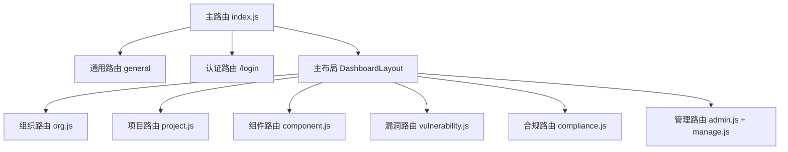
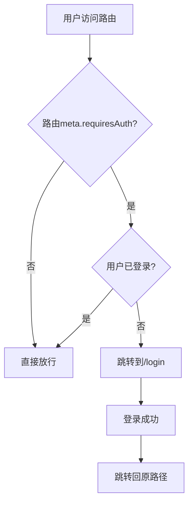

# 路由系统指南

本指南详细介绍Vue Router的配置、模块化路由、动态路由加载和路由守卫等核心功能。

## 目录

- [路由系统架构](#路由系统架构)
- [主路由文件](#主路由文件)
- [模块化路由](#模块化路由)
- [Route Meta字段](#route-meta字段)
- [路由守卫](#路由守卫)
- [动态登录页实现](#动态登录页实现)
- [路由懒加载](#路由懒加载)
- [路由导航](#路由导航)
- [实际案例](#实际案例)
- [路由配置最佳实践](#路由配置最佳实践)

---

## 路由系统架构

### 整体架构

```
src/router/
├── index.js                  # 主路由文件
└── routes/                   # 模块化路由
    ├── admin.js              # 系统管理模块
    ├── compliance.js         # 合规管理模块
    ├── component.js          # 组件管理模块
    ├── manage.js             # 组织成员管理模块
    ├── org.js                # 组织管理模块
    ├── project.js            # 项目管理模块
    └── vulnerability.js      # 漏洞管理模块
```

### 路由层级结构



---

## 主路由文件

### 文件位置

```
src/router/index.js
```

### 核心代码

```javascript
import { createWebHistory, createRouter } from "vue-router"
import org from "./routes/org"
import admin from "./routes/admin"
import project from "./routes/project"
import component from "./routes/component"
import vulnerability from "./routes/vulnerability"
import compliance from "./routes/compliance"
import management from "./routes/manage"
import { companyConfig, isCatarc } from "@/config"

const isMstl = companyConfig.COMPANY_ID == "mstl"
const is306 = companyConfig.COMPANY_ID == "306"
const isAnesec = companyConfig.COMPANY_ID == "anesec"
const isOsredm = companyConfig.COMPANY_ID == "osredm"

// 通用路由（登录、回调、404等）
const general = [
  {
    path: "/terms-and-conditions",
    name: "termsAndConditions",
    component: () => import("@/views/termsAndConditions.vue"),
  },
  {
    path: "/invitation/organization/:token",
    name: "InvitationPage",
    component: () => import("@/views/InvitationPage.vue"),
  },
  {
    path: "/:catchAll(.*)",
    name: "Not Found",
    component: () => import("@/views/NotFound.vue"),
  },
  {
    path: "/callback",
    name: "Callback",
    component: () => import("@/views/Callback.vue"),
  },
  {
    path: "/reset/:uid/:token",
    name: "ResetPasswordRedirect",
    component: () => import("@/views/login/ResetPasswordRedirect.vue"),
  },
  {
    path: "/email-verification/:token/",
    name: "EmailVerificationRedirect",
    component: () => import("@/views/login/EmailVerificationRedirect.vue"),
  },
  {
    path: "/:org_id/settings/jira-callback",
    name: "JiraCallback",
    component: () => import("@/views/JiraCallback.vue"),
  },
  // 动态登录页（基于品牌配置）

// 动态登录页（基于品牌配置）
if (isCatarc) {
  general.push({
    path: "/login",
    name: "Login",
    component: () => import("@/views/login/pages/CatarcLoginPage.vue"),
  })
} else if (isMstl) {
  general.push({
    path: "/login",
    name: "Login",
    component: () => import("@/views/login/pages/MstlLoginPage.vue"),
  })
} else if (isAnesec) {
  general.push({
    path: "/login",
    name: "Login",
    component: () => import("@/views/login/pages/AnesecLoginPage.vue"),
  })
} else if (isOsredm || is306) {
  general.push({
    path: "/login",
    name: "Login",
    component: () => import("@/views/login/pages/OsRedMLoginPage.vue"),
  })
} else {
  general.push({
    path: "/login",
    name: "Login",
    component: () => import("@/views/login/pages/LoginPage.vue"),
  })
}

// 主布局路由（需要认证）
const main = {
  path: "/",
  meta: {
    requiresAuth: true,  // 路由守卫标识
  },
  component: () => import("@/views/layouts/DashboardLayout.vue"),
  children: [
    ...org,
    ...project,
    ...component,
    ...vulnerability,
    ...compliance,
    ...admin,
    ...management,
  ],
}

// 合并所有路由
const routes = [...general, main]

// 创建路由实例
const router = createRouter({
  history: createWebHistory(),
  routes,
})

export default router
```

**完整文件：** [src/router/index.js](file:///D:/tanxun_code/000_main_project/vue3-frontend/src/router/index.js)

### 关键特性

1. **模块化导入**：从 `./routes/` 目录导入各个业务模块路由
2. **动态登录页**：根据品牌配置（catarc/mstl/anesec/osredm/306）加载不同的登录页面
3. **路由守卫**：主布局路由设置 `requiresAuth: true` 标识
4. **主布局**：所有需要认证的页面使用 `DashboardLayout.vue` 作为布局
5. **子路由合并**：使用扩展运算符 `...` 合并各个模块的子路由

---

## 模块化路由

### 路由模块结构

每个业务模块拥有独立的路由文件：

```javascript
// src/router/routes/{moduleName}.js

import { companyConfig } from "@/config"

const modulePath = "/org/:org_id/{moduleName}s"
const meta = {
  requiresAuth: true,
  category: "{moduleName}",  // 用于导航分类
}

const moduleRoutes = [
  {
    path: `${modulePath}`,
    name: "MODULE_LIST",
    component: () => import("@/views/moduleName/List.vue"),
    meta,
  },
  {
    path: `${modulePath}/:id`,
    name: "MODULE_DETAIL",
    component: () => import("@/views/moduleName/Detail.vue"),
    meta,
  },
  {
    path: `${modulePath}/create`,
    name: "MODULE_CREATE",
    component: () => import("@/views/moduleName/Create.vue"),
    meta,
  },
]

export default moduleRoutes
```

### 实际路由模块示例

#### 项目模块（project.js）

```javascript
// src/router/routes/project.js

import { companyConfig } from "@/config"

const projectPath = "/org/:org_id/projects"
const meta = {
  requiresAuth: true,
  category: "projects",
}

const projectRoutes = [
  {
    path: `${projectPath}/:project_id/scans/:scan_id`,
    name: "SCAN_DETAIL",
    redirect: (to) => ({
      name: "PROJECT_DETAIL",
      params: { org_id: to.params.org_id, project_id: to.params.project_id },
    }),
    meta,
  },
  {
    path: `${projectPath}`,
    name: "PROJECT_MANAGEMENT",
    component: () => import("@/views/project/SAASProjects.vue"),
    meta,
  },
  {
    path: `${projectPath}/:project_id`,
    name: "PROJECT_DETAIL",
    component: () => import("@/views/project/SAASProjectDetail.vue"),
    meta,
  },
]

export default projectRoutes
```

**完整文件：** [src/router/routes/project.js](file:///D:/tanxun_code/000_main_project/vue3-frontend/src/router/routes/project.js)

#### 现有路由模块清单

| 模块文件 | 业务模块 | 主要路由 | 组件位置 |
|----------|----------|----------|----------|
| [admin.js](file:///D:/tanxun_code/000_main_project/vue3-frontend/src/router/routes/admin.js) | 系统管理 | /org/:org_id/admin/* | [src/views/admin/](file:///D:/tanxun_code/000_main_project/vue3-frontend/src/views/admin/) |
| [compliance.js](file:///D:/tanxun_code/000_main_project/vue3-frontend/src/router/routes/compliance.js) | 合规管理 | /org/:org_id/compliance/* | [src/views/compliance/](file:///D:/tanxun_code/000_main_project/vue3-frontend/src/views/compliance/) |
| [component.js](file:///D:/tanxun_code/000_main_project/vue3-frontend/src/router/routes/component.js) | 组件管理 | /org/:org_id/component/* | [src/views/component/](file:///D:/tanxun_code/000_main_project/vue3-frontend/src/views/component/) |
| [manage.js](file:///D:/tanxun_code/000_main_project/vue3-frontend/src/router/routes/manage.js) | 组织管理 | /org/:org_id/manage/* | [src/views/management/](file:///D:/tanxun_code/000_main_project/vue3-frontend/src/views/management/) |
| [org.js](file:///D:/tanxun_code/000_main_project/vue3-frontend/src/router/routes/org.js) | 组织 | /org/:org_id/* | [src/views/home/](file:///D:/tanxun_code/000_main_project/vue3-frontend/src/views/home/) |
| [project.js](file:///D:/tanxun_code/000_main_project/vue3-frontend/src/router/routes/project.js) | 项目管理 | /org/:org_id/projects/* | [src/views/project/](file:///D:/tanxun_code/000_main_project/vue3-frontend/src/views/project/) |
| [vulnerability.js](file:///D:/tanxun_code/000_main_project/vue3-frontend/src/router/routes/vulnerability.js) | 漏洞管理 | /org/:org_id/vulnerabilities/* | [src/views/vulnerability/](file:///D:/tanxun_code/000_main_project/vue3-frontend/src/views/vulnerability/) |

### 路由模块开发规范

#### 标准模板

```javascript
// src/router/routes/moduleName.js

import { companyConfig } from "@/config"

const modulePath = "/org/:org_id/moduleNames"
const meta = {
  requiresAuth: true,      // 需要认证
  category: "moduleNames",  // 导航分类
  // 其他meta字段...
}

const moduleRoutes = [
  // 列表页
  {
    path: `${modulePath}`,
    name: "MODULE_LIST",
    component: () => import("@/views/moduleName/List.vue"),
    meta: {
      ...meta,
      title: "Module List",  // 页面标题
      breadcrumb: ["Org", "Modules"]  // 面包屑
    },
  },

  // 详情页
  {
    path: `${modulePath}/:id`,
    name: "MODULE_DETAIL",
    component: () => import("@/views/moduleName/Detail.vue"),
    meta: {
      ...meta,
      title: "Module Detail",
      breadcrumb: ["Org", "Modules", "Detail"]
    },
  },

  // 创建页
  {
    path: `${modulePath}/create`,
    name: "MODULE_CREATE",
    component: () => import("@/views/moduleName/Create.vue"),
    meta: {
      ...meta,
      title: "Create Module",
      breadcrumb: ["Org", "Modules", "Create"]
    },
  },

  // 编辑页
  {
    path: `${modulePath}/:id/edit`,
    name: "MODULE_EDIT",
    component: () => import("@/views/moduleName/Edit.vue"),
    meta: {
      ...meta,
      title: "Edit Module",
      breadcrumb: ["Org", "Modules", "Edit"]
    },
  },
]

export default moduleRoutes
```

---

## Route Meta字段

### 标准Meta字段

```javascript
{
  meta: {
    requiresAuth: true,      // 是否需要认证（路由守卫使用）
    category: "projects",     // 导航分类
    title: "Project List",    // 页面标题
    breadcrumb: ["Org", "Projects"],  // 面包屑导航
    // 其他自定义字段...
  }
}
```

### Meta字段说明

| 字段 | 类型 | 必填 | 说明 |
|------|------|------|------|
| `requiresAuth` | Boolean | 是 | 是否需要登录认证，`true`表示需要登录 |
| `category` | String | 否 | 导航分类，用于侧边栏菜单分组 |
| `title` | String | 否 | 页面标题，用于浏览器标签和页面头部 |
| `breadcrumb` | Array | 否 | 面包屑导航数组 |
| `permissions` | Array | 否 | 需要的权限列表 |
| `hideInMenu` | Boolean | 否 | 是否在侧边栏菜单中隐藏 |
| `activeMenu` | String | 否 | 指定高亮的菜单项 |

### 使用示例

```javascript
// src/router/routes/project.js

const meta = {
  requiresAuth: true,
  category: "projects",
}

const projectRoutes = [
  {
    path: `${projectPath}`,
    name: "PROJECT_LIST",
    component: () => import("@/views/project/Projects.vue"),
    meta: {
      ...meta,
      title: "Project Management",
      breadcrumb: ["Organization", "Projects"]
    },
  },
  {
    path: `${projectPath}/:project_id`,
    name: "PROJECT_DETAIL",
    component: () => import("@/views/project/ProjectDetail.vue"),
    meta: {
      ...meta,
      title: "Project Detail",
      breadcrumb: ["Organization", "Projects", "Detail"],
      // 自定义字段
      cacheable: true,  // 是否缓存页面
    },
  },
]
```

### 在组件中访问Route Meta

```vue
<template>
  <div>
    <h1>{{ $route.meta.title }}</h1>
    <el-breadcrumb>
      <el-breadcrumb-item
        v-for="item in $route.meta.breadcrumb"
        :key="item"
      >
        {{ item }}
      </el-breadcrumb-item>
    </el-breadcrumb>
  </div>
</template>

<script setup>
import { useRoute } from "vue-router"

const route = useRoute()

console.log(route.meta.title)        // 页面标题
console.log(route.meta.breadcrumb)   // 面包屑
console.log(route.meta.requiresAuth) // 是否需要认证
</script>
```

---

## 路由守卫

### 实现原理

项目中使用 `requiresAuth` meta字段配合导航守卫实现权限控制：

```javascript
// 在导航守卫中（示例，实际可能放在main.js或单独的guard文件中）

router.beforeEach((to, from, next) => {
  // 检查是否需要认证
  if (to.meta.requiresAuth) {
    // 检查是否已登录
    const isAuthenticated = checkAuth()

    if (!isAuthenticated) {
      // 未登录，跳转到登录页
      next({
        path: "/login",
        query: { redirect: to.fullPath }  // 记录原路径，登录后跳转回来
      })
    } else {
      // 已登录，允许访问
      next()
    }
  } else {
    // 不需要认证，直接放行
    next()
  }
})
```

### 路由守卫流程图



### 登录后返回原页面

```javascript
// 登录组件中
import { useRoute, useRouter } from "vue-router"

const route = useRoute()
const router = useRouter()

const handleLoginSuccess = () => {
  // 获取redirect参数，如果有则跳转回原页面
  const redirect = route.query.redirect || "/"
  router.push(redirect)
}
```

---

## 动态登录页实现

### 多品牌登录页配置

项目支持多个品牌（catarc/mstl/anesec/osredm/306），每个品牌有独立的登录页面：

```javascript
// src/router/index.js (53-83行)

if (isCatarc) {
  general.push({
    path: "/login",
    name: "Login",
    component: () => import("@/views/login/pages/CatarcLoginPage.vue"),
  })
} else if (isMstl) {
  general.push({
    path: "/login",
    name: "Login",
    component: () => import("@/views/login/pages/MstlLoginPage.vue"),
  })
} else if (isAnesec) {
  general.push({
    path: "/login",
    name: "Login",
    component: () => import("@/views/login/pages/AnesecLoginPage.vue"),
  })
} else if (isOsredm || is306) {
  general.push({
    path: "/login",
    name: "Login",
    component: () => import("@/views/login/pages/OsRedMLoginPage.vue"),
  })
} else {
  // 默认登录页
  general.push({
    path: "/login",
    name: "Login",
    component: () => import("@/views/login/pages/LoginPage.vue"),
  })
}
```

### 登录页文件结构

```
src/views/login/
├── pages/
│   ├── CatarcLoginPage.vue    # Catarc品牌登录页
│   ├── MstlLoginPage.vue      # MSTL品牌登录页
│   ├── AnesecLoginPage.vue    # Anesec品牌登录页
│   ├── OsRedMLoginPage.vue    # OsRedM/306品牌登录页
│   └── LoginPage.vue          # 默认登录页
└── components/
    └── ...（共享登录组件）
```

### 品牌配置

品牌ID在构建时配置（通过环境变量或配置文件）：

```javascript
// src/config/index.js

import companyConfig from "./default"

// 根据COMPANY_ID加载对应配置
const COMPANY_ID = import.meta.env.VITE_COMPANY_ID || "default"

// 动态加载品牌配置
const brandConfig = await import(`./${COMPANY_ID}/index.js`)
const finalConfig = merge(companyConfig, brandConfig)

export default finalConfig
```

**详细配置系统说明：** 参见 [multibrand_config.md](./multibrand_config.md)

---

## 路由懒加载

### 实现方式

所有路由组件都使用动态导入实现懒加载：

```javascript
// 懒加载语法
component: () => import("@/views/Component.vue")

// 带webpack chunk name（如需代码分割）
component: () => import(/* webpackChunkName: "group-name" */ "@/views/ Component.vue")
```

### 优势

1. **减少首屏加载时间**：只加载当前页面需要的代码
2. **按需加载**：访问路由时才加载对应组件
3. **代码分割**：Webpack自动进行代码分割

### 路由懒加载示例

```javascript
const routes = [
  {
    path: "/login",
    component: () => import("@/views/login/pages/LoginPage.vue")
  },
  {
    path: "/org/:org_id/projects",
    component: () => import("@/views/project/Projects.vue"),
    children: [
      {
        path: ":project_id",
        component: () => import("@/views/project/ProjectDetail.vue")
      }
    ]
  }
]
```

---

## 路由导航

### 声明式导航（模板中）

```vue
<template>
  <div>
    <!-- 字符串路径 -->
    <router-link to="/org/123/projects">Projects</router-link>

    <!-- 对象 -->
    <router-link :to="{ path: '/org/123/projects' }">Projects</router-link>

    <!-- 命名路由 -->
    <router-link :to="{ name: 'PROJECT_LIST', params: { org_id: 123 } }">
      Projects
    </router-link>

    <!-- 带查询参数 -->
    <router-link
      :to="{ name: 'PROJECT_LIST', query: { page: 1, search: 'keyword' } }"
    >
      Projects
    </router-link>
  </div>
</template>
```

### 编程式导航（Script中）

```typescript
import { useRouter, useRoute } from "vue-router"

const router = useRouter()
const route = useRoute()

// 字符串路径
router.push("/org/123/projects")

// 对象
router.push({ path: "/org/123/projects" })

// 命名路由
router.push({ name: "PROJECT_LIST", params: { org_id: 123 } })

// 带查询参数
router.push({
  name: "PROJECT_LIST",
  params: { org_id: 123 },
  query: { page: 1, search: "keyword" }
})

// 替换当前路由（不添加历史记录）
router.replace({ name: "PROJECT_LIST", params: { org_id: 123 } })

// 前进/后退
router.go(1)   // 前进一页
router.go(-1)  // 后退一页
router.back()  // 后退
```

### 获取路由参数

```vue
<template>
  <div>
    <h1>Org ID: {{ orgId }}</h1>
    <h1>Project ID: {{ projectId }}</h1>
  </div>
</template>

<script setup>
import { useRoute } from "vue-router"
import { computed } from "vue"

const route = useRoute()

// 路径参数（params）
const orgId = computed(() => route.params.org_id)
const projectId = computed(() => route.params.project_id)

// 查询参数（query）
const page = computed(() => route.query.page || 1)
const search = computed(() => route.query.search || "")

// 完整路由信息
console.log(route.path)      // 当前路径
console.log(route.name)      // 路由名称
console.log(route.fullPath)  // 完整路径（含查询参数）
</script>
</template>
```

---

## 实际案例

### 案例：项目模块路由

**文件：** [src/router/routes/project.js](file:///D:/tanxun_code/000_main_project/vue3-frontend/src/router/routes/project.js)

```javascript
// 项目路由配置

import { companyConfig } from "@/config"

const projectPath = "/org/:org_id/projects"
const meta = {
  requiresAuth: true,
  category: "projects",
}

const projectRoutes = [
  // 扫描详情重定向到项目详情
  {
    path: `${projectPath}/:project_id/scans/:scan_id`,
    name: "SCAN_DETAIL",
    redirect: (to) => ({
      name: "PROJECT_DETAIL",
      params: { org_id: to.params.org_id, project_id: to.params.project_id },
    }),
    meta,
  },

  // 项目列表页
  {
    path: `${projectPath}`,
    name: "PROJECT_MANAGEMENT",
    component: () => import("@/views/project/SAASProjects.vue"),
    meta,
  },

  // 项目详情页
  {
    path: `${projectPath}/:project_id`,
    name: "PROJECT_DETAIL",
    component: () => import("@/views/project/SAASProjectDetail.vue"),
    meta,
  },
]

export default projectRoutes
```

**关键特性：**

1. **路径参数**：`:org_id` 和 `:project_id` 作为动态参数
2. **重定向**：旧的扫描详情路径重定向到项目详情
3. **懒加载**：使用动态导入 `() => import(...)`
4. **Meta配置**：需要认证，分类为projects

---

### 案例：组织管理路由

**文件：** [src/router/routes/org.js](file:///D:/tanxun_code/000_main_project/vue3-frontend/src/router/routes/org.js)

```javascript
// 组织路由配置

import { companyConfig } from "@/config"

const orgPath = "/org/:org_id"
const meta = {
  requiresAuth: true,
}

const orgRoutes = [
  {
    path: "/select-org",
    name: "selectOrg",
    component: () => import("@/views/home/SelectOrg.vue"),
    meta: { ...meta },
  },
  {
    path: `${orgPath}`,
    name: "ORG_DETAIL",
    component: () => import("@/views/home/OrgDetail.vue"),
    meta: { ...meta },
  },
  {
    path: `${orgPath}/home`,
    name: "HOME",
    redirect: { name: "ORG_DETAIL" },
  },
]

export default orgRoutes
```

**关键特性：**

1. **组织选择页**：`/select-org` 用于切换组织
2. **组织首页**：`/org/:org_id` 和 `/org/:org_id/home` 都指向组织详情
3. **组织上下文**：所有组织相关路由都有 `:org_id` 参数

---

## 路由配置最佳实践

### 1. 使用命名路由

```javascript
// ✅ 推荐：使用命名路由
{
  path: "/org/:org_id/projects",
  name: "PROJECT_LIST",
  component: Projects
}

// 导航时
router.push({ name: "PROJECT_LIST", params: { org_id: 123 } })

// ❌ 避免：使用硬编码路径
router.push("/org/123/projects")
```

### 2. 标准化Meta字段

```javascript
// ✅ 推荐：定义标准的meta对象
const meta = {
  requiresAuth: true,
  category: "projects",
  title: "Project List",
  breadcrumb: ["Org", "Projects"]
}

// 路由配置中使用
{
  path: "/org/:org_id/projects",
  component: Projects,
  meta: { ...meta }
}
```

### 3. 合理的路由结构

```javascript
// ✅ 推荐：按业务模块组织路由
const routes = [
  {
    path: "/org/:org_id",
    component: Layout,
    children: [
      ...orgRoutes,      // 组织
      ...projectRoutes,  // 项目
      ...scanRoutes,     // 扫描
      ...userRoutes      // 用户
    ]
  }
]

// ❌ 避免：路由结构混乱
const routes = [
  { path: "/org", component: Org },
  { path: "/projects", component: Projects },
  { path: "/project/:id", component: ProjectDetail },
  // ...
]
```

### 4. 使用重定向处理旧路由

```javascript
// ✅ 推荐：保持向后兼容
{
  path: "/old-path/:id",
  redirect: (to) => ({
    path: `/new-path/${to.params.id}`
  })
}

// 或者重定向到命名路由
{
  path: "/old-path/:id",
  redirect: (to) => ({
    name: "NEW_ROUTE_NAME",
    params: { id: to.params.id }
  })
}
```

### 5. 路由参数验证

```javascript
// ✅ 推荐：使用导航守卫验证参数
router.beforeEach((to, from, next) => {
  if (to.params.org_id) {
    // 验证org_id是否有效
    const isValidOrg = validateOrgId(to.params.org_id)

    if (!isValidOrg) {
      next("/select-org")  // 无效则跳转到组织选择页
    } else {
      next()
    }
  } else {
    next()
  }
})
```

### 6. 路由懒加载

```javascript
// ✅ 推荐：所有路由组件都使用懒加载
{
  component: () => import("@/views/Component.vue")
}

// ❌ 避免：直接导入组件
import Component from "@/views/Component.vue"

{
  component: Component
}
```

### 7. 路由参数命名规范

```javascript
// ✅ 推荐：使用语义化的参数名
/org/:org_id/projects/:project_id/scans/:scan_id

// ❌ 避免：使用无意义的参数名
/org/:id1/projects/:id2/scans/:id3
```

---

## 常见问题

### Q1: 如何在路由变化时保持组件状态？

**A:** 使用 `<keep-alive>` 或路由缓存

```vue
<template>
  <router-view v-slot="{ Component }">
    <keep-alive>
      <component :is="Component" />
    </keep-alive>
  </router-view>
</template>
```

### Q2: 如何监听路由参数变化？

**A:** 使用 `watch` 监听 `$route`

```vue
<script setup>
import { watch } from "vue"
import { useRoute } from "vue-router"

const route = useRoute()

watch(
  () => route.params.project_id,
  (newId) => {
    // project_id变化时重新加载数据
    loadProjectDetail(newId)
  }
)
</script>
```

### Q3: 如何在路由中获取品牌配置？

**A:** 使用配置系统

```javascript
import { companyConfig } from "@/config"

console.log(companyConfig.COMPANY_ID)  // "catarc" | "mstl" | "anesec" | "osredm" | "306" | "default"
```

### Q4: 如何实现404页面？

**A:** 使用通配符路由

```javascript
{
  path: "/:catchAll(.*)",
  name: "NotFound",
  component: () => import("@/views/NotFound.vue")
}
```

---

## 扩展阅读

- [模块开发指南](./module_development_guide.md) - 创建新业务模块时配置路由
- [API接口层文档](./api_layer.md) - 路由参数传递给API
- [组件开发规范](./component_guide.md) - 在组件中使用路由

---

## 最后更新

**最后更新日期：** 2025-11-26
**适用版本：** v4.10.0
**文档维护：** 新增路由模块时更新本文档
