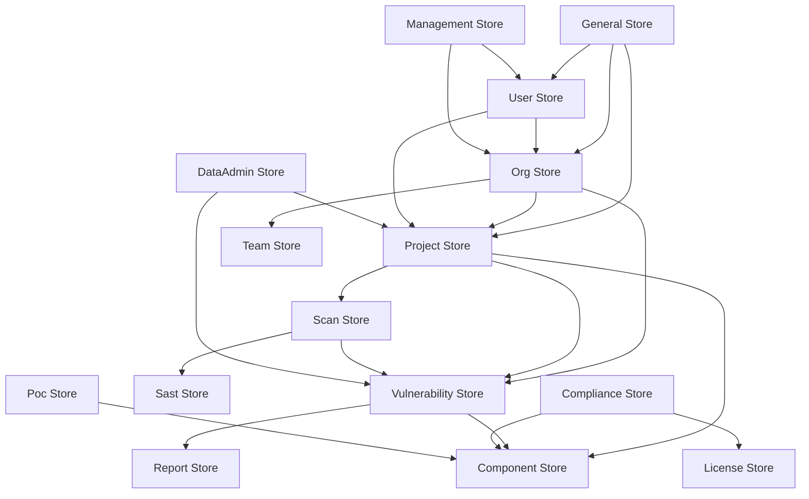

# Pinia状态管理文档

> 本文档详细介绍项目中Pinia状态管理的架构设计、Store模块划分、使用规范及最佳实践。

## 📋 文档信息

- **最后更新**: 2025-11-26
- **适用版本**: vue3-frontend v4.10.0
- **重要性**: ⭐⭐⭐ 核心文档
- **相关文件**: `src/stores/` 目录下所有store模块

---

## 目录

1. [概述](#概述)
2. [Store架构设计](#store架构设计)
3. [Store模块清单](#store模块清单)
4. [核心Store详解](#核心store详解)
5. [Store使用规范](#store使用规范)
6. [Store使用示例](#store使用示例)
7. [Store设计模式](#store设计模式)
8. [最佳实践](#最佳实践)

---

## 概述

### 什么是Pinia？

Pinia是Vue官方推荐的状态管理库，作为Vuex的替代品，提供了：

- **类型安全**: 完整的TypeScript支持
- **模块化**: 天然的模块化设计，无需手动拆分modules
- **组合式API**: 与Vue 3 Composition API完美结合
- **轻量级**: 体积更小，性能更好
- **调试友好**: 优秀的devtools支持

### Store在项目中的作用

在vue3-frontend项目中，Store承担着：

1. **状态管理**: 统一管理应用状态，避免 prop drilling
2. **数据缓存**: 缓存API数据，避免重复请求
3. **业务逻辑**: 封装业务逻辑，保持组件简洁
4. **跨组件通信**: 实现不相关组件之间的数据共享
5. **响应式数据**: 自动响应数据变化，更新视图

---

## Store架构设计

### Store文件结构

项目采用**分离式架构**，将Store拆分为多个文件：

```
stores/
├── project/           # 项目管理Store
│   ├── index.ts       # Store主入口（组合state/getters/actions）
│   ├── state.ts       # 状态定义
│   ├── actions.ts     # 操作（异步）
│   └── getters.ts     # 计算属性
│
├── org/               # 组织管理Store
├── user/              # 用户管理Store
├── vulnerability/     # 漏洞管理Store
├── component/         # 组件库Store
└── ...               # 其他业务模块Store

├── extractStore.ts    # Store组合工具
└── index.ts           # Store统一导出（可选）
```

### Store组合机制

**核心工具**: `src/stores/extractStore.ts`

```typescript
// extractStore.ts (简化版)
export function extractStore(store: any) {
  const { subscribe, ...rest } = store;
  return rest;
}

// 使用方式（src/stores/project/index.ts）
import { extractStore } from "@/stores/extractStore";
import { defineStore } from "pinia";
import { useActions } from "./actions";
import { useGetters } from "./getters";
import { useState } from "./state";

export const useProjectStore = defineStore("project", () => {
  return {
    ...extractStore(useState()),      // 导入state
    ...extractStore(useGetters()),    // 导入getters
    ...extractStore(useActions()),    // 导入actions
  };
});
```

### State定义（state.ts）

```typescript
// src/stores/project/state.ts
import { defineStore } from "pinia";

// 定义接口（类型安全）
export interface State {
  project: Record<string, any>;              // 当前项目详情
  projectList: any[];                        // 项目列表
  total: number;                             // 总数
  scanDisabled: boolean;                     // 扫描是否禁用
  addNewProject: any[];                      // 新建项目缓存
  NewProjectId: string;                      // 新项目ID
  uploadHistory: any[];                      // 上传历史
  reportGenerationProjects: any[];           // 报告生成项目
  scanCompareReport: any[];                  // 扫描对比报告
  projectSaasProgressItem: Record<string, any>; // SaaS进度
  projectStatus: Record<string, any>;        // 项目状态
}

export const useState = defineStore({
  id: "project.state",
  state: (): State => {
    return {
      scanDisabled: true,
      addNewProject: [],
      NewProjectId: "",
      project: {},
      projectList: [],
      uploadHistory: [],
      total: 0,
      reportGenerationProjects: [],
      scanCompareReport: [],
      projectSaasProgressItem: {},
      projectStatus: {},
    };
  },
});
```

### Actions定义（actions.ts）

```typescript
// src/stores/project/actions.ts
import { defineStore } from "pinia";
import { useState } from "./state";
import project from "@/api/project";
import errorHandler from "@/utils/errorHandler";

export const useActions = defineStore("project.actions", () => {
  const state = useState();

  // Action: 获取项目列表
  const getProjectList = async (payload: any) => {
    try {
      const response = await project.getProjectList(
        (data) => data,
        (e) => errorHandler(e),
        payload
      );

      if (response.code === 200) {
        state.projectList = response.data.results;
        state.total = response.data.count;
      }

      return response;
    } catch (error) {
      errorHandler(error);
    }
  };

  // Action: 获取项目详情
  const getProject = async (payload: any) => {
    try {
      const response = await project.getProject(
        (data) => data,
        (e) => errorHandler(e),
        payload
      );

      if (response.code === 200) {
        state.project = response.data;
      }

      return response;
    } catch (error) {
      errorHandler(error);
    }
  };

  // Action: 创建项目
  const createProject = async (payload: any) => {
    try {
      const response = await project.postProject(payload);

      if (response.code === 200) {
        ElMessage.success('项目创建成功');
        // 刷新列表
        await getProjectList({ org_id: payload.org_id });
      }

      return response;
    } catch (error) {
      errorHandler(error);
    }
  };

  return {
    getProjectList,
    getProject,
    createProject,
  };
});
```

### Getters定义（getters.ts）

```typescript
// src/stores/project/getters.ts
import { defineStore } from "pinia";
import { useState } from "./state";
import { computed } from "vue";

export const useGetters = defineStore("project.getters", () => {
  const state = useState();

  // Getter: 获取活跃项目
  const activeProjects = computed(() => {
    return state.projectList.filter(p => p.status === 'active');
  });

  // Getter: 项目总数
  const totalCount = computed(() => state.total);

  // Getter: 当前项目ID
  const currentProjectId = computed(() => state.project.id);

  // Getter: 是否有项目
  const hasProjects = computed(() => state.projectList.length > 0);

  return {
    activeProjects,
    totalCount,
    currentProjectId,
    hasProjects,
  };
});
```

---

## Store模块清单

### 16个Store模块概览

| Store | 文件路径 | 核心功能 | 关联API | 关联Views |
|-------|----------|----------|---------|----------|
| **project** | `stores/project/` | 项目管理 | `api/project.ts` | `views/project/` |
| **org** | `stores/org/` | 组织管理 | `api/org.ts` | `views/management/` |
| **vulnerability** | `stores/vulnerability/` | 漏洞管理 | `api/vulnerability.ts` | `views/vulnerability/` |
| **component** | `stores/component/` | 组件库 | `api/component.ts` | `views/component/` |
| **user** | `stores/user/` | 用户管理 | `api/user.ts` | `views/login/` |
| **scan** | `stores/scan/` | 扫描管理 | `api/scan.ts` | `views/scan/` |
| **compliance** | `stores/compliance/` | 合规管理 | `api/compliance.ts` | `views/compliance/` |
| **general** | `stores/general/` | 通用状态 | `api/general.ts` | 全局 |
| **report** | `stores/report/` | 报告管理 | `api/report.ts` | `views/report/` |
| **management** | `stores/management/` | 系统管理 | `api/management.ts` | `views/admin/` |
| **sast** | `stores/sast/` | SAST扫描 | `api/sast.ts` | `views/scan/` |
| **dataAdmin** | `stores/dataAdmin/` | 数据管理 | `api/dataAdmin.ts` | `views/dataManagement/` |
| **team** | `stores/team/` | 团队管理 | `api/team.ts` | `views/management/` |
| **poc** | `stores/poc/` | PoC管理 | `api/poc.ts` | `views/scan/` |
| **license** | `stores/license/` | 许可证管理 | `api/license.ts` | `views/setting/` |
| **chat** | `stores/chat/` | 聊天/消息 | `api/chat.ts` | 全局 |

### Store模块详细说明

#### 1. Project Store（项目管理 - 核心）

**职责**: 管理项目相关的所有状态

**State**: `src/stores/project/state.ts`
```typescript
State {
  project: object;           // 当前项目详情
  projectList: array;        // 项目列表
  total: number;            // 总数
  scanDisabled: boolean;    // 扫描状态
  NewProjectId: string;     // 新项目ID
  uploadHistory: array;     // 上传历史
  reportGenerationProjects: array; // 报告生成项目
  scanCompareReport: array; // 扫描对比报告
}
```

**核心Actions**:
- `getProjectList()` - 获取项目列表
- `getProject()` - 获取项目详情
- `createProject()` - 创建项目
- `updateProject()` - 更新项目
- `deleteProject()` - 删除项目
- `uploadProject()` - 上传项目代码
- `getProjectScanPolicy()` - 获取扫描策略

**核心Getters**:
- `activeProjects` - 活跃项目列表
- `totalCount` - 项目总数
- `currentProjectId` - 当前项目ID
- `hasProjects` - 是否有项目

---

#### 2. Org Store（组织管理）

**职责**: 管理组织、成员、订阅、集成配置等

**State**:
```typescript
State {
  org: object;              // 当前组织
  orgList: array;           // 组织列表
  members: array;           // 组织成员
  subscription: object;     // 订阅信息
  usage: object;            // 用量统计
  integrationConfigs: array; // 集成配置
  jiraIntegration: object;  // Jira集成
  gitlabIntegration: object; // GitLab集成
  scmIntegration: boolean;  // SCM集成状态
  ciCdIntegration: boolean; // CI/CD集成状态
}
```

**核心Actions**:
- `getOrg()` - 获取组织详情
- `getOrgList()` - 获取组织列表
- `getOrgMembers()` - 获取组织成员
- `createOrgMember()` - 添加成员
- `getOrgSubscriptionUsage()` - 获取订阅用量
- `getIntegrationConfigs()` - 获取集成配置

**核心Getters**:
- `isAdmin` - 是否为管理员
- `memberCount` - 成员数量
- `hasSubscription` - 是否有订阅
- `integrationsEnabled` - 集成是否启用

---

#### 3. User Store（用户管理）

**职责**: 用户认证、权限、个人信息

**State**:
```typescript
State {
  user: object;             // 当前用户信息
  isLoggedIn: boolean;      // 登录状态
  permissions: array;       // 用户权限
  token: string;            // 认证Token
  defaultOrgId: string;     // 默认组织ID
  roles: array;             // 用户角色
  preferences: object;      // 用户偏好设置
}
```

**核心Actions**:
- `getUser()` - 获取用户信息
- `login()` - 用户登录
- `logout()` - 用户登出
- `getPermissionRoles()` - 获取用户权限
- `updateUserProfile()` - 更新用户资料

**核心Getters**:
- `username` - 用户名
- `userId` - 用户ID
- `hasPermission()` - 检查权限
- `isAdmin` - 是否为管理员
- `avatar` - 用户头像

---

#### 4. Vulnerability Store（漏洞管理）

**职责**: 管理漏洞检测、分类、统计、修复等

**State**:
```typescript
State {
  vulnerabilities: array;   // 漏洞列表
  vulnerability: object;    // 当前漏洞详情
  total: number;            // 漏洞总数
  severityCount: object;    // 按严重级别统计
  categories: array;        // 漏洞分类
  classes: array;           // 漏洞类型
  trend: array;             // 趋势数据
  filters: object;          // 筛选条件
}
```

**核心Actions**:
- `getVulnerabilities()` - 获取漏洞列表
- `getVulnerability()` - 获取漏洞详情
- `updateVulnerabilityStatus()` - 更新漏洞状态
- `getVulnerabilitySeverityCount()` - 获取严重级别统计
- `exportVulnerabilities()` - 导出漏洞报告

**核心Getters**:
- `criticalCount` - 严重漏洞数
- `highCount` - 高危漏洞数
- `filteredVulnerabilities` - 筛选后的漏洞列表

---

#### 5. Scan Store（扫描管理）

**职责**: 扫描任务、扫描历史、扫描结果

**State**:
```typescript
State {
  scans: array;             // 扫描列表
  currentScan: object;      // 当前扫描
  scanHistory: array;       // 扫描历史
  scanProgress: number;     // 扫描进度
  scanStatus: string;       // 扫描状态
  queue: array;             // 扫描队列
  engines: object;          // 扫描引擎配置
}
```

**核心Actions**:
- `startScan()` - 开始扫描
- `getScanStatus()` - 获取扫描状态
- `getScanHistory()` - 获取扫描历史
- `cancelScan()` - 取消扫描
- `getScanEngines()` - 获取扫描引擎

**核心Getters**:
- `isScanning` - 是否正在扫描
- `scanProgressPercent` - 扫描进度百分比
- `queuedScans` - 队列中的扫描

---

#### 6. General Store（通用状态）

**职责**: 全局通用状态，如加载状态、通知、页面配置等

**State**:
```typescript
State {
  pageLoading: boolean;     // 页面加载状态
  locale: string;          // 当前语言
  theme: string;           // 当前主题
  notifications: array;    // 通知列表
  breadcrumbs: array;      // 面包屑导航
  integrations: object;    // 集成状态
  licenseStatus: object;   // 许可证状态
}
```

**核心Actions**:
- `setPageLoading()` - 设置页面加载状态
- `showNotification()` - 显示通知
- `getIntegrationConfigs()` - 获取集成配置
- `getLicenseStatus()` - 获取许可证状态
- `setLocale()` - 设置语言

**核心Getters**:
- `isLoading` - 是否加载中
- `notificationCount` - 通知数量
- `integrationsEnabled` - 集成是否启用

---

## Store使用规范

### 1. 在组件中使用Store（基本用法）

```vue
<template>
  <div class="project-list">
    <el-table :data="projects" v-loading="loading">
      <el-table-column prop="name" label="项目名称" />
      <el-table-column prop="status" label="状态" />
    </el-table>
  </div>
</template>

<script setup lang="ts">
import { useProjectStore } from '@/stores/project';
import { storeToRefs } from 'pinia';
import { onMounted, ref } from 'vue';

// 1. 创建Store实例
const projectStore = useProjectStore();

// 2. 使用 storeToRefs 保持响应式
const { projectList: projects, total } = storeToRefs(projectStore);

// 3. 加载状态
const loading = ref(false);

// 4. 加载数据
onMounted(async () => {
  loading.value = true;
  try {
    await projectStore.getProjectList({
      page: 1,
      page_size: 10
    });
  } finally {
    loading.value = false;
  }
});
</script>
```

### 2. 使用Getters

```vue
<script setup lang="ts">
import { useProjectStore } from '@/stores/project';
import { useVulnerabilityStore } from '@/stores/vulnerability';

const projectStore = useProjectStore();
const vulnerabilityStore = useVulnerabilityStore();

// 使用Getter
const activeProjects = projectStore.activeProjects;
const hasProjects = projectStore.hasProjects;

const criticalCount = vulnerabilityStore.criticalCount;
const highCount = vulnerabilityStore.highCount;

// 在模板中使用
const stats = computed(() => ({
  projects: projectStore.totalCount,
  criticalVulns: vulnerabilityStore.criticalCount,
  highVulns: vulnerabilityStore.highCount
}));
</script>
```

### 3. 调用Actions（异步操作）

```vue
<script setup lang="ts">
const handleCreateProject = async () => {
  try {
    submitting.value = true;

    // 调用Action
    const response = await projectStore.createProject({
      name: formData.name,
      description: formData.description,
      org_id: currentOrgId
    });

    if (response?.code === 200) {
      ElMessage.success('项目创建成功');
      // 刷新列表
      await projectStore.getProjectList({ page: 1 });
    }
  } catch (error) {
    console.error('创建失败:', error);
  } finally {
    submitting.value = false;
  }
};

const handleUpdateProject = async (id: string, data: any) => {
  // 调用Action
  await projectStore.updateProject({
    projectId: id,
    ...data
  });
};

const handleDeleteProject = async (id: string) => {
  await projectStore.deleteProject({ projectId: id });
};
</script>
```

### 4. 跨Store通信

```vue
<script setup lang="ts">
import { useProjectStore } from '@/stores/project';
import { useOrgStore } from '@/stores/org';
import { useUserStore } from '@/stores/user';

const projectStore = useProjectStore();
const orgStore = useOrgStore();
const userStore = useUserStore();

// 加载依赖多个Store的数据
const loadDashboardData = async () => {
  loading.value = true;

  try {
    // 1. 获取用户信息（确定默认组织）
    await userStore.getUser();
    const defaultOrgId = userStore.defaultOrgId;

    // 2. 获取组织信息
    await orgStore.getOrg({ activeOrgId: defaultOrgId });

    // 3. 根据组织ID获取项目列表
    await projectStore.getProjectList({
      org_id: defaultOrgId,
      page: 1,
      page_size: 10
    });

    // 4. 获取组织统计信息
    await orgStore.getOrgSubscriptionUsage({ org_id: defaultOrgId });

  } catch (error) {
    console.error('加载仪表板数据失败:', error);
  } finally {
    loading.value = false;
  }
};

// 使用多个Store的数据计算
const dashboardStats = computed(() => ({
  activeOrg: orgStore.org.name,
  username: userStore.username,
  projectCount: projectStore.totalCount,
  memberCount: orgStore.memberCount,
  usagePercent: orgStore.usage.percentage
}));
</script>
```

### 5. 使用 setupStore 模式（推荐）

```vue
<script setup lang="ts">
// hooks/useProject.ts
import { useProjectStore } from '@/stores/project';
import { storeToRefs } from 'pinia';

export function useProject() {
  const projectStore = useProjectStore();
  const { projectList, total } = storeToRefs(projectStore);

  const loadProjects = async (params: any) => {
    await projectStore.getProjectList(params);
  };

  const createProject = async (data: any) => {
    return await projectStore.createProject(data);
  };

  return {
    // State
    projects: projectList,
    total,

    // Actions
    loadProjects,
    createProject
  };
}

// 组件中使用
import { useProject } from '@/hooks/useProject';

const { projects, total, loadProjects, createProject } = useProject();

onMounted(() => {
  loadProjects({ page: 1 });
});
</script>
```

---

## Store使用示例

### 示例 1: 状态管理（项目列表页）

**需求**: 显示项目列表，支持分页、筛选、搜索

```vue
<template>
  <div class="project-list">
    <!-- 搜索和筛选 -->
    <div class="filter-bar">
      <el-input
        v-model="searchKeyword"
        placeholder="搜索项目名称"
        @keyup.enter="handleSearch"
      />
      <el-select v-model="statusFilter" @change="handleFilterChange">
        <el-option label="全部" value="" />
        <el-option label="活跃" value="active" />
        <el-option label="已归档" value="archived" />
      </el-select>
      <el-button type="primary" @click="handleSearch">搜索</el-button>
    </div>

    <!-- 项目列表 -->
    <el-table :data="projectStore.projectList" v-loading="loading">
      <el-table-column prop="name" label="项目名称" width="200">
        <template #default="{ row }">
          <router-link :to="`/project/${row.id}`">
            {{ row.name }}
          </router-link>
        </template>
      </el-table-column>
      <el-table-column prop="description" label="描述" />
      <el-table-column prop="status" label="状态" width="100">
        <template #default="{ row }">
          <el-tag :type="row.status === 'active' ? 'success' : 'info'">
            {{ row.status }}
          </el-tag>
        </template>
      </el-table-column>
      <el-table-column prop="created_at" label="创建时间" width="180" />
      <el-table-column label="操作" width="200">
        <template #default="{ row }">
          <el-button link @click="handleEdit(row)">编辑</el-button>
          <el-button link @click="handleDelete(row.id)">删除</el-button>
        </template>
      </el-table-column>
    </el-table>

    <!-- 分页 -->
    <div class="pagination">
      <el-pagination
        v-model:current-page="currentPage"
        v-model:page-size="pageSize"
        :total="projectStore.total"
        @current-change="handlePageChange"
        layout="total, prev, pager, next, sizes"
      />
    </div>
  </div>
</template>

<script setup lang="ts">
import { useProjectStore } from '@/stores/project';
import { storeToRefs } from 'pinia';
import { ref, onMounted } from 'vue';

// Store实例
const projectStore = useProjectStore();

// 响应式数据
const loading = ref(false);
const searchKeyword = ref('');
const statusFilter = ref('');
const currentPage = ref(1);
const pageSize = ref(10);

// 加载数据
const loadProjects = async () => {
  loading.value = true;
  try {
    await projectStore.getProjectList({
      page: currentPage.value,
      page_size: pageSize.value,
      search: searchKeyword.value,
      status: statusFilter.value
    });
  } finally {
    loading.value = false;
  }
};

// 搜索
const handleSearch = async () => {
  currentPage.value = 1; // 重置到第一页
  await loadProjects();
};

// 筛选变化
const handleFilterChange = async () => {
  currentPage.value = 1;
  await loadProjects();
};

// 分页变化
const handlePageChange = async () => {
  await loadProjects();
};

// 初始化
onMounted(() => {
  loadProjects();
});

// 使用Getter
const hasProjects = projectStore.hasProjects;
</script>
```

### 示例 2: 异步操作（创建项目）

```vue
<template>
  <el-dialog v-model="dialogVisible" title="创建新项目">
    <el-form :model="formData" :rules="rules" label-width="120px">
      <el-form-item label="项目名称" prop="name">
        <el-input v-model="formData.name" placeholder="输入项目名称" />
      </el-form-item>

      <el-form-item label="项目描述" prop="description">
        <el-input
          v-model="formData.description"
          type="textarea"
          :rows="4"
          placeholder="输入项目描述"
        />
      </el-form-item>

      <el-form-item label="可见性" prop="visibility">
        <el-radio-group v-model="formData.visibility">
          <el-radio label="private">私有</el-radio>
          <el-radio label="public">公开</el-radio>
        </el-radio-group>
      </el-form-item>

      <el-form-item label="自动扫描" prop="autoScan">
        <el-switch v-model="formData.autoScan" />
      </el-form-item>
    </el-form>

    <template #footer>
      <el-button @click="dialogVisible = false">取消</el-button>
      <el-button type="primary" @click="handleSubmit" :loading="submitting">
        创建
      </el-button>
    </template>
  </el-dialog>
</template>

<script setup lang="ts">
import { useProjectStore } from '@/stores/project';
import { useOrgStore } from '@/stores/org';
import { ElMessage } from 'element-plus';
import { reactive, ref } from 'vue';
import { useRouter } from 'vue-router';

const projectStore = useProjectStore();
const orgStore = useOrgStore();
const router = useRouter();

const dialogVisible = ref(false);
const submitting = ref(false);

// 表单数据
const formData = reactive({
  name: '',
  description: '',
  visibility: 'private',
  autoScan: true,
  scanPolicy: 'weekly'
});

// 表单验证规则
const rules = {
  name: [
    { required: true, message: '请输入项目名称', trigger: 'blur' },
    { min: 3, max: 100, message: '长度在 3 到 100 个字符', trigger: 'blur' }
  ]
};

// 处理提交
const handleSubmit = async () => {
  try {
    submitting.value = true;

    // 1. 准备数据
    const payload = {
      activeOrgId: orgStore.activeOrgId,
      name: formData.name,
      description: formData.description,
      visibility: formData.visibility,
      settings: {
        auto_scan: formData.autoScan,
        scan_policy: formData.scanPolicy
      }
    };

    // 2. 调用Store Action
    const response = await projectStore.createProject(payload);

    // 3. 处理响应
    if (response?.code === 200) {
      ElMessage.success('项目创建成功');

      // 关闭对话框
      dialogVisible.value = false;

      // 从Store获取新创建的项目ID
      const newProjectId = projectStore.NewProjectId;

      // 跳转到项目详情页
      if (newProjectId) {
        router.push(`/org/${orgStore.activeOrgId}/project/${newProjectId}`);
      }

      // 刷新项目列表
      await projectStore.getProjectList({
        org_id: orgStore.activeOrgId,
        page: 1
      });

      // 重置表单
      resetForm();
    }
  } catch (error) {
    console.error('创建失败:', error);
  } finally {
    submitting.value = false;
  }
};

// 重置表单
const resetForm = () => {
  formData.name = '';
  formData.description = '';
  formData.visibility = 'private';
  formData.autoScan = true;
};

// 打开对话框
const openDialog = () => {
  resetForm();
  dialogVisible.value = true;
};

// 导出方法供父组件使用
defineExpose({ openDialog });
</script>
```

### 示例 3: 跨组件通信（组织切换影响项目列表）

**需求**: 切换组织时，自动更新项目列表、成员列表、统计数据

```vue
<!-- OrgSelector.vue - 组织选择器组件 -->
<template>
  <el-select v-model="selectedOrg" @change="handleOrgChange">
    <el-option
      v-for="org in orgStore.orgList"
      :key="org.id"
      :label="org.name"
      :value="org.id"
    />
  </el-select>
</template>

<script setup lang="ts">
import { useOrgStore } from '@/stores/org';
import { ref, watch } from 'vue';

const orgStore = useOrgStore();
const selectedOrg = ref(orgStore.activeOrgId);

// 处理组织切换
const handleOrgChange = async (orgId: string) => {
  try {
    loading.value = true;

    // 1. 更新当前组织
    await orgStore.setActiveOrg(orgId);

    // 2. 加载新组织的数据
    await Promise.all([
      // 加载组织详情
      orgStore.getOrg({ activeOrgId: orgId }),

      // 加载组织成员
      orgStore.getOrgMembers({ org_id: orgId }),

      // 加载订阅用量
      orgStore.getOrgSubscriptionUsage({ org_id: orgId }),

      // 加载集成配置
      orgStore.getIntegrationConfigs({ org_id: orgId })
    ]);

    // 触发自定义事件，通知其他组件
    emit('org-changed', orgId);

  } catch (error) {
    console.error('切换组织失败:', error);
    ElMessage.error('切换组织失败');
  } finally {
    loading.value = false;
  }
};
</script>
```

```vue
<!-- ProjectList.vue - 项目列表组件 -->
<template>
  <div class="project-list">
    <!-- 监听组织切换事件 -->
    <OrgSelector @org-changed="handleOrgChanged" />

    <!-- 项目列表 -->
    <el-table :data="projectStore.projectList" v-loading="loading">
      ...
    </el-table>
  </div>
</template>

<script setup lang="ts">
import { useProjectStore } from '@/stores/project';
import { useOrgStore } from '@/stores/org';
import OrgSelector from './OrgSelector.vue';

const projectStore = useProjectStore();
const orgStore = useOrgStore();

// 处理组织切换
const handleOrgChanged = async (orgId: string) => {
  try {
    loading.value = true;

    // 重新加载项目列表（新组织）
    await projectStore.getProjectList({
      org_id: orgId,
      page: 1,
      page_size: pageSize.value
    });

  } catch (error) {
    console.error('加载项目失败:', error);
  } finally {
    loading.value = false;
  }
};

// 监听组织变化（备用方案）
watch(
  () => orgStore.activeOrgId,
  async (newOrgId) => {
    if (newOrgId) {
      await handleOrgChanged(newOrgId);
    }
  }
);
</script>
```

```vue
<!-- Dashboard.vue - 仪表板组件 -->
<template>
  <div class="dashboard">
    <!-- 组织统计 -->
    <StatsCard
      title="组织用量"
      :usage="orgStore.usage"
      :limit="orgStore.subscription.limit"
    />

    <!-- 成员统计 -->
    <StatsCard
      title="团队成员"
      :count="orgStore.memberCount"
      :trend="memberTrend"
    />

    <!-- 项目统计 -->
    <StatsCard
      title="项目数量"
      :count="projectStore.totalCount"
      :trend="projectTrend"
    />
  </div>
</template>

<script setup lang="ts">
import { useProjectStore } from '@/stores/project';
import { useOrgStore } from '@/stores/org';

const projectStore = useProjectStore();
const orgStore = useOrgStore();

// 组织切换时自动更新统计数据
const handleOrgChanged = async (orgId: string) => {
  await Promise.all([
    // 加载仪表板数据
    loadDashboardData(orgId),

    // 加载分析数据
    loadAnalyticsData(orgId)
  ]);
};
</script>
```

---

## Store设计模式

### 模式 1: 状态管理模式（推荐）

```typescript
// stores/project/[state|actions|getters].ts

// 1. State（原始数据）
export interface State {
  projects: Project[];
  currentProject: Project | null;
  filters: FilterOptions;
}

// 2. Actions（业务逻辑）
const fetchProjects = async (params: QueryParams) => {
  const response = await projectApi.getProjects(params);
  state.projects = response.data;
};

const createProject = async (data: CreateProjectData) => {
  const response = await projectApi.createProject(data);
  if (response.success) {
    await fetchProjects(); // 自动刷新列表
  }
};

// 3. Getters（派生数据）
const activeProjects = computed(() =>
  state.projects.filter(p => p.status === 'active')
);

const projectCount = computed(() => state.projects.length);
```

### 模式 2: 共享状态模式

```typescript
// 多个组件共享同一状态

// Component A
const projectStore = useProjectStore();
const handleUpdate = async () => {
  await projectStore.updateProject(data);
};

// Component B
const projectStore = useProjectStore();
const projects = projectStore.projects; // 自动获取更新

// Component C
const projectStore = useProjectStore();
watch(
  () => projectStore.currentProject,
  (newVal) => {
    // 响应数据变化
  }
);
```

### 模式 3: 组合模式（复杂场景）

```typescript
// hooks/useDashboard.ts
import { useProjectStore } from '@/stores/project';
import { useOrgStore } from '@/stores/org';
import { useVulnerabilityStore } from '@/stores/vulnerability';
import { computed } from 'vue';

export function useDashboard(orgId: string) {
  const projectStore = useProjectStore();
  const orgStore = useOrgStore();
  const vulnerabilityStore = useVulnerabilityStore();

  // 加载所有数据
  const loadAllData = async () => {
    await Promise.all([
      projectStore.getProjectList({ org_id: orgId }),
      orgStore.getOrg({ activeOrgId: orgId }),
      orgStore.getOrgSubscriptionUsage({ org_id: orgId }),
      vulnerabilityStore.getVulnerabilities({ org_id: orgId })
    ]);
  };

  // 组合数据
  const dashboardData = computed(() => ({
    projects: {
      total: projectStore.totalCount,
      active: projectStore.activeProjects.length,
      lastUpdated: projectStore.lastUpdate
    },
    vulnerabilities: {
      total: vulnerabilityStore.total,
      critical: vulnerabilityStore.criticalCount,
      high: vulnerabilityStore.highCount,
      medium: vulnerabilityStore.mediumCount,
      low: vulnerabilityStore.lowCount
    },
    organization: {
      name: orgStore.org.name,
      members: orgStore.memberCount,
      usage: orgStore.usage.percentage,
      subscription: orgStore.subscription.type
    }
  }));

  return {
    loadAllData,
    dashboardData,
    loading: computed(() =>
      projectStore.loading ||
      orgStore.loading ||
      vulnerabilityStore.loading
    )
  };
}

// 在组件中使用
const { loadAllData, dashboardData, loading } = useDashboard(orgId);

onMounted(() => {
  loadAllData();
});
```

---

## 最佳实践

### ✅ 推荐做法

1. **使用storeToRefs保持响应式**
   ```typescript
   // ✅ 正确
   const { projects, total } = storeToRefs(projectStore);

   // ❌ 错误 - 会失去响应式
   const projects = projectStore.projectList;
   ```

2. **在Actions中处理异步逻辑**
   ```typescript
   // ✅ 正确
   const createProject = async (data) => {
     loading.value = true;
     try {
       const response = await projectApi.create(data);
       await fetchProjects(); // 刷新列表
     } finally {
       loading.value = false;
     }
   };

   // ❌ 不要在组件中处理
   const handleCreate = async () => {
     loading.value = true; // 重复代码
     const response = await projectApi.create(data);
     loading.value = false;
   };
   ```

3. **使用Getter封装派生数据**
   ```typescript
   // ✅ 正确
   const activeProjects = computed(() =>
     state.projects.filter(p => p.status === 'active')
   );

   // ❌ 不要在组件中重复计算
   const activeProjects = computed(() =>
     projectStore.projects.filter(p => p.status === 'active')
   );
   ```

4. **跨Store通信时保持单向数据流**
   ```typescript
   // ✅ 正确：通过Actions调用
   // Module A
   const handleAction = async () => {
     await storeB.fetchData(); // 明确调用
     await storeC.updateData();
   };

   // ❌ 避免：Store之间直接依赖
   // Store A
   const action = () => {
     // 隐式依赖其他Store
     useStoreB().someData;
   };
   ```

5. **使用分离式架构（项目已采用）**
   - state.ts: 纯状态定义
   - actions.ts: 业务逻辑
   - getters.ts: 派生数据
   - index.ts: 组合导出

### ❌ 避免的做法

1. **不要在Store中直接修改props**
   ```typescript
   // ❌ 错误
   const updateProject = (props) => {
     props.name = 'new name'; // 直接修改props
   };

   // ✅ 正确
   const updateProject = async (data) => {
     await api.update(data.id, { name: data.name });
   };
   ```

2. **不要在Store中处理DOM操作**
   ```typescript
   // ❌ 错误
   const action = () => {
     document.querySelector('.modal').show(); // DOM操作
   };

   // ✅ 正确
   const action = async () => {
     await fetchData();
     // 组件决定如何展示
   };
   ```

3. **不要将Store实例作为prop传递**
   ```vue
   <!-- ❌ 错误 -->
   <ChildComponent :store="projectStore" />

   <!-- ✅ 正确 -->
   <ChildComponent
     :projects="projects"
     @create="handleCreate"
   />
   ```

4. **避免Store过大**
   - 如果一个Store超过500行，考虑拆分
   - 按业务模块划分，保持职责单一

5. **不要直接修改State**
   ```typescript
   // ❌ 错误
   projectStore.project.name = 'new name'; // 直接修改

   // ✅ 正确
   await projectStore.updateProject({
     projectId: id,
     name: 'new name'
   });
   ```

---

## Store调试

### 1. 使用 Vue DevTools

```javascript
// 在浏览器中安装 Vue DevTools
// 打开 Vue 面板 -> Pinia

// 查看：
// - 所有 Store 的状态
// - State 的变化历史
// - Actions 的调用记录
// - Getters 的计算结果
```

### 2. 在代码中添加调试日志

```typescript
// 在 actions.ts 中
const fetchProjects = async (params) => {
  console.log('[Store] fetchProjects called with:', params);
  console.log('[Store] Current state before:', state.projects);

  const response = await projectApi.getProjects(params);

  console.log('[Store] API response:', response);
  console.log('[Store] New state after:', state.projects);

  return response;
};
```

### 3. 监听Store变化

```typescript
// 在组件中
watch(
  () => projectStore.projectList,
  (newList, oldList) => {
    console.log('Project list changed:', {
      old: oldList.length,
      new: newList.length
    });
  },
  { deep: true }
);

// 监听特定值
watch(
  () => projectStore.currentProject?.id,
  (newId, oldId) => {
    if (newId !== oldId) {
      console.log('Current project changed:', newId);
      loadProjectDetails(newId);
    }
  }
);
```

---

## Store与其他层的关系

### 完整的数据流

```
┌─────────────────────────────────────────────────────────────┐
│                    Vue Component (View)                      │
│  - 展示数据                                                  │
│  - 调用Actions                                              │
│  - 监听State变化                                            │
└──────────────────┬──────────────────────────────────────────┘
                   │
                   │ 1. import { useStore } from '@/stores/xxx'
                   │ 2. store.action()
                   │ 3. watch(store.state, () => { ... })
                   ↓
┌─────────────────────────────────────────────────────────────┐
│                      Pinia Store                            │
│  ┌──────────────┐  ┌──────────────┐  ┌──────────────┐       │
│  │    State     │  │   Actions    │  │   Getters    │       │
│  │  - 缓存数据   │  │  - 业务逻辑  │  │  - 派生数据   │       │
│  │  - 响应式    │  │  - 调用API   │  │  - 计算属性   │       │
│  └──────┬───────┘  └──────┬───────┘  └──────┬───────┘       │
└─────────┼─────────────────┼─────────────────┼────────────────┘
          │                 │                 │
          │                 │ 2. Call API     │ 3. Update state
          │                 ↓                 ↑
          │  ┌────────────────────────────────┐
          │  │        API Layer (axios)       │
          │  │  - Request interceptors        │
          │  │  - Response interceptors       │
          │  │  - Error handling              │
          │  └────────────┬───────────────────┘
          │               │
          │               │ HTTP Request
          ↓               ↓
┌────────────────────────────────────────────────────┐
│              Backend API Service                   │
│  - RESTful endpoints                               │
│  - Business logic                                  │
│  - Database operations                             │
└────────────────────────────────────────────────────┘
```

### 分层职责

| 层级 | 职责 | 禁止做 |
|------|------|--------|
| **Component** | 渲染UI、用户交互、调用Store Actions | 直接调用API、业务逻辑 |
| **Store** | 状态管理、业务逻辑、调用API、缓存数据 | DOM操作、路由跳转 |
| **API** | HTTP请求、请求/响应处理、错误拦截 | 业务逻辑、状态管理 |
| **Backend** | 业务处理、数据持久化、权限验证 | 前端UI相关 |

---

## 总结

Pinia在vue3-frontend项目中承担了核心角色：

1. **模块化设计**: 16个业务模块，清晰划分职责
2. **分离式架构**: state/actions/getters分离，便于维护
3. **类型安全**: TypeScript提供完整的类型推导
4. **响应式**: 自动响应数据变化，更新视图
5. **可测试**: 易于单元测试和集成测试

### 快速参考

```typescript
// 1. 导入Store
import { useProjectStore } from '@/stores/project';

// 2. 创建实例
const projectStore = useProjectStore();

// 3. 使用storeToRefs保持响应式
const { projectList, total } = storeToRefs(projectStore);

// 4. 调用Action
await projectStore.getProjectList({ org_id: currentOrgId });

// 5. 使用Getter
const activeCount = projectStore.activeProjects.length;

// 6. 跨Store通信
const orgStore = useOrgStore();
const userStore = useUserStore();

await Promise.all([
  orgStore.getOrg({ activeOrgId }),
  projectStore.getProjectList({ org_id: currentOrgId })
]);
```

---

## 相关文档

- [API接口层文档](./api_layer.md) - Store如何调用API
- [模块开发指南](./module_development_guide.md) - 如何创建新Store模块
- [AI_Coding_Context.md](./AI_Coding_Context.md) - 快速入门指南
- [组件开发规范](./component_guide.md) - 组件中如何使用Store

---

## 附录

### A. Store模块依赖图



### B. 创建新Store模块模板

```typescript
// stores/moduleName/state.ts
import { defineStore } from 'pinia';

export interface State {
  items: any[];
  currentItem: any | null;
  loading: boolean;
  filters: Record<string, any>;
}

export const useState = defineStore('moduleName.state', () => {
  return {
    items: [],
    currentItem: null,
    loading: false,
    filters: {},
  };
});
```

```typescript
// stores/moduleName/actions.ts
import { defineStore } from 'pinia';
import { useState } from './state';
import api from '@/api/moduleName';
import errorHandler from '@/utils/errorHandler';

export const useActions = defineStore('moduleName.actions', () => {
  const state = useState();

  const fetchItems = async (params: any) => {
    state.loading = true;
    try {
      const response = await api.getItems(params);
      if (response.code === 200) {
        state.items = response.data;
      }
      return response;
    } finally {
      state.loading = false;
    }
  };

  const createItem = async (data: any) => {
    const response = await api.createItem(data);
    if (response.code === 200) {
      await fetchItems();
    }
    return response;
  };

  return {
    fetchItems,
    createItem,
  };
});
```

```typescript
// stores/moduleName/getters.ts
import { defineStore } from 'pinia';
import { useState } from './state';
import { computed } from 'vue';

export const useGetters = defineStore('moduleName.getters', () => {
  const state = useState();

  const itemCount = computed(() => state.items.length);
  const hasItems = computed(() => state.items.length > 0);

  return {
    itemCount,
    hasItems,
  };
});
```

```typescript
// stores/moduleName/index.ts
import { extractStore } from '@/stores/extractStore';
import { defineStore } from 'pinia';
import { useActions } from './actions';
import { useGetters } from './getters';
import { useState } from './state';

export const useModuleNameStore = defineStore('moduleName', () => {
  return {
    ...extractStore(useState()),
    ...extractStore(useGetters()),
    ...extractStore(useActions()),
  };
});
```

---

**文档版本**: v1.0
**最后更新**: 2025-11-26
**维护者**: AI Assistant (Claude Sonnet 4.5)

---

## 文档维护记录

### 2025-11-26
- 初始版本创建
- 包含16个Store模块完整说明
- 提供3个详细使用示例
- 包含Store架构设计、设计模式、最佳实践
